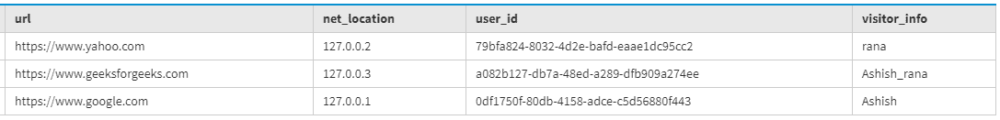
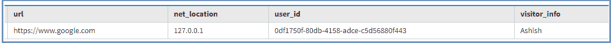
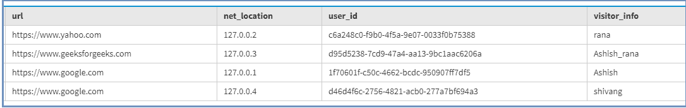
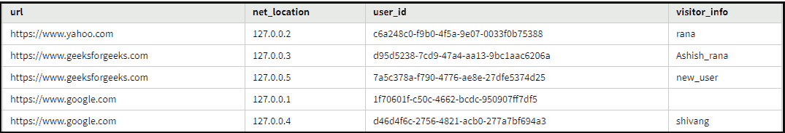
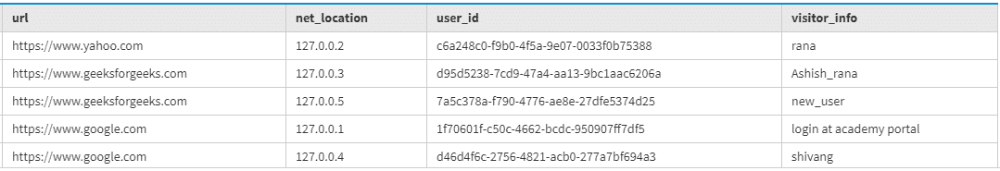

# 卡珊德拉有用的 CQL 查询

> 原文:[https://www . geesforgeks . org/有用-cql-query-in-cassandra/](https://www.geeksforgeeks.org/useful-cql-query-in-cassandra/)

先决条件–[卡珊德拉](https://www.geeksforgeeks.org/introduction-to-apache-cassandra/)
在本文中，我们将讨论 CQL 查询，它对于创建、插入、删除、操作、过滤数据等非常有用。让我们讨论如何为这些操作编写更好的 CQL 查询。

**[卡珊德拉查询语言(CQL)](https://www.geeksforgeeks.org/additional-functions-in-cql-cassandra-query-language/) :**
CQL 用于在卡珊德拉中创建、插入、[操纵数据。关于 CQL，需要注意的主要事情是它没有 GROUP 或 JOIN 的概念，并且 ORDER BY 的实现非常有限。](https://www.geeksforgeeks.org/data-manipulation-in-cassandra/)

**创建键空间**

```
//keyspace with SimpleStrategy

create keyspace cluster1    
WITH replication = {'class': 'SimpleStrategy', 
                    'replication_factor' : 3};

//keyspace with NetworkTopologyStrategy

create keyspace cluster1
WITH replication = {'class': 'NetworkTopologyStrategy', 
                    'west' : 1, 'east' : 3}
AND durable_writes = false; 
```

现在，我们要创建一个表 web_info，其中 url、用户 id、网络位置、访问者信息是表的字段。
我们来看看。

**创建表格:**

```
CREATE TABLE web_info (
  url text,
  user_id uuid,
  net_location inet,
  visitor_info text,
  PRIMARY KEY (url, net_location)
) ; 
```

**在表中插入行:**
现在，我们要在表中插入一些数据。

```
Insert into web_info(url, user_id, net_location, visitor_info)
values('https://www.google.com', uuid(), '127.0.0.1', 'Ashish');   

Insert into web_info(url, user_id, net_location, visitor_info)
values('https://www.google.com', uuid(), '127.0.0.4', 'shivang');    

Insert into web_info(url, user_id, net_location, visitor_info)
values('https://www.yahoo.com', uuid(), '127.0.0.2', 'rana');

Insert into web_info(url, user_id, net_location, visitor_info)
values('https://www.geeksforgeeks.com', uuid(), '127.0.0.3', 'Ashish_rana'); 
```

现在，使用特定行数的 LIMIT 选项验证结果。

```
SELECT * 
FROM web_info LIMIT 3; 
```

**输出:**



**ALLOW FILTERING:**
这个选项在 CQL 非常有用，它有能力让服务器主动过滤出结果。

**选择与允许过滤的用法:**

```
SELECT *
FROM web_info
WHERE url='https://www.google.com'
AND net_location='127.0.0.1' AND visitor_info = 'Ashish'
ALLOW FILTERING; 
```

**输出:**



此示例显示了 ALLOW FILTERING 在非分区列的 CQL 查询中的工作方式。
我们来看看。

```
SELECT *
FROM web_info
WHERE visitor_info = 'Ashish'
ALLOW FILTERING; 
```

**输出:**


为了验证插入到 web_info 表中的数据的结果，使用了下面给出的 CQL。

```
SELECT * 
FROM web_info; 
```

**输出:**



在这里，我们将展示我们的批处理 CQL 查询在卡珊德拉中是如何有用的。在下面给出的例子中，我们只是展示了如何使用 BATCH 更新、删除和插入数据到表中。让我们看看。

```
BEGIN BATCH
UPDATE web_info USING TTL 345600
SET visitor_info = 'Ashish rana'
WHERE url='https://www.google.com' and net_location = '127.0.0.1';

Delete visitor_info 
FROM web_info 
where url='https://www.google.com' and net_location = '127.0.0.1';

Insert into web_info(url, user_id, net_location, visitor_info)
values('https://www.geeksforgeeks.com', uuid(), '127.0.0.5', 'new_user');
APPLY BATCH; 
```

现在，使用下面给出的 CQL 查询来验证批处理结果。

```
select * 
from web_info; 
```

**输出:**



要设置 visitor_info 列，请使用下面给出的 CQL 查询。

```
UPDATE web_info 
SET visitor_info = 'login at academy portal'
WHERE url='https://www.google.com' and net_location = '127.0.0.1'; 
```

现在，使用下面给出的 CQL 查询来验证结果。

```
select * 
from web_info; 
```

**输出:**

