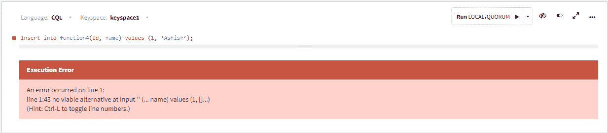
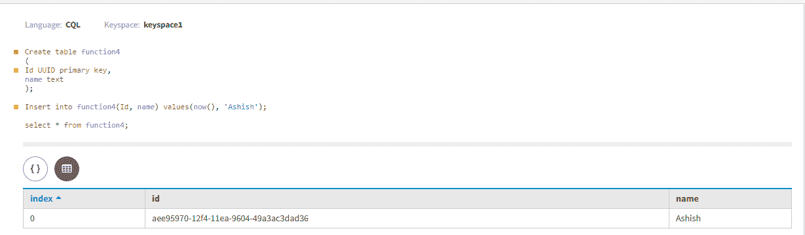
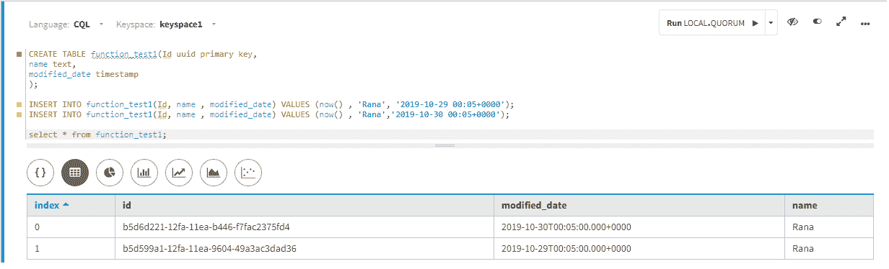
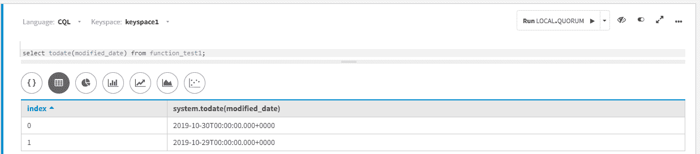
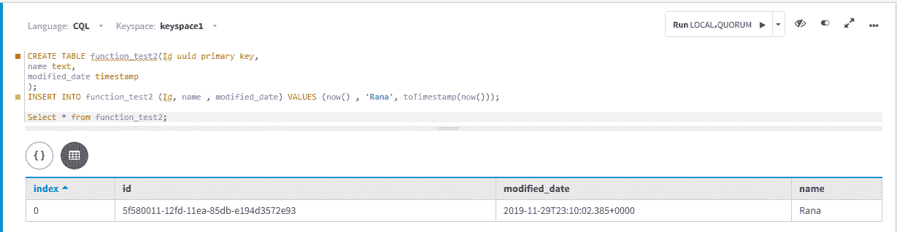
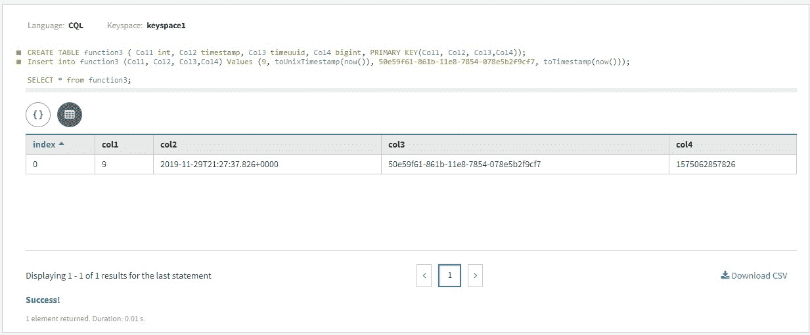

# UUID 和时间在卡珊德拉的作用

> 原文:[https://www . geesforgeks . org/uuid-and-time uuid-functions-in-Cassandra/](https://www.geeksforgeeks.org/uuid-and-timeuuid-functions-in-cassandra/)

先决条件–[卡珊德拉](https://www.geeksforgeeks.org/introduction-to-apache-cassandra/)
在本文中，我们将讨论 uuid()函数，该函数对于插入值和唯一生成“保证唯一的”uid 值非常重要。

使用 uuid()函数生成 Unique ID 的原因之一，这有助于避免冲突。uuid()函数适用于 insert 或 update 语句，uuid()函数不取任何参数值来生成唯一的随机类型 4 UUID 值，该值保证是唯一值。让我们举个例子来理解 uuid()函数。

```
Create table function4(Id uuid primary key, name text); 
```

此 CQL 查询不正确，无法使用 uuid()函数插入 Id 值。

```
Insert into function4 (Id, name) 
values (1, ‘Ashish’); // fails  
```

**输出:**



此 CQL 查询使用 uuid()函数插入 Id 值是正确的。

```
Insert into function4(Id, name) 
values (now(), ‘Ashish’);  //correct 
```

**输出:**



**一些额外的 timeuuid()函数:**

1.  **dateof() :**
    该函数返回提取的时间戳作为日期。
2.  **now() :** 
    In Cassandra Query Language now() function can be used for UTC (Universal Time) standard. Now() method is useful to insert value which is guaranteed to be unique. 

    要将当前时间作为值插入，我们可以使用 timeuuid 函数 now()和 dateof()。

```
CREATE TABLE function_test1(Id uuid primary key,
                                        name text,
                           modified_date timestamp );

INSERT INTO function_test1(Id, name, modified_date) 
       VALUES (now(), 'Rana', '2019-10-29 00:05+0000');
INSERT INTO function_test1(Id, name, modified_date) 
       VALUES (now(), 'Rana', '2019-10-30 00:05+0000');

select * 
from function_test1; 
```

1.  **输出:**



1.  现在，让我们来看看 todate()函数是如何工作的。

```
select todate(modified_date) 
from function_test1; 
```

1.  **输出:**



1.  对于 Cassandra 中> 2.2.0 的更高版本，我们可以使用 toTimestamp(now())函数。

```
CREATE TABLE function_test2(Id uuid primary key,
                                        name text,
                         modified_date timestamp );

INSERT INTO function_test2 (Id, name, modified_date) 
       VALUES (now(), 'Rana', toTimestamp(now()));

Select * 
from function_test2; 
```

1.  **输出:**



2.  **minTimeuuid()和 maxTimeuuid() :**
    两个函数分别用来求最小和最大 Timeuuid。minTimeuuid()函数返回 minimumm Timeuuid 值，maxTimeuuid()函数返回最大 Timeuuid 值。

3.  **unixTimestampOf() :**
    在 Cassandra 查询语言中 unixTimestampOf()函数以毫秒为单位计算结果集中 timeuuid 列的时间戳。unixTimestampOf()函数返回 64 位整数时间戳。

在新版本的 Cassandra 中操纵日期支持一些额外的 timeuuid 和时间戳功能。它可用于插入、更新和选择语句。

<figure class="table">

| 附加时间标识和时间戳功能名称 | 皈依者 |
| --- | --- |
| toDate(timeuuid) | 从 timeuuid 到 date[YYYY-MM-DD]格式。 |
| 时间标记 | 从 timeuuid 到时间戳格式。 |
| toUnixTimestamp(timestamp) | 从 timeuuid 到 UNIX 时间戳格式。 |
| 今日(时间戳) | 从时间戳到日期[YYYY-MM-DD]格式。 |
| toUnixTimestamp(timestamp) | 从时间戳到 UNIX 时间戳格式。 |
| totimestamp(日期) | 从日期到时间戳格式。 |
| toUnixTimestamp(日期) | 从日期到 UNIX 时间戳格式。 |

让我们用一个例子来理解，

```
CREATE TABLE function3( Col1 int, Col2 timestamp, 
                             Col3 timeuuid, Col4 bigint, 
                  PRIMARY KEY(Col1, Col2, Col3, Col4)); 
```

```
Insert into function3(Col1, Col2, Col3, Col4) 
            Values (9, toUnixTimestamp(now()), 
                     49d59e61-961b-11e8-9854-134d5b3f9cf8, 
                       toTimestamp(now()));  
```

```
SELECT * 
from function3; 
```

**输出:**



**图–**功能表输出

</figure>