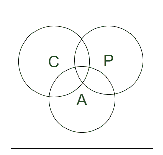
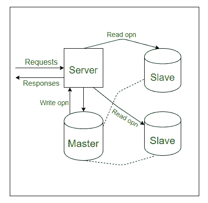
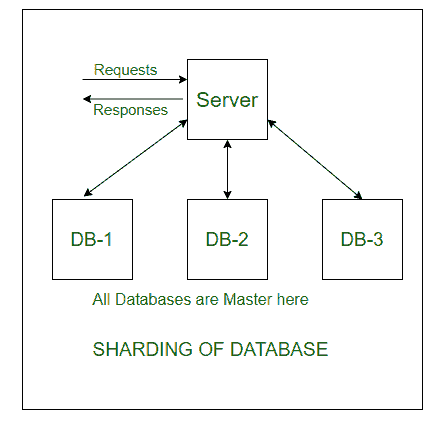
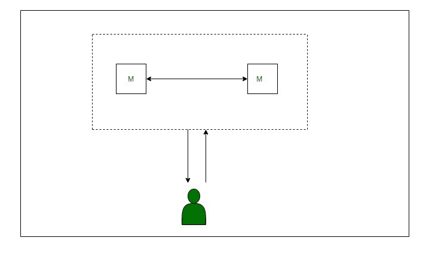
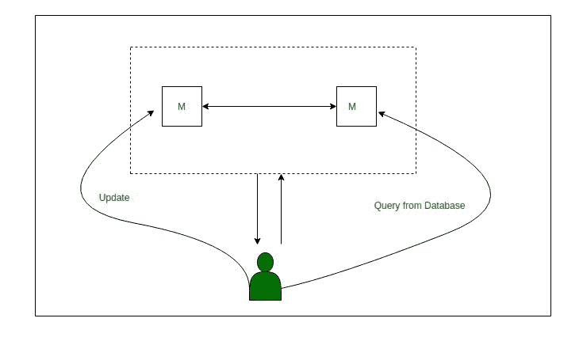
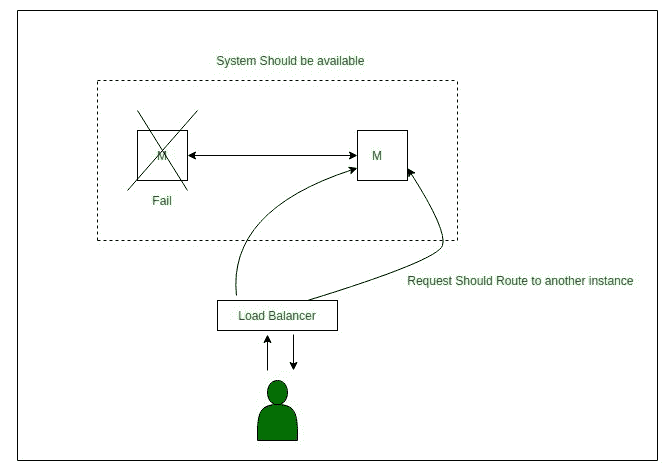
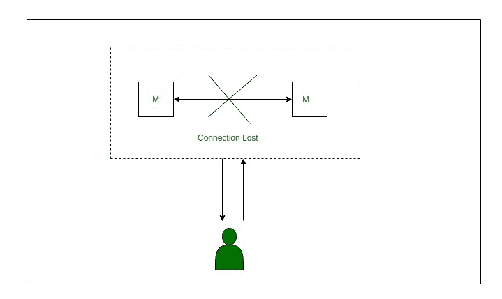

# CAP 定理的各种性质

> 原文:[https://www . geeksforgeeks . org/各种-cap-定理的属性/](https://www.geeksforgeeks.org/various-properties-of-cap-theorem/)

先决条件–[CAP 定理](https://www.geeksforgeeks.org/the-cap-theorem-in-dbms/)

在分布式系统中，你一定听说过 CAP 定理这个术语。CAP 定理指出，不可能在您的数据存储中实现所有这三个属性。

这里所有三个属性指的是 C =一致性，A =可用性和 P =分区容差。根据这个定理，一次只能实现两个。

如果每月有 1000 个请求，它们可以被管理，但是每月 100 万个请求会有点困难。在图中，我们可以有 n 个不同的数据库设置。所有写操作都在主数据库中执行，所有读操作都在从数据库中执行。但是来自主数据库的数据必须被复制到从数据库，这是异步发生的。

**不一致:**
当某个用户试图在写入数据后立即读取数据(甚至在数据被复制到从机之前)时，称为不一致。用户可能会认为这是一个 bug 或什么的。

**切分:**
因此，为了克服这种不一致的缺点，我们有另一种方法叫做切分。

在这种情况下，这里的所有数据库都是主数据库，而不是主从关系，也就是说，所有数据库都分担同等的责任。例如，在下图中，我们有 3 个数据库实例。这里需要注意的几点:

数据被分成 n 个独立的段(这里是 3)。
系统将读写操作缩放 n 倍(如果有 n 个数据库)。

**这种方法的缺点:**
如果一个特定的实例会有更重的负载，比如说 DB-1，那么它就变得难以扩展。
现在，如何规模化？我们必须将负载实例分成两个实例来分担负载。那个特定的数据库需要被拆除，然后再次分割，然后再切换回来。这是一个繁琐的过程，始终需要监控。

SQL 连接将需要 b/w 碎片。

让我们通过考虑以下系统来了解以下每个属性，在该系统中，我们有两个数据实例，它们都是主数据库。

**一致性–**

如前所述，如果一个数据被更新到一个数据库实例，但是在它被复制到另一个实例之前，用户查询，如果用户得到的信息是它以前的数据，那么这意味着您的系统是不一致的。如果用户获得相同的更新值，则系统被称为是一致的。

**可用性–**

即使您的一台或多台机器出现故障，您的系统也应该始终可用，这意味着如果多台数据库服务器出现故障，但作为一个整体，您的系统应该能够执行读写操作。因此，必须没有停机时间。

**分区容差–**
即使您的数据库服务器之间的连接丢失，您的系统也应该仍然可以工作。

