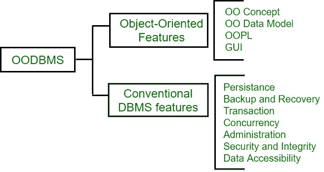

# 面向对象 DBMS 的各种规则

> 原文:[https://www . geesforgeks . org/各种面向对象的规则数据库/](https://www.geeksforgeeks.org/various-rules-of-object-oriented-dbms/)

过去几年，数据管理和应用环境变得越来越复杂。这些可以由[面向对象数据库管理系统(ODBMS)](https://www.geeksforgeeks.org/odbms-full-form/) 处理。该系统结合了面向对象和数据库管理系统的特点。

**Figure –** Object Oriented DBMS

除了像 ACID 属性这样的数据库概念之外，还实施了面向对象的特性，如封装、多态性和继承，这导致了系统的完整性、对即席查询语言的支持，以及对二级存储管理系统的支持。以透明的方式访问数据库中的对象，以便与持久对象的交互与与内存对象的交互没有区别。ODBMS 的产品包括设计公司的“对象商店”和客观性公司的“客观性/数据库”。

**ODBMS 的应用:**

*   用在风险管理的金融应用中，因为这些应用产生数据的实时视图。
*   用于电信应用，因为它们可以自动监控、识别和跟踪基于数百个实时参数的通信网络。
*   用于处理 x 光、核磁共振扫描等医学应用。
*   用于计算机辅助设计和计算机辅助制造。
*   用于使用视频、音频和需要数据管理功能的高质量图形的多媒体应用程序。
*   处理相互关联的数据，通过这些数据设计计算机辅助软件工程。

**ODBMS 的黄金法则:**
要成为 ODBMS 的数据库必须满足两个标准。第一个标准是它必须是一个数据库管理系统，第二个标准是它必须具有面向对象的特性。定义 ODBMS 特性的第一次尝试是“面向对象数据库系统宣言”。它还包括 13 个强制功能和一些可选特性。这 13 条规则基本分为两套。第一组包含 8 个定义它是面向对象的规则，第二组包含 5 个定义它是数据库管理系统的规则。

这些解释如下。

1.  **系统必须支持复杂对象–**
    复杂对象可以通过给简单对象添加构造函数来构建。简单的对象就像整数、浮点数和布尔值。复杂对象构造函数包括集合、列表和数组元组。系统必须具有的最小数量的构造函数是集合、元组和列表。
2.  **支持对象身份–**
    对象必须有独立于其价值的存在。这是用来比较 OID 和物体的状态。在这种情况下，每个对象都有一个独立于其当前状态和行为的唯一的、不可测量的 OID。
3.  **对象必须被封装–**
    该特性确保对象必须只显示公共方面，而其他细节(如实现)必须被隐藏。
4.  **支持类型还是类–**
    这个规则基本上是用户用来选择系统是支持类概念还是类型概念。类用于存储和处理类似类型的数据。但是类型用于在编译时检查属性值分配中的类型错误。
5.  **支持继承–**
    对象必须继承父类的属性。因此，增加了现有代码的可重用性。
6.  **避免过早绑定–**
    该功能帮助用户将同名对象添加到不同的类中。面向对象的概念根据它属于哪个类的对象来决定在运行时使用哪个实现。这也被称为**后期绑定**。

*   **计算完成–**
    计算完成函数使用数据库系统的 DML，即它允许用户用语言添加任何类型的操作。*   **可扩展系统–**
    它能够定义新的数据类型，而不区分系统定义的和用户定义的类型。*   **支持持久化–**
    面向对象系统将所有对象保存在内存中，计算机关闭后，所有对象空间都将丢失。持久性是程序员在执行过程中生存下来，重新使用它的能力。*   **支持非常多的数据库–**
    由于数据库管理中的对象非常复杂和庞大，因此它们需要借助缓冲区和访问路径选择技术来优化二级存储设备的管理。*   **对并发用户的支持–**
    由于多个用户的管理同时与系统交互，系统必须提供与当前数据库系统相同的服务级别。*   **必须支持恢复–**
    系统能够从任何硬件和软件故障中恢复。系统必须支持自动备份和恢复工具。*   **Adhoc Query Facility –**
    As RDBMS supports SQL, ODBMS supports object query language i.e., [SQL](https://www.geeksforgeeks.org/sql-tutorial/).

    ODBMS 还支持以下一些附加功能–

    *   支持多重继承。
    *   支持类型检查和类型接口。
    *   支持分布式 ODBMS。
    *   支持版本控制。