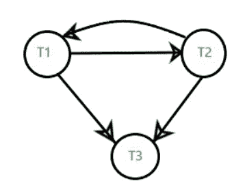
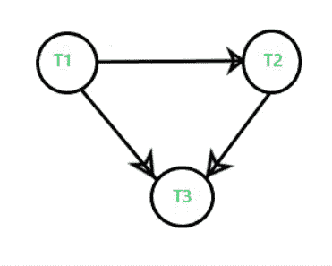
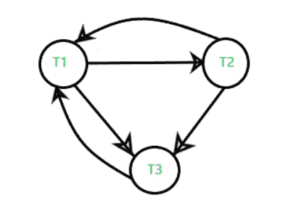

# 在数据库管理系统中查看可序列化性

> 原文:[https://www.geeksforgeeks.org/view-serializability-in-dbms/](https://www.geeksforgeeks.org/view-serializability-in-dbms/)

先决条件–[数据库管理系统中的计划类型](https://www.geeksforgeeks.org/types-of-schedules-in-dbms/)
[视图可序列化性](https://www.geeksforgeeks.org/view-serializability-in-dbms-transactions/)是一个用于计算计划是否可视图序列化的概念。如果一个计划是与一个**序列计划**等价的视图，那么这个计划被称为**视图-可串行化的**(在这里事务是不可能交错的)。

**为什么我们需要使用视图可序列化？**
可能有些计划不是冲突可串行化的，但仍然给出一致的结果，因为当计划的 [**优先图**](https://www.geeksforgeeks.org/precedence-graph-for-testing-Conflict-Serializability-in-dbms/) 包含一个**循环/循环时，[冲突可串行化的概念](https://www.geeksforgeeks.org/conflict-serializability-in-dbms/)变得有限。**在这种情况下，我们无法预测时间表是一致还是不一致。根据冲突可串行化的概念，如果一个调度对应的优先图没有任何循环，我们可以说它是冲突可串行化的。

但是，如果一个调度的优先图包含一个循环/循环，并且给出了一致的结果/精确的结果，就像一个冲突可串行化调度给出的那样，该怎么办？
所以，为了解决这样的情况，我们引入了**视图-可串行化的概念**，因为我们不想将可串行化的概念仅仅局限于冲突-可串行化。

**示例:**理解视图-可序列化性首先使用**时间表 S <sub>1</sub> :**

<figure class="table">

| T <sub>1</sub> | T <sub>2</sub> | T <sub>3</sub> |
| --- | --- | --- |
| a=100
**读作(a)**
 |   |   |
|   | a=a-40
**写(a) //60**
 |   |
| a=a-40
**写(a) //20**
 |   |   |
|   |   | a = a-20
T1【写(a)//0T3】 |

因此，它的冲突优先图如下–



上面的图包含循环/循环，这意味着它不是冲突可串行化的，但这并不意味着它不能与串行调度一致和等价，无论它可能是也可能不是。

**look schedule S '<sub>1</sub>:**
在上面的例子中，如果我们在一些事务的操作之间进行**交换**，那么我们的表将看起来像–

<figure class="table">

| T <sub>1</sub> | T <sub>2</sub> | T <sub>3</sub> |
| --- | --- | --- |
| a=100
**读作(a) //100**
 |   |   |
| a=a-40
**写(a) //60**
 |   |   |
|   | a=a-40
**写(a) //20**
 |   |
|   |   | a = a-20
T1【写(a)//0T3】 |

其优先图如下–



现在，我们看到第二个表的优先图不包含任何循环/循环，这意味着它是冲突可序列化的(相当于串行调度，一致)，最终结果与第一个表相同。

**注意:**在上面的例子中，我们知道如果一个调度是冲突可串行化的，那么我们可以很容易地预测它将是–

1.  相当于一个序列表，
2.  一致的，
3.  也是视图可序列化的。

但是如果它是非冲突可串行化的(优先图包含循环)呢。在这种情况下，我们无法预测它是否一致和可序列化。正如我们在上面的例子中看到的，其中**调度 S <sub>1</sub>** 的优先图给出了一致的结果，相当于**调度 S’<sub>1</sub>**的可串行化结果，尽管包含循环/循环。因此，为了解决冲突-可串行化概念的局限性，视图-可串行化方法应运而生。

**检查计划的视图可序列化性的方法–**

**方法-1 :**
两个时间表 **S <sub>1</sub> 和 S <sub>2</sub>** 被认为是视图等效的，如果同意以下条件–[**转到链接:第 3 点**](https://www.geeksforgeeks.org/View-Serializability-in-dbms-transactions/) 。

**方法-2 :**
首先，检查给定的计划是非冲突可序列化还是冲突可序列化–

*   如果给定的计划是冲突可序列化的(意味着它的优先图不包含任何循环/循环)，那么给定的计划必须是视图可序列化的。停下来提交你的最终答案。
*   如果给定的计划是非冲突可序列化的，那么它可能是视图可序列化的，也可能不是。我们不能仅仅通过使用冲突可串行化的概念来预测它，所以我们需要看看下面的情况。

执行上述步骤后，如果您发现提供的时间表不冲突，您需要执行以下步骤–
**盲写:执行写操作(更新)，不执行读操作，这种写操作称为盲写。**

*   如果不存在盲写，则计划必须是非视图可序列化的计划。停下来提交你的最终答案。
*   如果存在任何盲目写入，那么，在这种情况下，计划可能被视为可序列化，也可能不被视为可序列化。所以我们需要看看下面的案例。因为，如果它不包含任何盲写，我们肯定可以声明该计划不是视图可序列化的。
*   如果以上两个条件不起作用{意味着我们已经尝试了以上两个条件，那么我们已经到了这一步}。然后，使用这些依赖关系绘制一个优先图。如果图形中不存在循环/循环，那么调度将是视图可串行化的，否则不是。

**问题:**证明给定的时间表是否可视图序列化？

```
S' : read1(A), write2(A), read3(A), write1(A), write3(A)
```

**解决方案:**首先，我们将制作一个表格，以便更好地理解**时间表 S’-**的给定交易

<figure class="table">

| T <sub>1</sub> | T <sub>2</sub> | T <sub>3</sub> |
| --- | --- | --- |
| 阅读(a) |   |   |
|   | 写(a) |   |
|   |   | 阅读(a) |
| 写(a) |   |   |
|   |   | 写(a) |

*   首先我们检查它是否是冲突可串行化的，因为如果它是冲突可串行化的，那么它也将是视图可串行化的，所以我们将为**调度 S’制作一个优先图。**
*   在这里，我们将检查时间表是否包含任何盲写。我们发现时间表包含事务 T2 中的盲写写 2(a)。因此，计划可能是视图可序列化的，也可能不是。所以我们来看看另一种方法。因为，如果它不包含任何盲写，我们可以肯定地说，该计划不会是视图可序列化的。
*   现在，我们将绘制一个不同于优先图的依赖图。

其依赖关系图如下–



*   事务 **T <sub>1</sub>** 先读取 data _ item“a”，事务 **T <sub>2</sub>** 先更新(写入)**“a”。**
*   所以，交易**T<sub>1</sub>T3】必须在 **T <sub>2</sub> 之前执行。****
*   这样我们就得到图中的依赖 **(T <sub>1</sub> → T <sub>2</sub> )** 。
*   并且，对**“a”**的最终更新(写入)是通过交易 **T <sub>3</sub> 进行的。**
*   所以，事务**T<sub>3</sub>T3】必须在所有其他**事务(T <sub>1</sub> ，T <sub>2</sub> 之后执行。****
*   这样我们就得到图中的依赖关系 **(T <sub>1</sub> ，T <sub>2</sub> ) → T <sub>3</sub>** 。

**由于依赖关系图中没有循环/循环，计划是视图可序列化的。**

</figure>

</figure>

</figure>