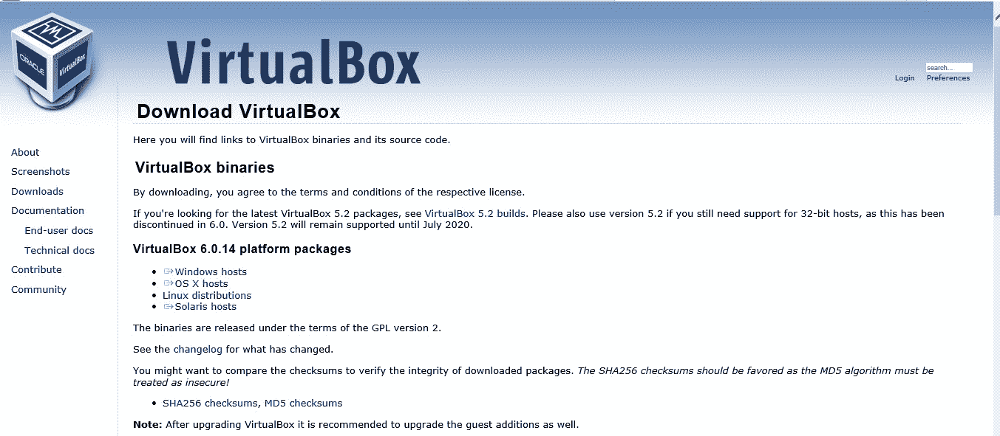
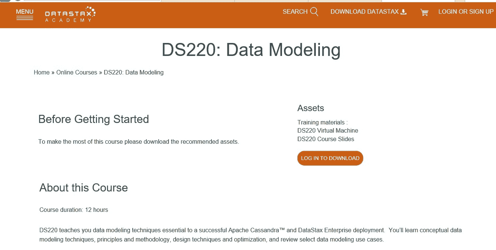
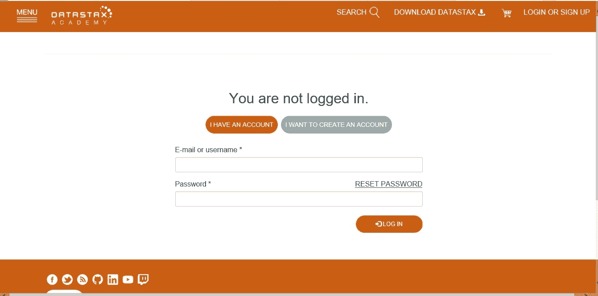
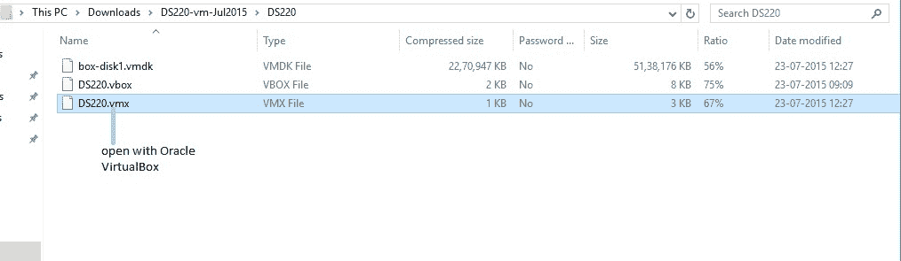
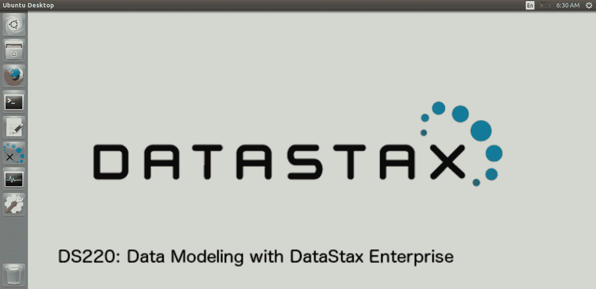
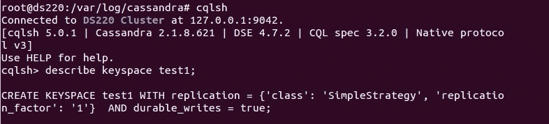

# 卡珊德拉 CQL 查询虚拟机安装

> 原文:[https://www . geesforgeks . org/virtual-machine-installation-for-Cassandra-cql-query/](https://www.geeksforgeeks.org/virtual-machine-installation-for-cassandra-cql-query/)

在本文中，我们将讨论如何安装虚拟机来运行 Cassandra，并可以逐步执行 CQL 查询。遵循下面给出的步骤。

*   **Step-1:**
    First download and install any one of virtual machine. here we will discuss about oracle Virtual Box. [Download VirtualBox](https://www.virtualbox.org/wiki/Downloads)

    

    <center>**Figure –** Oracle VirtualBox</center>

*   **步骤-2:**
    安装虚拟箱后。去数据税务学院下载 DS220 虚拟机。这里有一个链接可以转到数据税学院 DS220 课程。 [DS220 数据建模课程](https://academy.datastax.com/resources/ds220-data-modeling)



<center>**Figure –** DS220 DataStax Academy page</center>

*   **Step-3:**
    Login to access and download DS220 resources. If you don’t have account then create first and then login with your credential. [DS220 login page](https://academy.datastax.com/user/login?destination=node/6102)

    

    <center>**Figure –** DS220 login page</center>

*   **Step-4:**
    After downloading DS220 resources you will get these files such that box-disk1.vmdk, DS220.vbox, DS220.vmx and then open DS220.vmx file open with oracle virtual box.

    

    <center>**Figure –** DS220 resources</center>

*   **步骤-5:**
    打开后用 DS220.vmx 文件带 oracle 虚拟盒。您将在 Oracle 虚拟盒中获得添加的 DS220 虚拟机。然后最后打开 Virtual Box，然后双击添加的 DS220 虚拟机。双击后，打开 Linux 虚拟机需要几分钟时间。忽略窗口顶部菜单栏上的一些弹出菜单。
*   **Step-6:**
    Finally, Linux window virtual machine will open. let’s have a look.

    

    <center>**Figure –** Linux virtual machine with cqlsh</center>

*   **Step-7:**
    Now open terminal and change directory by using the following command.

    ```
    cd /var/log/Cassandra 
    ```

    为了打开 cqlsh shell，使用了下面的 CQL 查询。

    ```
    cqlsh 
    ```

    让我们看看，

    

    <center>**Figure –** connect to cqlsh</center>

    **注意:**如果您对上述步骤有任何问题，请用描述来评论您的问题，我会尽力解决您的问题。