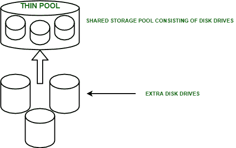

# 虚拟化数据中心中的虚拟资源调配

> 原文:[https://www . geeksforgeeks . org/虚拟化数据中心虚拟资源调配/](https://www.geeksforgeeks.org/virtual-provisioning-in-virtualized-data-centre/)

虚拟资源调配是一种向计算系统呈现 LUN 的能力，其容量大于存储阵列上物理分配给 LUN 的容量。可以在–实现

*   计算层
*   存储层

物理存储仅在计算需要时分配，并且调配决策不受当前可访问存储的约束。物理存储从物理容量共享池中“按需”分配给应用程序。这通过最大限度地减少已分配但未使用的物理存储来提高存储利用率。

### 虚拟资源调配需求:

管理员通常根据存储的预期增长来分配存储空间。这是因为他们希望最大限度地减少随后添加新存储所需的管理开销和应用程序停机时间。这将导致存储容量的过度调配，从而导致更高的成本、更多的电力、冷却和占地空间需求以及更低的容量利用率。虚拟资源调配通过最大限度地减少已分配但未使用的物理存储量来提高存储利用率，从而应对这些挑战。

### 什么是精简池？

它由物理驱动器组成，提供精简 LUN 使用的实际物理存储。存储阵列中可以形成各种池，当擦除精简 LUN 时，池会回收分配的容量。精简 LUN 是一种逻辑设备，在创建时不需要完全分配物理存储。一个池中形成的所有精简 LUN 共享该池的存储资源。

### 虚拟资源调配的优势:

*   最大限度降低运营和存储成本。
*   减少停机时间。
*   提高产能利用率。
*   最小化管理开销。

### 虚拟资源调配的最佳实践:

*   精简池中的驱动器应具有相同的转速(每分钟转数)。如果不匹配，所需的性能可能会有所不同。
*   精简池中的驱动器大小应该相同。不同的大小可能会导致驱动器的未使用容量。
*   为可能允许性能波动的应用程序调配精简 LUN。