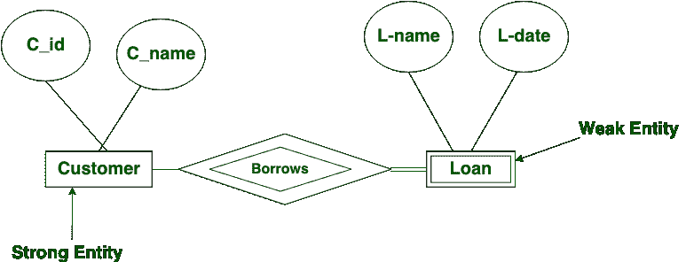
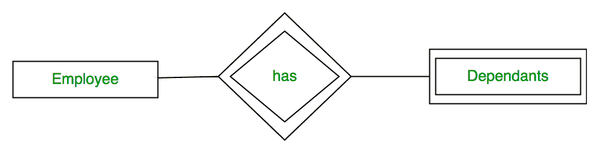
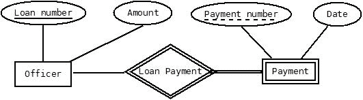

# ER 图中的弱实体集

> 原文:[https://www . geesforgeks . org/weak-entity-set-in-er-diagrams/](https://www.geeksforgeeks.org/weak-entity-set-in-er-diagrams/)

实体类型应该有一个键属性，它唯一地标识实体集中的每个实体，但是存在一些无法定义键属性的实体类型。这些被称为弱实体类型。

没有足够属性形成[主键](https://www.geeksforgeeks.org/dbms-keys-candidate-super-primary-alternate-and-foreign/)的实体集称为**弱实体集**，有主键的实体集称为强实体集。

由于弱实体没有任何主键，它们不能被自己识别，因此它们依赖于其他实体(称为所有者实体)。弱实体在其与所有者身份的识别关系中具有总[参与约束](https://www.geeksforgeeks.org/database-management-system-er-model/)(存在依赖)。弱实体类型有部分键。部分关键字是一组属性，借助这些属性可以区分和识别弱实体的元组。

**注意–**弱实体总是有完全参与，但强实体可能没有完全参与。

弱实体是**依靠强实体**来保证弱实体的存在。像[强实体](https://www.geeksforgeeks.org/difference-between-strong-and-weak-entity/)一样，弱实体没有任何主键，它有部分鉴别键。弱实体用双矩形表示。一个强实体和一个弱实体之间的关系用双菱形表示。



**弱实体**在 ER 图中用**双矩形**框表示，识别关系用双菱形表示。部分关键属性用虚线表示。



**例-1:**
下图 ER 图中，‘支付’是弱实体。“贷款付款”是识别关系，“付款编号”是部分关键。贷款的主键和部分键将用于识别记录。



**例-2:**
房间的存在完全取决于酒店的存在。所以房间可以看作是酒店的薄弱实体。

**例-3:**
如果某银行不存在了，那么该银行的银行账户就不存在了。

**例-4:**
公司可以存储员工家属(父母、子女、配偶)的信息。但是没有员工，家属就不存在。因此，受抚养人将是弱实体类型，员工将是受抚养人的标识实体类型。

**其他例子:**

```
Strong entity | Weak entity
Order | Order Item
Employee | Dependent
Class | Section
Host | Logins 
```

**注意–**强-弱实体集总是有父子关系的。