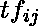
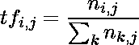
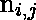
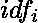
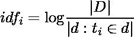
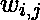
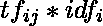
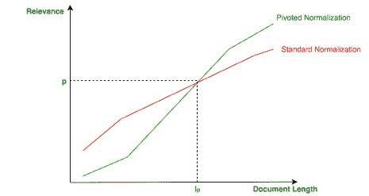

# 网页信息检索|向量空间模型

> 原文:[https://www . geesforgeks . org/web-信息-检索-向量-空间-模型/](https://www.geeksforgeeks.org/web-information-retrieval-vector-space-model/)

不言而喻，一般来说，搜索引擎用相关文档的排序列表来响应给定的查询。本文的目的是描述针对给定查询查找相关文档的第一种方法。在向量空间模型(VSM)中，每个文档或查询都是一个 N 维向量，其中 N 是所有文档和查询中不同术语的数量。向量的第 I 个索引包含该向量的第 I 项的分数。

主要评分函数基于:术语频率和反向文档频率。

**术语频率和逆文档频率–**
术语频率()是针对第 I 个术语和第 j 个文档计算的:

其中是第 j 个文档中第 I 个术语的出现。

这个想法是，如果一个文档有多个给定术语的接收，它可能会处理那个论点。
逆文档频率()考虑第 I 个术语和集合中的所有文档:

直觉告诉我们，罕见的术语比常见的更重要:如果一个术语只出现在一个文档中，它可能意味着该术语是该文档的特征。
第 j 个文档中第 I 个术语的最终得分由一个简单的乘法组成:。由于文档/查询只包含集合中所有不同术语的子集，因此对于大量术语，术语频率可以为零:这意味着需要稀疏向量表示来优化空间需求。

**余弦相似度–**
为了计算两个向量 a、b(文档/查询，但也包括文档/文档)之间的相似度，使用余弦相似度:

(1) 

该公式计算由两个归一化向量描述的角度的余弦值:如果向量很接近，则角度很小，相关性很高。
可以看出，在向量归一化的假设下，余弦相似度与欧氏距离相同。

**改进–**
向量归一化有一个微妙的问题:谈论单个主题的短文档可以以处理更多主题的长文档为代价得到青睐，因为归一化没有考虑文档的长度。

旋转规范化的思想是使比经验值(旋转长度:)短的文档不太相关，而使长的文档更相关，如下图所示:旋转规范化

VSM 没有考虑的一个大问题是同义词:术语之间没有语义关联，因为它既没有被术语频率捕获，也没有被反向文档频率捕获。为了解决这个问题，引入了广义向量空间模型(GVSM)。