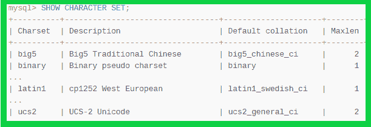
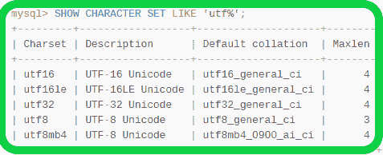
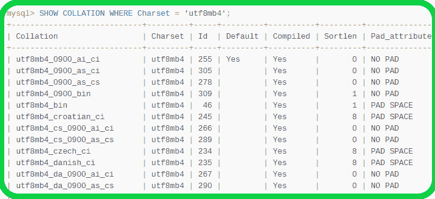

# 什么是 MySQL 中的排序规则和字符集？

> 原文:[https://www . geesforgeks . org/什么是 mysql 中的排序规则和字符集/](https://www.geeksforgeeks.org/what-is-collation-and-character-set-in-mysql/)

***MySQL 整理*** 一直是 MySQL 初学者学习者的一个故弄玄虚的话题。MySQL 排序规则是一组定义明确的规则，用于通过使用相应的编码来比较特定字符集的字符。MySQL 中的每个字符集可能有多个排序规则，并且至少有一个默认排序规则。两个字符集不能有相同的排序规则。

*   字符集是一组特定的符号和编码技术。排序规则是一组用于比较字符集内字符的规则。字符集允许我们通过各种字符集存储数据，并根据各种排序规则进行比较。我们可以在服务器、数据库、表和列级别突出显示字符集。
*   假设，我们有一些字母 A，B，C，D，A，B，C，D，我们给所有的字母分配了一个数字，比如 A=1，B=2，C=3，D=4，a=5，b=6，c=7，d=8。所以，对于符号 A 编码是 1，对于 B 编码是 2，对于 C 编码是 3，以此类推。如果我们想比较字符串 A，B，A，B，我们有一个更简单的方法，就在刚才，我们给一些字母分配了一个不同的值，比如 A 的编码是 1，B 的编码是 2，类似地，A 和 B 的编码是 5 和 6。那么，我们如何能够进行这种比较，仅仅是因为校对。我们明确地将排序技术(比较相应的编码)应用到我们的字符集。
*   字符集不仅影响数据存储，还影响客户端程序和 MySQL 服务器之间的通信媒介。如果您希望客户端程序使用不同于默认字符集的字符集与服务器通信，您需要突出显示您使用的是哪一个字符集。例如，要使用***【utf8】***Unicode 字符集，请在建立与服务器的连接后使用以下语句:

```
SET NAMES 'utf8'; 

```

有一个 MySQL 语句可以了解字符集的默认排序规则，如下所示:

```
SHOW CHARACTER SET;

```



字符集

*   默认情况下，“显示字符集”语句显示所有可用的字符集。但是如果您想要访问特定类型的字符集，那么您需要使用 MySQL 的 LIKE 或 WHERE 子句来指示哪些字符集名称符合条件。以下示例显示了一些与格式*(“utf %”)*匹配的 Unicode 字符集:



使用 LIKE 语句获取字符集

*   如果您想拥有特定或给定字符集的所有排序规则，那么 MySQL 提供了如下语句“显示排序规则”:

```
SHOW COLLATION LIKE 'character_set_name%';

```



使用 WHERE 语句获取排序规则

*   在上表中，排序规则以 **_ci** 结尾，这里的 ci 代表**不区分大小写**。可能还有其他类型的排序规则，例如:

```
***1\.  _cs(Case-sensitive) ,***
***2\.  _bin(Binary)*** 

```

*   在数据库级别设置字符集和排序规则的 MySQL 查询:如果您在创建时没有指定字符集，那么数据库将使用默认字符集，但是如果您想要分配一个特定的字符集以便您可以通过 MySQL 查询显式地表达它:

```
CREATE DATABASE name_of_database
CHARACTER SET character-set_name;
COLLATE collation_name;

```

**示例:**

```
CREATE DATABASE my_database
CHARACTER SET utf8mb4
COLLATE utf8_unicode_ci;

```

您还可以使用 MySQL“ALTER”语句更改或应用数据库的字符集和排序规则名称:

```
ALTER DATABASE database_name
CHARACTER SET character_set_name
COLLATE collation_name; 

```

**示例:**

```
ALTER DATABASE my_database
CHARACTER SET utf8mb4
COLLATE  utf8mb4_0900_ai_ci;

```

在表级别设置字符集和排序规则的 MySQL 查询:您也可以在创建表时明确指定您想要的字符集和排序规则的类型，但是如果您没有指定，则将应用默认的字符集和排序规则。

```
CREATE TABLE table_name(
ID   INT   AUTO_INCREMENT  NOT NULL,
NAME VARCHAR (20)     NOT NULL,
ADDRESS  CHAR (25) ,
SALARY   DECIMAL (18, 2),        
PRIMARY KEY (ID) );
CHARACTER SET character_set_name
COLLATE collation_name ;

```

*   如果您在通过 MySQL“ALTER”语句创建表时没有应用字符集和排序规则名称，您还可以根据需要设置它们:

```
ALTER TABLE table_name(
RENAME COLUMN old_name TO new_name);
CHARACTER SET character_set_name
COLLATE collation_name;

```

*   您还可以在列级别设置字符集和排序规则名称:正如我们所知，表中的列可能包含各种数据，如(varchar、Int、float)。因此，您可以根据需要为不同类型(数据类型)的列显式指定字符集和排序规则名称。

```
ALTER TABLE table_name
MODIFY column_name   VARCHAR(25)
CHARACTER SET latin1;
```