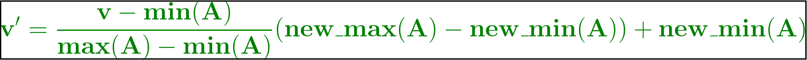
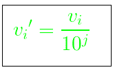
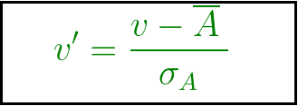

# 什么是数据归一化？

> 原文:[https://www.geeksforgeeks.org/what-is-data-normalization/](https://www.geeksforgeeks.org/what-is-data-normalization/)

规范化是任何类型的问题陈述的预处理阶段。特别是归一化在软计算、云计算等领域发挥着重要作用。对于数据操作，在数据用于下一阶段之前缩小或扩大数据范围。这里有很多标准化技术，即最小-最大标准化、Z 分数标准化和十进制缩放标准化。

> 规范化是将要分析的数据缩放到特定的范围，如[0.0，1.0]以提供更好的结果。

### 什么是数据规范化？

数据转换操作，如规范化和聚合，是额外的数据预处理过程，有助于数据提取过程的成功。

数据标准化包括将数值列重塑为标准比例。数据规范化一般认为是开发干净的数据。然而，更深入地说，数据规范化的意义或目标是双重的:

*   数据规范化是将数据组织成在所有记录和字段中看起来相似。
*   它增加了条目类型的内聚性，导致清理、线索生成、细分和更高质量的数据。

### 数据标准化的重要性

数据规范化处理各种异常，这些异常会使信息检查变得更加复杂。这些不规则性的一部分可能表现为擦除信息、嵌入更多数据或刷新现有数据。一旦这些错误被解决并从框架中消除，就可以通过数据和数据检查中的不同工作获得进一步的优势。

在很大程度上，通过数据规范化，数据集内的数据可以被设计成可视化和可检查的。

### 数据规范化的优势

*   我们可以有更多的聚集索引。
*   索引搜索往往更快。
*   数据修改命令更快。
*   空值更少，冗余数据更少，让你的数据更紧凑。
*   数据修改异常减少。
*   规范化在概念上更清晰，更容易随着需求的变化而维护和改变。
*   搜索、排序和创建索引的速度更快，因为表更窄，数据页上容纳的行更多。

### **需要正常化**

当我们处理不同尺度的属性时，通常需要归一化，否则，由于其他属性在更大尺度 a 上具有值，这可能会导致中一个同等重要的重要属性(在 a 较低尺度上)的有效性被稀释。简单来说，当存在多个属性但属性具有不同尺度的值时，这可能会导致在执行数据挖掘操作时数据模型不佳。因此，它们被规范化，以使所有属性处于相同的规模。

### 数据归一化方法

标准化是一种缩放技术或映射技术或预处理阶段。在那里我们可以从现有的系列中找到新的系列。它对预测或预测非常有帮助。众所周知，预测或预测的方法有很多，但各有千秋。因此，为了保持预测和预测预测的多样性，需要标准化技术来使它们更加接近。下面提到了一些现有的规范化技术:

[**Min-Max 归一化**](https://www.geeksforgeeks.org/data-normalization-in-data-mining/) **:** 在这种数据归一化技术中，对原始数据进行一线性变换。数据中的最小值和最大值是提取的，每个值根据以下公式进行替换。

其中 A 为属性数据，
Min(A)、Max(A)分别为 A 的最小值和最大值绝对值。
v’是数据中每个条目的新值。
v 是数据中每个条目的旧值。
new_max(A)，new_min(A)分别是范围的最大值和最小值(即要求范围的边界值)。

[**通过小数进行归一化** **缩放**](https://www.geeksforgeeks.org/data-normalization-in-data-mining/) **:** 它通过移动数据值的小数点进行归一化。为了通过这种技术对数据进行归一化，我们将数据的每个值除以和数据的最大绝对值。数据、的数据值、 *v i 、*、【T28】通过以下公式归一化为、 *v i 、*、

其中 *j* 是最小的整数，使得 max(|v i '|) < 1。

[**-Z 分数归一化或零均值归一化**](https://www.geeksforgeeks.org/data-normalization-in-data-mining/) **:** 在这种技术中，值是基于数据 a 的均值和标准差归一化的。使用的公式是:

v’，v 分别是数据中每个条目的新旧。σ A ，A 分别是 A 的标准差和均值。