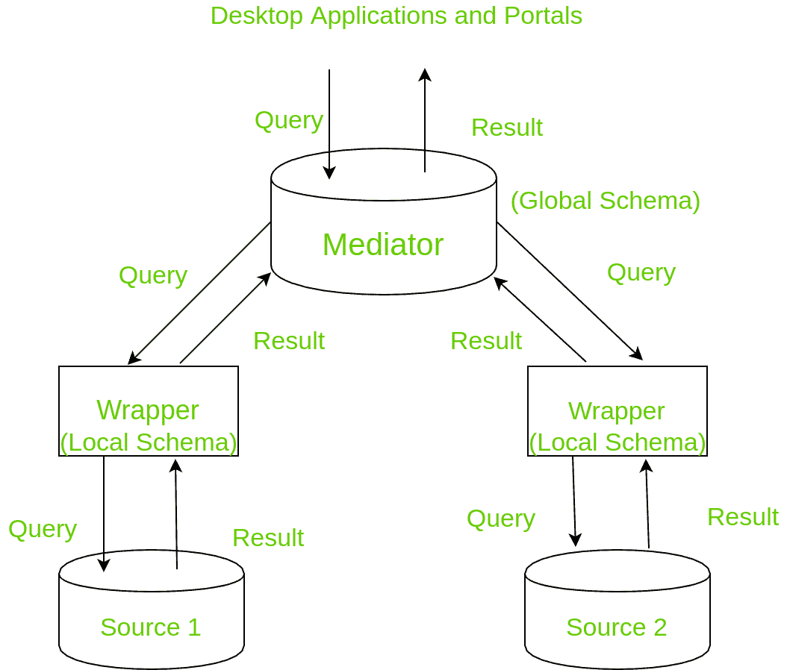

# 什么是 GAV(全局即视图)？

> 原文:[https://www.geeksforgeeks.org/what-is-gav-global-as-view/](https://www.geeksforgeeks.org/what-is-gav-global-as-view/)

有许多数据库和数据源需要集成。几乎每个应用程序都有许多可以一起工作的数据源。数据集成包括集成来自不同来源的数据，并且它对这些来源有一个单一的视图。它是使用组合的信息来回答查询的。它可以是物理的，也可以是虚拟的。物理数据集成将数据保存到仓库中。

虚拟集成将数据保存在数据源本身。集成带来的问题是数据源之间的数据异构性。从语义(具有相似数据的属性的不同名称)、通信、模式或数据类型等来源收集数据时，可能会出现各种异构问题。为了克服这些问题，有三种模型被设计用于集成数据，它们是联邦数据库、数据仓库和中介。

**全局 as 视图(GAV) :**
全局 as 视图是基于视图的数据集成的中介类型之一。全局模式充当源模式的视图，即中介模式是根据本地模式描述的。给定对全局模式的查询，中介将遵循现有的规则和模板，将查询转换为特定于源的查询。它将新的查询发送到包装器进行执行。包装器搜索所有可能的表达式，以及如何组合它们来回答给定的查询。

**应用:**

1.  企业信息集成，使公司拥有独立的数据库，并且它们一起工作。
2.  科学数据库，例如基因组数据库。
3.  整合目录–包括整合来自每个供应商的产品信息。

**工作原理:**
中介涉及到一个中介，它是数据的虚拟视图，不存储任何数据，因为数据存储在源位置。来自各种来源的模式被组合在一起，形成了一个虚拟的中介模式。映射发生在查询时。当用户查询时，它被映射到多个其他查询，并且每个查询都被发送到源。消息来源对它们进行评估，并发回结果。

结果被合并在一起并发送给最终用户。这个过程叫做调解。它使用负责执行查询映射的包装器。他们使用表示许多查询的模板(已经创建)，因此变得灵活。如果中介查询与模板匹配，则返回结果，否则不返回。有两种类型的中介，它们是全局作为视图和局部作为视图。我们将讨论全局视图。



**例:**
我们举个例子来了解一下 GAV 的工作原理。
整合目录。假设 Zexmon(一家公司)想要购买像 DIPs 和 PGA 这样的具有相同协议的芯片。

**全局模式–**

```
DIP ( manufacturer, model, protocol )
PGA ( manufacturer, model, protocol ) 
```

**本地模式–**
每个 DIP 和 PGA 厂商都有关系(模型、协议)。

Zexmon 将询问调解人。Mediator 将首先向每个 DIP 制造商查询模型和协议对。包装器将通过添加属性制造商把它们变成一个三元组。来自每个 DIP 芯片的所有来源的协议被返回给调解器。

现在，中介开始使用之前返回的协议查询所有 PGA 制造商。包装器再次将制造商属性添加到(模型、协议)对中。这就是中介如何检索具有相似协议的 DIP 和 PGA 芯片。这有助于 zexmon 购买所需的芯片。

**优势:**

1.  全局 as 视图更容易实现，因为您可以控制中介的工作。
2.  设计简单。
3.  查询回答方法是程序性的，因此它被许多工业系统实践。

**缺点:**

1.  由于全局数据库有多个源，因此全局模式不能构建任何源模式中缺少的任何信息。
2.  在现有资源的基础上增加新的资源是一项开销，因为必须确保现有资源依赖于它，即很少增加独立的资源。如果添加了新的源，映射也必须更改。
3.  可以生成的内容的视图被缩小。
4.  删除数据源也可能需要大量工作，使其不灵活。