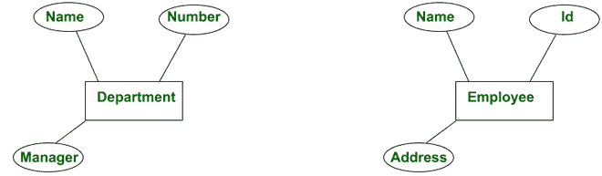
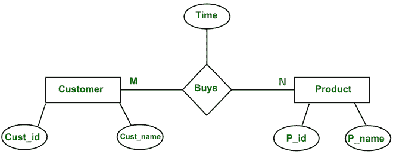
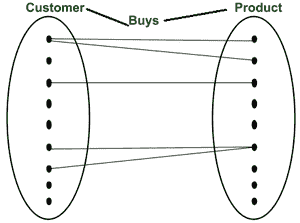
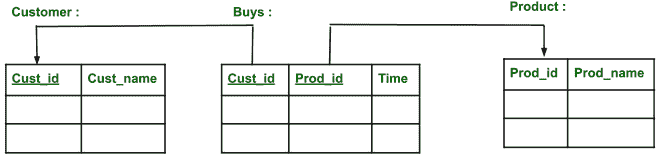
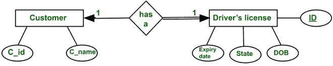
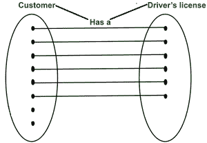
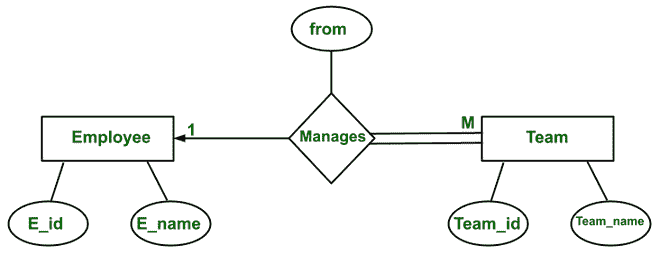
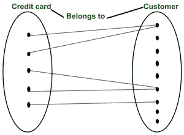
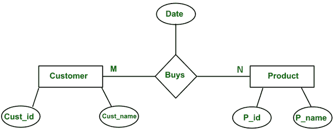

# 什么是映射基数| ER 图

> 原文:[https://www . geesforgeks . org/什么是映射-基数-er-diagrams/](https://www.geeksforgeeks.org/what-is-mapping-cardinalities-er-diagrams/)

**先决条件:**[ER 模型介绍](https://www.geeksforgeeks.org/introduction-of-er-model/)

**简介:**
每当一个实体类型的属性引用另一个实体类型时，它们之间就存在某种关系。

**示例–**

*   部门的“经理”属性是指管理部门的员工。
*   在 ER 模型中，这些引用被表示为关系。

**关系:**
ER 模型中的关系用菱形框表示。

**示例–**

**‘Buys’**是客户实体和产品之间的关系。这种关系可以理解为“客户购买一种或多种产品”。

**因此，关系是连接多个实体的一种方式。**

*   当客户购买产品时，有一个时间戳与之相关联，因此属性“时间”将是“购买”的属性。
*   所有的数据库概念都可以很容易地从集合和关系的概念中理解。
*   根据集合论的观点，它将表示为

通过解释这一点，我们可以理解，许多客户可以购买同一类型的产品，许多产品可以被许多客户购买。还有一些产品不是任何顾客买的，也有一些顾客不买任何产品。

**根据关系/表视角或关系模型:**
可以表示为

由于客户和产品之间的关系是多对多(M:N)，因此我们需要单独的“购买”表/关系。
在购买关系中，Cust_id 和 Prod_id 是客户和产品的外键。

**映射基数/基数比:**
映射基数是实体可以参与的最大关系实例数。

**示例**–

**实体类型员工与部门实体类型由 works _ for 关系关联**

数学上，这里(e1，e2，e3…)是实体集 Employee 和(d1，d2，d3 …)的实例。)是实体类型部门的实例，而(r1、r2、r3 …)是关系类型的关系实例。

每个实例 r i (其中 i = 1，2，3，…)。)在 R 中，是实体的关联，并且该关联恰好包括来自每个参与实体类型的一个实体。每个这样的关系实例，r i 表示参与 ri 的实体通过用户向设计者提供的任何约束/条件以某种方式相关。

*   在 works_for 二元关系类型“部门:员工”的基数为(N:1)，这意味着每个部门可以与任意数量的员工相关，但一名员工只能与一个部门相关(为一个部门工作)。
*   二元关系类型的可能基数比是(1:1，1:N，N:1，N:M)。

**参与或存在约束:**
它代表每个实体可以参与的最小关系实例数，也称为最小基数约束。参与约束有两种类型，即**全部和部分**。

**示例–**

*   在上面的例子中，如果公司的政策是每个员工都应该为一个部门工作。那么员工实体集的所有员工都必须通过一个 works_for 关系与部门相关联。因此，员工实体类型的参与在关系类型中是总计。总参与也叫**存在依赖。**
*   如果存在新部门不需要员工的约束，则员工实体集中的某个实体与 works_for 关系中的部门实体不相关。因此，员工实体在此关系(works_for)中的参与是部分的。
*   在 ER 图中，总参与度用一条将参与实体类型连接到关系的双线来表示，单线用于部分参与度。

基数比率和参与约束一起被称为关系类型的结构约束。
下面用一个例子解释二元关系的所有可能的基数比。

**1。一对一关系(1:1) :**

它使用 arrow(⇢,⇠)(ThERe 来表示，对于 er 图可以有许多可能的表示法)。
**示例–**

在这个 ER 图中，实体客户和驾驶执照都有一个箭头，这意味着实体客户以一对一的方式参与关系“有”。可以理解为“每个客户都有一个驾驶执照，每个驾驶执照都与一个客户相关联。

电流变图的集合论观点是

可能有些客户没有信用卡，但每张信用卡都只与一个客户相关联。因此，实体客户完全参与关系。

**2。** **一对多关系(1:M) :**

**示例–**

这种关系是一对多的，因为“有些员工管理多个团队，而只有一个经理管理一个团队”。
ER 图的集合论视角是:

**3。多对一关系(M:1) :**

**示例–**

它与一对多的关系有关，但不同之处在于视角。
任何数量的信用卡都可以属于一个客户，可能有一些客户没有任何信用卡，但是系统中的每张信用卡都必须与一名员工相关联(即全部参与)。而一张信用卡不能属于多个客户。
电流变图的集合论观点是:

**4。多对多关系(M:N) :**

**示例–**
一个客户可以购买任意数量的产品，一个产品可以被多个客户购买。

电流变图的集合论观点是:

二元关系的四个基数中的任何一个都可以有两边的部分参与、全部参与、一个部分参与和一个全部参与，这取决于用户需求指定的约束。