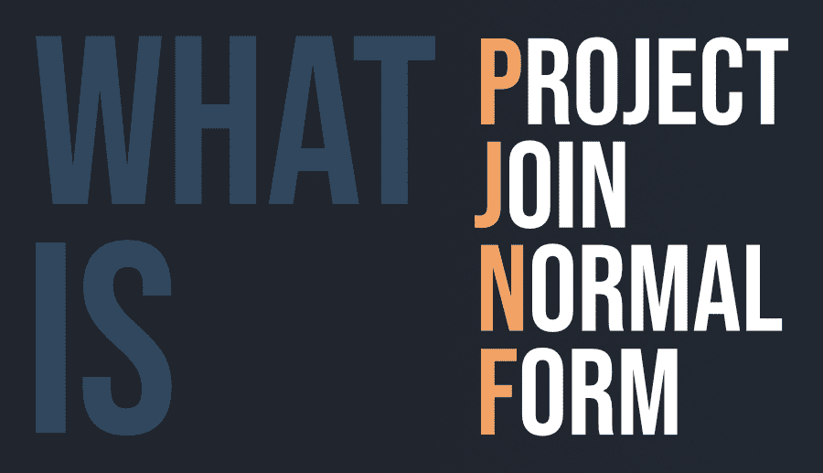

# 什么是 PJNF(Project-Join 范式)？

> 原文:[https://www . geesforgeks . org/what-is-pjnfproject-join-normal-form/](https://www.geeksforgeeks.org/what-is-pjnfproject-join-normal-form/)

**第五范式(5NF)** ，又称**项目-加入范式(PJNF)** 。这是一种数据库规范化级别，旨在减少关系数据库中的冗余。当且仅当一个关系满足 4NF 且不存在连接依赖时，该关系才被称为 5NF。如果一个关系可以通过连接多个子关系来重新创建，并且这些子关系中的每一个都具有原始关系的属性子集，则称该关系具有连接依赖性。

**连接依赖的条件:**
如果 R1 和 R2 在 Q 上的连接等于关系 R，那么我们可以说存在连接依赖，其中 R1 和 R2 是给定关系 R (P，Q，S)的分解 R1 (P，Q)和 R2 (Q，S)。R1 和 R2 是 r 的无损分解

**5NF 的性质:**
关系 R 在 5NF 中当且仅当它满足以下条件:

*   r 应该在 4NF(不存在多值依赖关系)。
*   它不能进行无损分解(连接依赖)

**示例:**考虑下面的关系 **R** 具有模式 R(供应商、产品、消费者)。主键是关系的所有三个属性的组合。

**Table 1**

| 供应者 | 产品 | 消费者 |
| S1 | 第一亲代 | C1 |
| S1 | P2 | C1 |
| S2 | 第一亲代 | C1 |
| S3 | P3 | C3 |

**Table 2**

| 供应者 | 产品 |
| S1 | 第一亲代 |
| S1 | P2 |
| S2 | 第一亲代 |
| S3 | P3 |

**Table 3**

| 消费者 | 产品 |
| C1 | 第一亲代 |
| C1 | P2 |
| C3 | P3 |

**Table 4**

| 供应者 | 消费者 |
| S1 | C1 |
| S2 | C1 |
| S3 | C3 |

**说明:**
表 2、表 3、表 4 联接后产生原表(表 1)。因此表 1 中存在连接依赖，因此表 1 不在 5NF 或 PJNF 中。然而，表 2、表 3 和表 4 满足 5NF，因为它没有多值依赖，不能进一步分解(连接依赖不存在)。但这可能不是在所有情况下都是正确的，即当我们组合分解的表时，结果表可能不等同于原始表，在这种情况下，如果原始表已经在 4NF，则称其为 5NF。然而，5NF 并没有应用于实际场景，仍然局限于理论概念。