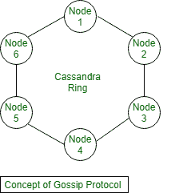
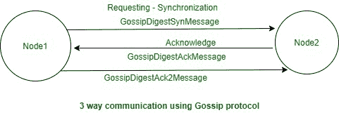

# 在卡珊德拉工作的八卦协议

> 原文:[https://www . geesforgeks . org/工作的流言-协议-in-cassandra/](https://www.geeksforgeeks.org/working-of-gossip-protocol-in-cassandra/)

在本文中，我们将讨论 gossip 协议的概述，并主要关注 Gossip 协议的工作以及在集群中与其他节点通信的角色是什么。我们一个一个来讨论。

****:**
在卡珊德拉，节点之间的通信就是通过八卦协议进行的。流言协议的主要作用是识别环中其他节点在做什么。流言协议的主要存在是为了确保每个节点都知道自己和环中每个其他节点的状态。**

****

****八卦协议的工作:**
在本文中，我们将讨论八卦协议的工作，在这里我们将看到八卦协议实际上是如何工作的，并将主要关注通信是如何在两个节点之间发生的。八卦协议必须能够知道其他节点的情况，并找到其他节点。现在，我们将逐一讨论功能。**

****

**它很可能是一个 TCP 三次握手协议。**

1.  ****SYN–**
    在同步部分，它会向集群中的接收节点发送 GossipDigestSynMessage 请求，接收节点会得到这个请求并做出相应的响应。** 
2.  ****确认–**
    请求同步后，一旦接收节点收到请求，它将确认该请求，并发送 GossipDigestAckMessage。** 
3.  ****ack 2–**
    最后，初始节点将获得确认，然后它将向接收节点发送 GossipDigestAck2Message 消息，以确认来自接收节点的确认响应。**

****八卦协议的工作步骤:****

1.  **最初，要接收端点状态信息，将在 Cassandra 启动时完成，它向 Gossiper 注册自己。**
2.  **之后，周期性地，通常每秒一次，八卦者将选择环中的随机节点开始八卦会话。**
3.  **之后，发起节点将向接收节点发送请求 GossipDigestSynMessage，这仅仅意味着它正在请求同步。**
4.  **之后，当接收节点收到请求时，它将使用 GossipDigestAckMessage 消息来确认请求。**
5.  **最后，当发起节点将从接收节点获得确认时，它将再次发送带有 GossipDigestAck2Message 消息的确认。**

****参考文献:**
https://wiki.apache.org/cassandra/ArchitectureGossip**