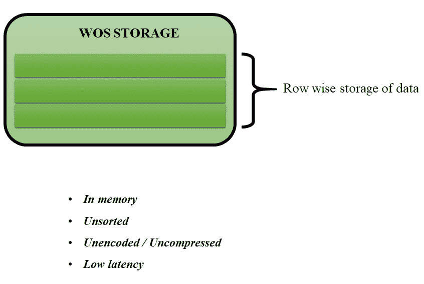
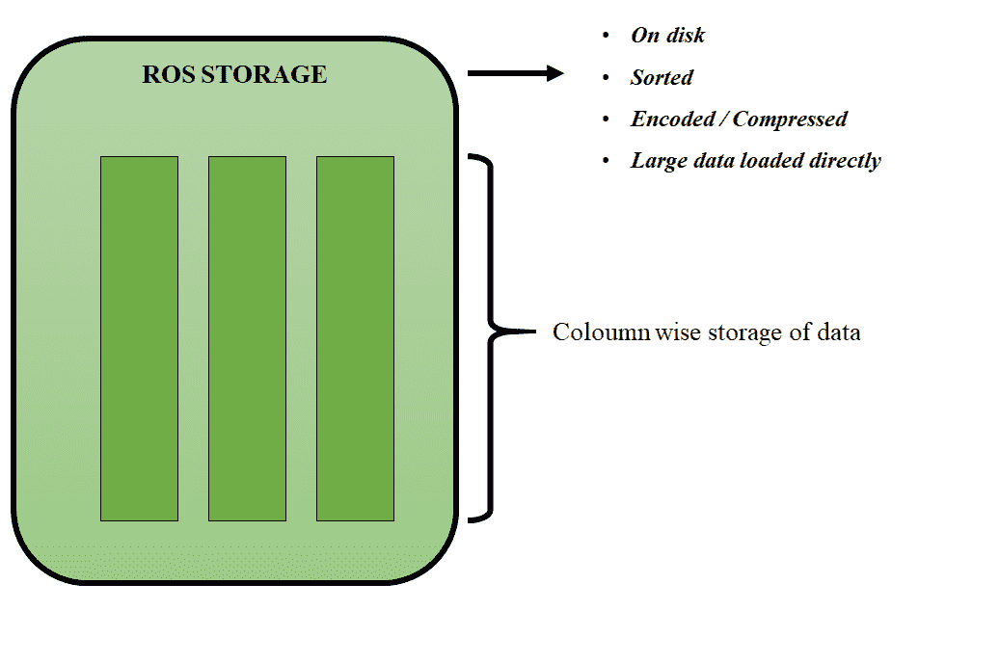

# 惠普 Vertica 的 WOS 和活性氧存储

> 原文:[https://www . geeksforgeeks . org/wos-and-ROS-storage-in-HP-vertica/](https://www.geeksforgeeks.org/wos-and-ros-storage-in-hp-vertica/)

[Vertica](https://www.geeksforgeeks.org/features-of-hp-vertica/) 在很多方面都是独一无二的，其中一点可以从它的数据存储模型中看到。Vertica 使用两种不同的结构来存储数据:WOS 存储(写优化行存储)和活性氧存储(读优化列存储)。这些解释如下。

**1。WOS :**
在 Vertica，WOS 代表写优化商店。WOS 是一种内存数据存储结构，针对低延迟数据加载进行了优化。它旨在高效地支持插入、更新、删除和大多数复制操作。

当您加载数据时，它首先进入 WOS(除非您使用 COPY DIRECT 语句)。WOS 的记录存储时没有压缩或索引，以支持更快的加载。

**2。ROS :**
另一方面，ROS 是为快速读取而构建的。ROS 代表读取优化存储。这是一种高度优化、面向读取的磁盘存储结构。

ROS 数据被划分成称为存储容器的部分。容器只是通过 move out 或 COPY DIRECT 语句创建并存储在特定文件组中的一组行。数据库中的大部分数据都存在于 ROS 中，并且是经过排序和压缩的。

