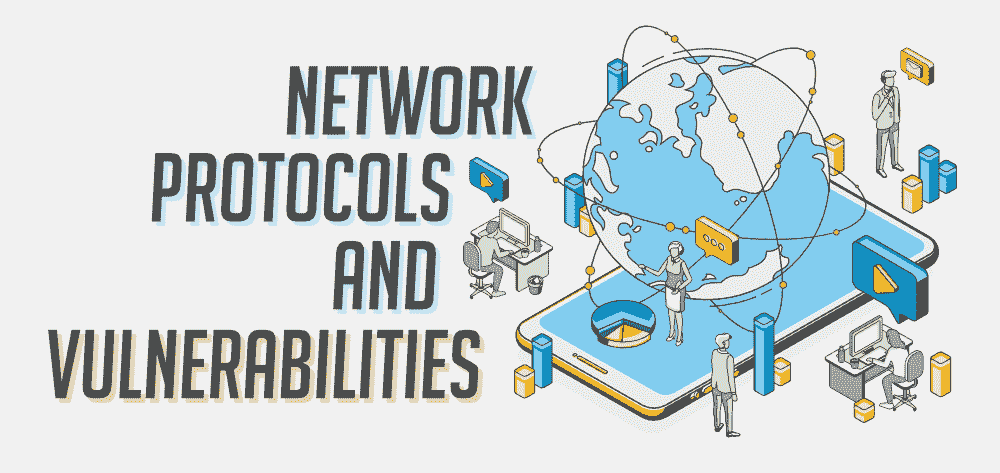

# 14 种最常见的网络协议及其漏洞

> 原文:[https://www . geesforgeks . org/14-最常见的网络协议及其漏洞/](https://www.geeksforgeeks.org/14-most-common-network-protocols-and-their-vulnerabilities/)

网络协议是一组既定的规则，通过遵循安全、可靠和简单的方法来控制和管理信息交换。这些规则集适用于各种应用。一些众所周知的协议示例包括有线网络(如以太网)、无线网络(如无线局域网)和互联网通信。用于在互联网上广播和传输数据的互联网协议套件包括几十种协议。

这些协议中存在许多漏洞，导致它们被主动利用，并对网络安全构成严重挑战。让我们了解 14 种最常见的网络协议以及其中存在的相应漏洞。

### 1.地址解析协议

一种通信层协议(数据链路层和网络层之间的映射过程)，用于识别给定 IP 地址的媒体访问控制(MAC)地址。在对等网络中，主机无法验证网络数据包来自何处。这是一个漏洞，会导致 ARP 欺骗。如果攻击者与目标在同一个局域网上，或者使用同一网络上的受损机器，攻击者就可以利用这一点。其思想是，攻击者将他的媒体访问控制地址与目标的 IP 地址相关联，以便攻击者接收任何去往目标的流量。

### 2.域名系统

IP 地址是数字格式的，因此人类不容易读取或记住。DNS 是一个分层系统，它将这些 IP 地址转换成人类可读的主机名。DNS 中最常见的漏洞是缓存中毒。在这里，攻击者替换合法的 IP 地址，将目标受众发送到恶意网站。在允许递归查找并使用递归来放大攻击幅度的 DNS 服务器上，也可以利用 DNS 放大。

### 3.文件传输协议/安全

它是一种基于客户机和服务器模型架构的网络协议，用于在计算机网络上的客户机和服务器之间传输文件。当攻击者使用网络应用程序以浏览器端脚本(或 cookies)的形式向用户发送恶意代码时，最常见的 FTP 攻击使用跨站点脚本。远程文件传输协议(FTP)不控制连接和加密其数据。用户名和密码以明文形式传输，任何网络嗅探器都可以截获，甚至可能导致中间人攻击(MITM)。

### 4.超文本传输协议/安全

它用于计算机网络上的安全通信。它的主要功能包括认证访问的网站，然后保护交换数据的隐私和完整性。HTTPS 的一个主要漏洞是淹没攻击，它帮助攻击者破解加密，窃取信用卡信息和密码。另一个严重的 bug 是 Heartbleed bug，它允许窃取受用于保护互联网的 TLS/SSL 加密保护的信息。其他一些漏洞包括分解 RSA 导出密钥和压缩比信息泄漏变得容易。

### 5.互联网消息访问协议

它是一种互联网电子邮件协议，将电子邮件存储在邮件服务器上，但允许最终用户检索、查看和操作存储在用户设备本地的邮件。首先，当电子邮件通过互联网发送时，它会通过未受保护的通信渠道。用户名、密码和消息本身都可能被截获。拒绝服务(DoS)攻击也可以在邮件服务器上执行，导致未收到和未发送的电子邮件。此外，电子邮件服务器可能会被注入恶意软件，而恶意软件又会使用受感染的附件发送给客户端。

### 6.邮局协议(POP3)

应用层互联网协议用于从远程服务器检索电子邮件到客户端的个人本地机器。即使在脱机状态下，它也可以用来查看邮件。以邮箱存储为目标的漏洞包括火线直接内存访问或 DMS 攻击，这种攻击依赖于使用直接硬件访问来直接读写主内存，而无需任何操作系统交互或监督。登录过程允许用户通过未加密的路径进行连接，从而以明文形式通过网络发送登录凭据。

### 7.远程桌面协议(RDP)

它由微软开发，是一种协议，为用户提供图形界面，通过网络连接到另一台计算机，其中一个用户运行 RDP 客户端软件，而另一个用户运行 RDP 服务器软件。一个名为 BlueKeep 的漏洞可能允许像 ransomware 这样的恶意软件在易受攻击的系统中传播。BlueKeep 允许攻击者连接到 RDP 服务。在此之后，他们可以发出命令来窃取或修改数据，安装危险的恶意软件，并可能进行其他恶意活动。利用漏洞不需要用户进行身份验证。它甚至不需要用户点击任何东西来激活。

### 8.会话发起协议

它是一种信令协议，用于启动、维护、更改和终止实时会话。这些会话可以包括语音、视频、消息以及 IP 网络上两个或多个端点之间的其他通信应用和服务。它可能遭受缓冲区溢出、注入攻击、劫持等安全威胁。这些对手很容易以最少的费用或几乎不花攻击者的钱来安装。当攻击者发送大量流量导致目标系统消耗其所有资源并使其无法为合法客户服务时，就会发生泛洪攻击。SIP 网络基础设施中的泛洪很容易发生，因为信令和数据传输的信道没有分离。

### 9.服务器消息块

它是一种网络通信协议，用于在网络节点之间提供对文件、打印机和串行端口的共享访问。它还提供了一个经过认证和授权的进程间通信机制。中小企业中的漏洞是中小企业中继攻击，用于实施中间人攻击。另一种攻击是永恒蓝攻击。各种版本的 Microsoft Windows 中的 SMBv1server 对来自远程攻击者的特制数据包处理不当，使他们能够在目标计算机上执行任意代码。

### 10.简单邮件传输协议

它是一种通信应用层协议，用于发送电子邮件。垃圾邮件发送者和黑客可以利用电子邮件服务器，在不知情的开放中继所有者的伪装下，通过电子邮件发送垃圾邮件或恶意软件。黑客还会执行目录收集攻击，这是一种从服务器或域中收集有效电子邮件地址供黑客使用的方法。漏洞还包括缓冲区溢出攻击、木马攻击、shell 脚本攻击等。

### 11.简单网络管理协议

它是一种互联网标准协议，用于收集和组织有关 IP 网络上被管理设备的信息，也用于更改和修改该信息以改变设备行为。SNMP 反射是一种分布式拒绝服务攻击。这些攻击每秒可产生数百千兆比特的攻击量，可从各种宽带网络指向攻击目标。对手使用伪造的 IP 地址(即受害者的 IP)向多个连接的设备发送大量 SNMP 查询，这些设备反过来回复该伪造的 IP 地址。随着越来越多的设备继续响应，攻击量变得越来越严重，直到目标网络被这些响应的总数量拖垮。

### 12.Secure SHell (SSH)

它是一种基于密码学的网络协议，用于在不安全的网络上安全可靠地运行网络服务。一些特定的应用程序包括远程命令行、远程命令执行、登录，但是任何网络服务都可以在 SSH 的帮助下变得安全。中间人(MITM)攻击可能会使对手完全不稳定，破坏加密，并可能获得对加密内容的访问权限，包括密码。成功的对手是向终端注入命令的电缆，以修改或更改传输中的数据或窃取数据。该攻击还可能允许将有害的恶意软件注入到通过系统下载的任何二进制文件和其他软件更新中。过去，各种攻击组和恶意软件包都使用过这种技术。

### 13.用于远程联接服务的标准协议或者实现此协议的软件(可为动词)

它是一种在互联网或[局域网](https://www.geeksforgeeks.org/types-of-area-networks-lan-man-and-wan/)上使用的应用协议，提供使用虚拟终端连接的双向交互式面向文本的通信。telnet 协议中最大的安全问题是缺乏加密。从正在配置的远程设备发送到网络设备的每个通信都是以纯文本形式发送的。攻击者可以很容易地看到我们在该设备上配置的内容，并且他可以看到我们用来连接到该设备并进入配置模式的密码。另一种类型的远程登录攻击是拒绝服务攻击，攻击者发送许多无用和不相关的数据帧，并以这种方式阻塞连接。

### 14.虚拟网络计算(VNC)

虚拟网络计算用于建立远程桌面共享，这是计算机网络上远程访问的一种形式。VNC 显示另一台计算机的可视桌面显示，并通过网络连接控制该计算机。所有攻击都是由不正确的内存使用引起的，利用它们的攻击会导致拒绝服务状态、故障、对用户信息的未授权访问以及在目标设备上运行恶意代码的选项。漏洞和攻击包括 DoS 攻击、缓冲区溢出、缓冲区下溢和远程代码执行。