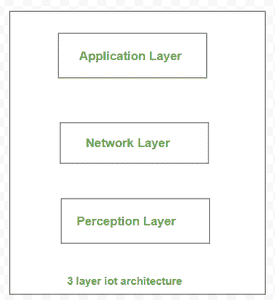

# 3 层物联网架构

> 原文:[https://www.geeksforgeeks.org/3-layer-iot-architecture/](https://www.geeksforgeeks.org/3-layer-iot-architecture/)

[物联网架构](https://www.geeksforgeeks.org/introduction-to-internet-of-things-iot-set-1/)是一个框架，它规定了要使用的物理元素、网络技术安排和设置、操作程序和数据格式。物联网架构可能因执行情况而有很大差异；它必须足够灵活，开放协议才能处理许多网络应用。

**3 层物联网架构:**

三层物联网架构

三层体系结构是常见且普遍已知的结构。它首次用于物联网研究的初始阶段。它表示三个层次:感知、网络和应用。

**1。感知层:**

这个感知层是物联网架构的物理层。在这些传感器和嵌入式系统中主要使用。这些工具根据需求收集大量数据。这也包括与周围环境通信的边缘设备、传感器和执行器。它检测某些空间参数或检测周围的其他智能事物/物体。

**2。网络层:**

这些设备获得的数据必须分发和存储。这是网络层的责任。它将这些智能对象绑定到其他智能/智能对象。它还负责数据传输。网络层负责链接智能对象、网络设备和服务器。它还用于分发和分析传感器数据。

**3。应用层:**

用户与这个应用层通信。它负责向客户提供软件资源。例如，在智能家居应用程序中，用户按下应用程序中的按钮来打开咖啡机。应用层负责向客户提供特定于应用程序的资源。它规定了物联网的不同用途，如智能住宅、智能城市和智能健康。