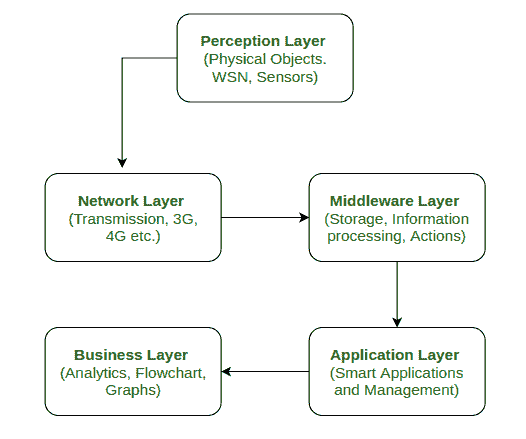

# 物联网 5 层架构

> 原文:[https://www . geeksforgeeks . org/5 层架构物联网/](https://www.geeksforgeeks.org/5-layer-architecture-of-internet-of-things/)

[物联网(IoT)](https://www.geeksforgeeks.org/introduction-to-internet-of-things-iot-set-1/) 包括借助各种联网技术连接到广阔互联网网络的大量智能设备。这些技术大多是无线的。这使得结构更加复杂和难以管理。因此，需要架构。

体系结构是网络物理组件及其功能组织和配置、操作原理和过程以及操作中使用的数据格式的规范结构。

物联网的发展取决于所使用的技术、应用领域和业务方面。物联网设备有多种物联网架构。然而，“5 层架构被认为是物联网的最佳架构。”

**物联网的 5 层架构:**
当项目工作采用各种前沿技术和广阔的应用领域完成时，5 层架构被认为是最好的。5 层模型可以被认为是物联网基本架构的扩展，因为它在基本模型的基础上增加了两层。

物联网 5 层架构

*   **感知层:**
    这是物联网架构的第一层。在感知层，许多传感器和执行器用于收集有用的信息，如温度、水分含量、入侵者检测、声音等。该层的主要功能是从周围环境中获取信息，并将数据传递到另一层，以便可以基于该信息执行一些操作。
*   **网络层:**
    顾名思义，是感知层和中间件层之间的连接层。它从感知层获取数据，并使用 3G、4G、UTMS、WiFI、红外等网络技术将数据传递到中间件层。这也被称为通信层，因为它负责感知层和中间件层之间的通信。所有数据传输都是安全完成的，对获得的数据保密。
*   **中间件层:**
    中间件层有一些高级功能，比如存储、计算、处理、动作采取能力。它存储所有数据集，并根据设备地址和名称为该设备提供适当的数据。它还可以根据从传感器获得的数据集进行计算来做出决定。
*   **应用层:**
    应用层基于从中间件层获取的信息管理所有应用进程。该应用包括发送电子邮件、激活警报、安全系统、打开或关闭设备、智能手表、智能农业等。
*   **业务层:**
    任何设备的成功不仅取决于其中使用的技术，还取决于如何将其交付给消费者。业务层为设备执行这些任务。它包括制作流程图、图表、结果分析以及如何改进设备等。