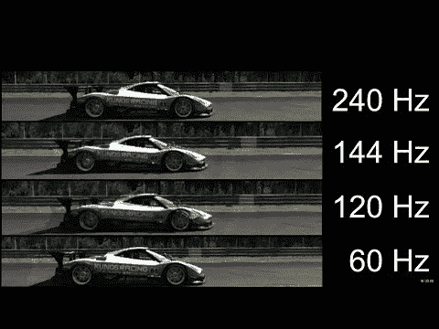
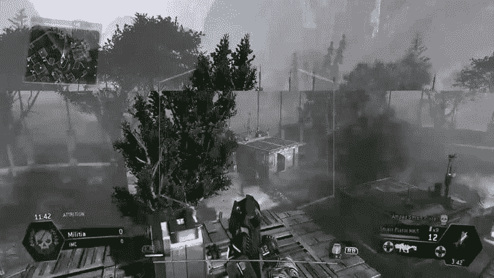

# 60 Hz vs 144 Hz:有关系吗？

> 原文:[https://www . geesforgeks . org/60-Hz-vs-144-Hz-无所谓/](https://www.geeksforgeeks.org/60-hz-vs-144-hz-does-it-matter/)

如果你正在玩电子游戏，或者读过关于任何电脑、笔记本电脑或电视屏幕的描述，那么你应该知道术语——刷新率——60hz 或更高。但是，你有没有厌倦去寻找一些关于它的信息，或者试图去思考它对屏幕是否有任何影响？现在我们可以看到刷新率的含义，以及 60 Hz 和 144 Hz 是否有区别。

**刷新率是什么意思？**
所以，刷新率基本上是任何屏幕的规格，它的单位是赫兹，也是频率的单位。这最终意味着它告诉我们 1 秒钟内屏幕可以显示多少张图片。

这样，60 Hz 意味着屏幕可以在 1 秒内显示 60 张图片，144 Hz 意味着屏幕可以在 1 秒内显示 144 张图片，以此类推。

更高的赫兹数或更高的刷新率意味着您每秒钟可以获得足够多的图片，这使得屏幕上的图片显示越来越流畅。更高的刷新率本质上使你获得更流畅的游戏或视频质量，这在游戏时非常重要。

**60hz 屏幕和 144 Hz 屏幕有什么不同？**
过去，据说我们的眼睛最多只能看到 30Hz。这个数字后来增加到 60Hz，现在这些数字还不能得出结论。随着市场上 144Hz 屏幕的推出，每个人都看到了巨大的差异，当你从 60 Hz 切换到 144Hz 显示屏时，即使从 60Hz 屏幕跳到 120Hz 屏幕，你也能看到差异。

另一方面，从 144 赫兹到 240 赫兹的差异似乎并不大，也许是因为我们的眼睛视力有限。但是，与 144 赫兹屏幕相比，240 赫兹屏幕的显示差异要平滑得多。

对于一个正常人来说，观察不同显示器之间的差异可能是困难的。但是对于游戏玩家来说，显示器上的这些微小差异可能是生与死的界限，也可能是主宰严肃比赛的关键，尤其是像 CS:GO、Overwatch、Rainbow Six Seige、堡垒之夜和 PUBG 这样的 FPS 游戏。

游戏画面的质量或图形都不会提高。提高的是显示的连续性。60Hz 屏幕将在一秒钟内显示 60 张独特的图片，而 120Hz 屏幕将在一秒钟内显示 120 张独特的图片。说到底，Hz 只是提升游戏流畅性的刷新率，与提升质量完全没有关系。

这种效果的主要原因是因为观想。从我们的眼睛以连续的顺序看到图片开始，我们的大脑就被从第一张图片开始到最后一张图片的顺序填满了，使图片看起来像一个不间断的视频，而不是真实的静态图片的某种排列。然而，这个填充过程带来了模糊。随着越来越多的数据以越来越快的速度发送到我们的大脑，发展看起来更加顺利。

这也有助于我们更快地应对由于屏幕刷新率较低而导致反应明显较慢的情况。

**刷新率与 GPU 的关系:**
如果你从事游戏，那么你也会听说过每秒帧数这个术语。我们系统中的图形处理器负责给出与我们屏幕同步的每秒帧数，而屏幕负责刷新率。由图形处理器创建的帧必须小于或等于显示器的刷新率，这意味着有时图形处理器给我们 144 fps，那么在这一点上，我们的屏幕必须有能力显示它，并在任何情况下至少有 144 赫兹的刷新率，否则将导致屏幕撕裂。

当你使用一个发送更多帧的图形处理器时，这种情况就会发生，而这些帧是我们的屏幕无法处理的。屏幕看起来好像是半满的，或者是从中间撕裂的。

为了解决这个问题，游戏的帧速率可以限制在我们的屏幕刷新率，例如，如果你的屏幕刷新率是 60Hz，那么你的帧不会超过每秒 60 帧。

**我要换屏吗？**
那么，我们脑海中浮现的最后一个问题就是，我的屏幕从 60 Hz 换成 144 Hz 值得吗。如果你问我，在这一点上，我当然会说，如果我们想体验更流畅的视频体验，那么你应该换成 144 赫兹的屏幕。然而，在某些情况下，240 赫兹的屏幕就不一样了，事实表明，它会比 144 赫兹的屏幕显示更流畅的体验，但它需要的支出会比上一个更多，因为你必须有一个图形处理器来创建如此多的帧，否则不建议从 144 赫兹的显示器进行更改。