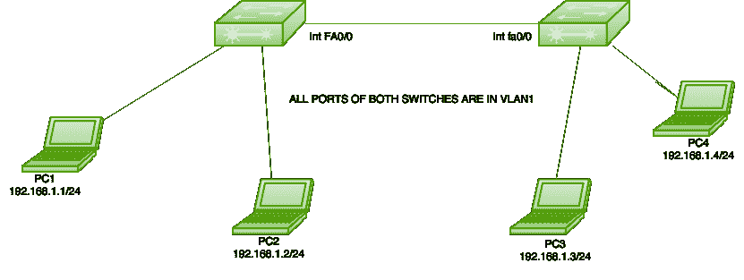
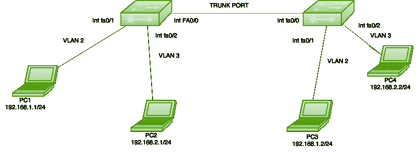

# 接入和中继端口

> 原文:[https://www.geeksforgeeks.org/access-trunk-ports/](https://www.geeksforgeeks.org/access-trunk-ports/)

交换机端口是第 2 层接口，用于承载第 2 层流量。无论是接入端口还是中继端口，单个交换机端口都可以承载单个 VLAN 流量。根据帧所经过的链接类型，帧的处理方式也不同。

**注意:**默认情况下，所有交换机端口都分配有 VLAN 1(不能修改或删除 VLAN 1)。

交换环境中有两种不同类型的端口:

**接入端口–**
这些交换机端口属于只承载一个 VLAN 的流量。默认情况下，它将承载本地 VLAN (VLAN 1)的流量。如果交换机端口被指定为接入端口，那么它们可以被视为属于单个广播域。到达这些交换机端口的任何流量都被视为属于分配给该端口的 VLAN。
**例:**



下面是一个简单的拓扑，其中连接了两台交换机，并且两台交换机上都只配置了默认的 VLAN (VLAN 1)，即两台交换机的所有交换机端口都属于一个广播域。

现在，请注意交换机之间的链路必须配置为接入端口，因为只需交换一个 VLAN (VLAN 1)数据。现在，在为 PC1-192.168.1.1/24、PC2-192.168.1.2/24、PC3-192.168.1.3/24、PC3-192.168.1.4/24 分配了一个 IP 地址后，用户应将两台交换机之间的链路配置为接入端口。

```
Switch1(config)#interface fa0/0
Switch1(config-if)#switchport mode access
```

这里，不需要将 VLAN 分配给端口，因为两台交换机上的所有交换机端口默认配置为 VLAN 1。

**中继端口–**
这些交换机端口属于并承载多个 VLAN 的流量。这是一个很大的优势，因为要承载一组 VLAN 的流量，可以使用单个交换机端口。如果用户希望在配置了多个 VLAN 的多台交换机之间交换流量，这些功能非常有用。为了识别属于 VLAN 的流量，使用了 VLAN 识别方法(802.1q 或 ISL)。此外，要在多个 VLAN 之间传输流量，则需要 VLAN 间路由，其中路由器和交换机之间的链路被配置为中继链路，因为该链路必须传输多个 VLAN 的流量(如果路由器采用棒形配置，则不在由第 3 层交换机进行的 VLAN 间路由中)。

**注意:**中继链路可以承载不同虚拟局域网之间的流量，但是默认情况下，如果交换机之间的链路不是中继链路，那么将只交换来自配置的接入 VLAN 的信息。

**示例:**



这是一个简单的拓扑，其中连接了 2 台交换机，并且在两台交换机上都配置了 VLANs 2 和 3，如图所示。

**注意–**
用户没有给交换机的其他端口分配任何 VLAN，因此默认情况下其他端口在 VLAN 1。
现在，请注意交换机之间的链路必须配置为中继端口，因为在这里，交换机之间必须交换多个 VLAN (VLAN 1，2，3)帧。现在将 IP 地址分配给 PC1-12.168.1.1/24、PC2-192.168.2.1/24、PC3-192.168.1.2/24、PC3-192.168.2.2/24。

现在，第一个用户必须在两台交换机上创建虚拟局域网。

```
Switch1(config)#vlan 2
Switch1(config)#vlan 3

Switch2(config)#vlan 2
Switch2(config)#vlan 3
```

现在，一个用户在两台交换机上配置了多个 VLAN。因此，用户必须将虚拟局域网分配给交换机 1 上各自的端口。

```
Switch1(config)#interface fa0/1
Switch1(config-if)#switchport access vlan 2
Switch1(config)#interface fa0/2
Switch1(config-if)#switchport access vlan 3
```

现在，在交换机 2 的各自端口上配置虚拟局域网。

```
Switch2(config-if)#interface fa0/1
Switch2(config-if)#switchport access vlan 2
Switch2(config)#interface fa0/2
Switch2(config-if)#switchport access vlan 3
```

现在，将两台交换机之间的链路配置为中继端口。

```
Switch1#interface fa0/0
Switch1#switchport trunk encapsulation dot1q
Switch1#switchport mode trunk
```

因此，现在用户可以从一台交换机向另一台交换机传输多个 VLAN 流量(这里只显示交换机端口的配置，不显示路由器的配置。为了执行 VLAN 间路由，还需要路由器的配置)。