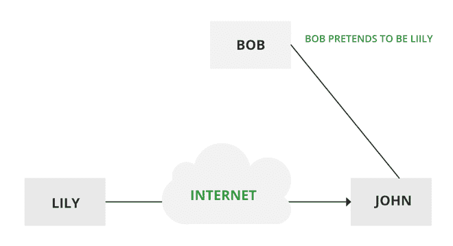
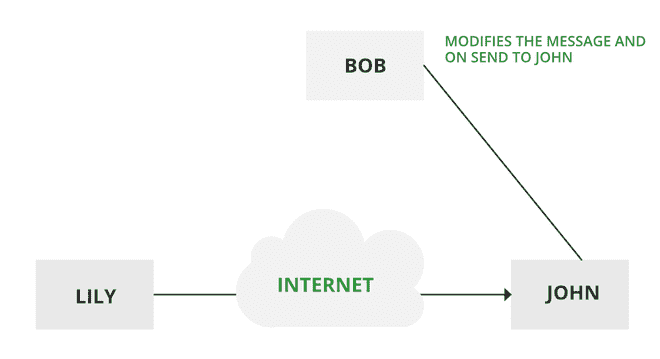
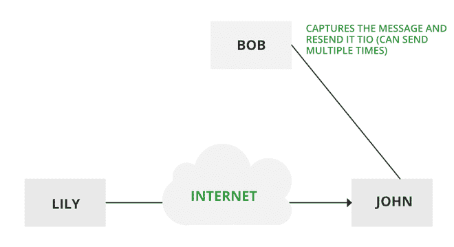
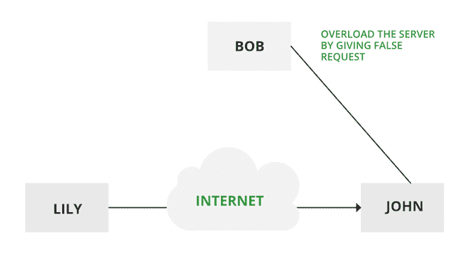
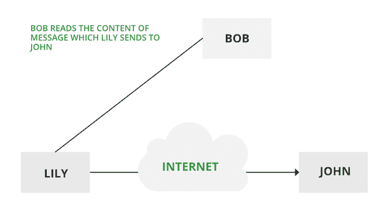
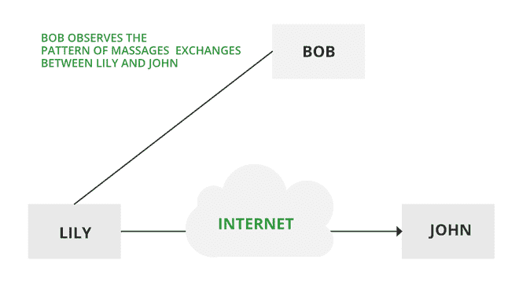

# 信息安全中的主动和被动攻击

> 原文:[https://www . geesforgeks . org/主动和被动攻击信息安全/](https://www.geeksforgeeks.org/active-and-passive-attacks-in-information-security/)

**主动攻击:**主动攻击试图改变系统资源或影响其运行。主动攻击涉及数据流的某些修改或虚假陈述的创建。主动攻击的类型如下:

*   伪装
*   消息的修改
*   拒绝
*   重播
*   拒绝服务

### **化妆舞会–**

当一个实体伪装成另一个实体时，就会发生伪装攻击。假面攻击包括其他形式的主动攻击。如果授权程序并不总是受到绝对的保护，那么它就会变得非常容易受到伪装攻击。伪装攻击可以使用被盗的密码和登录名，借助于在程序中查找间隙，或者借助于在认证过程中使用定位方式来执行。

假面攻击

### **消息修改–**

这意味着消息的某些部分被更改，或者消息被延迟或重新排序，从而产生未经授权的效果。修改是对原始数据完整性的攻击。这基本上意味着未经授权的一方不仅可以访问数据，还可以通过触发拒绝服务攻击来欺骗数据，例如更改传输的数据包或在网络中充斥虚假数据。制造是对身份验证的攻击。例如，意思是“允许约翰读取机密文件 X”的消息被修改为“允许史密斯读取机密文件 X”。

**修改消息**

### **否认–**

当网络不完全安全或登录控件被篡改时，就会发生此攻击。通过这种攻击，作者的信息可以被恶意用户的行为所改变，以便在日志文件中保存虚假数据，甚至可以代表其他人对数据进行一般操作，类似于电子邮件的欺骗。

### **重播–**

它包括被动捕获一条消息，并随后传输以产生授权效果。在这种攻击中，攻击者的基本目的是保存该特定网络上最初存在的数据的副本，然后将这些数据用于个人用途。一旦数据被破坏或泄露，对用户来说是不安全的。

**重播**

### **拒绝服务–**

它妨碍了通信设施的正常使用。这次攻击可能有特定的目标。例如，实体可以抑制指向特定目的地的所有消息。拒绝服务的另一种形式是中断整个网络，要么禁用网络，要么用消息使网络过载，从而降低性能。

**拒绝服务**

**被动攻击:**被动攻击试图从系统中学习或利用信息，但不影响系统资源。被动攻击的本质是窃听或监控传输。对手的目标是获取正在传输的信息。被动攻击的类型如下:

*   消息内容的发布
*   交通分析

### **消息内容的发布–**

电话交谈、电子邮件或传输的文件可能包含敏感或机密信息。我们希望阻止对手了解这些传输的内容。

**被动攻击**

### **流量分析–**

假设我们有一种屏蔽(加密)信息的方法，这样攻击者即使捕获了消息也无法从消息中提取任何信息。
对手可以确定通信主机的位置和身份，并可以观察正在交换的消息的频率和长度。该信息可能有助于猜测正在进行的通信的性质。
针对流量分析最有用的保护措施是对 SIP 流量进行加密。为此，攻击者必须访问 SIP 代理(或其呼叫日志)来确定是谁发出的呼叫。

**流量分析**