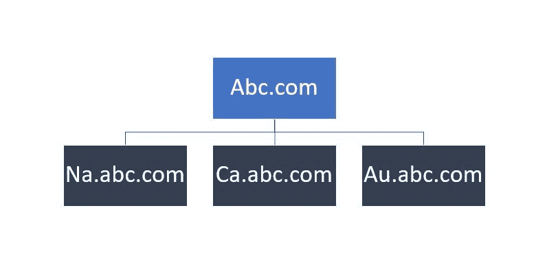
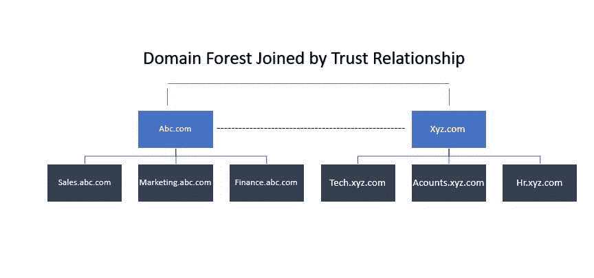

# 活动目录测试

> 原文:[https://www.geeksforgeeks.org/active-directory-pentesting/](https://www.geeksforgeeks.org/active-directory-pentesting/)

**活动目录**是微软的一项服务，用于管理由视窗服务器运行的服务，以提供权限和对网络资源的访问。超过 90%的财富公司使用活动目录来有效管理资源。

活动目录就像一本电话簿，我们把信息当作对象。在活动目录中，我们有计算机、用户、打印机等对象。以下是活动目录 的一些 ***组件–***

## 域控制器–

域控制器通常是活动目录的*管理员，用于设置整个目录。域控制器的作用是向不同的服务和用户提供身份验证和授权。域控制器还允许管理访问来管理用户帐户和网络资源。在活动目录中，域控制器具有最高的优先级，并且拥有最多的权限/特权。换句话说，我们可以说域控制器是活动目录的管理员。*

## 活动目录数据存储–

活动目录数据存储包含为用户、服务和应用程序存储和管理目录信息的数据库文件和进程。活动目录数据存储包含“`NTDS.DIT`”文件，它是整个 AD 中最关键的文件。它存储在所有域控制器上的“`%SystemRoot%\NTDS`”文件夹中。该 `NTDS.DIT`文件只能通过 DC 进程和协议访问。

### 逻辑活动目录组件–

以下是活动目录数据存储包含的组件，这些组件定义了在广告环境中创建对象的规则。

### 领域–

域用于将对象分组在一起并管理它们。该域提供了一个身份验证和授权边界，该边界提供了一种限制对该域资源的访问范围的方法。
把 abc.com 当成一个领地。

### 树木–

树通常是活动目录环境中的域组。树用于与父域共享连续的命名空间。树还可以有子域。默认情况下，树创建与其他域的可传递信任。考虑下图“树”。

上图中，ABC 是主域，ca.abc.com、na.abc.com 和 au.abc.com 代表不同位置的树木。Ca 代表加拿大，AU 代表澳大利亚，等等。

### 森林–

据说森林是树木的集合体。林在其分支之间共享公共模式。在森林分支的分区中，配置保持不变。林中维护所有域之间的信任。他们可能共享企业管理和模式管理概念。考虑下面给出的图片，以便形象地理解这个概念。

## 组织单位–

组织单位通常被称为组织单位。组织单位是活动目录容器，通常包含用户组、计算机和其他组织单位。OU 以层次和逻辑的方式表示您的计算机组织。OU 用于以一致的方式管理对象的集合。组织单位必须将权限委托给对象的管理员组。最后，组织单位在整个结构中应用策略/规则。

### 信托–

在关于活动目录的通俗语言中，信任可以被定义为资源之间的访问，以便获得对另一个域中的资源的许可/访问。活动目录中的信任一般有两种类型，即**定向信任**和**传递信任**。

1.**方向信任**:从信任域流向受信任域的信任方向。为了更好地理解，请考虑下图。
T3】

2.**可传递**:信任关系扩展到真正的域信任之外，包括其他受信任的域。为了更好地理解，请考虑下图。
T3】

> **备注:**
> 
> 1.林中的所有域都信任林中的所有其他域。
> 2。信任可以扩展到森林之外。