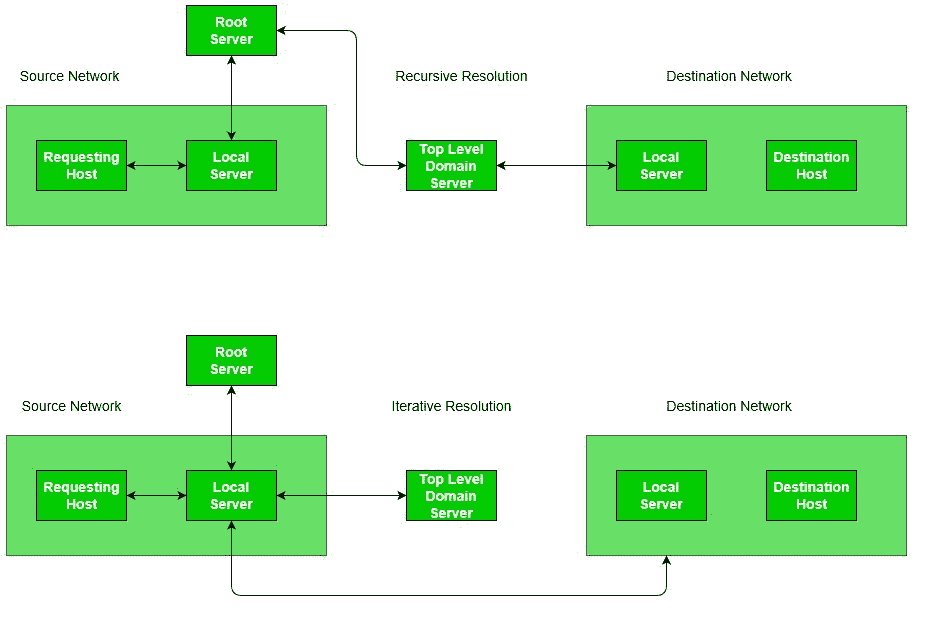

# DNS(域名服务器)中的地址解析

> 原文:[https://www . geesforgeks . org/address-resolution-in-DNS-domain-name-server/](https://www.geeksforgeeks.org/address-resolution-in-dns-domain-name-server/)

先决条件–[域名服务器](https://www.geeksforgeeks.org/dns-domain-name-server/)
将域名映射到一个 IP 地址被称为**名称-地址解析**。域名服务器解析程序通过咨询名称服务器来执行此操作。

为了找到特定的域名系统请求主机，将其查询与映射请求一起放入本地域名系统服务器。如果它有该信息，则解析器被满足，否则解析器被提交给其他服务器或者其他服务器被要求提供该信息。解析器获取响应后，检查响应是否正确。如果响应是正确的，响应将被传递给请求它的进程，否则名称查询将失败。

解析可以有两种类型——迭代和递归。

**1。递归解析–**
这里，客户端要求本地服务器提供请求的映射或错误消息。应用程序向解析器生成域名系统查询，以获取目标 IP 地址。然后，查询被转发到本地域名系统服务器。如果它知道 IP 地址，它会向解析器发送响应。假设它不知道 IP 地址，它会将查询发送到根名称服务器。

根名称服务器包含至少一个顶级域服务器的信息。然后，查询被发送到相应的顶级域服务器。如果它包含映射，响应将被发送回根服务器，然后发送到主机的本地服务器。如果它不包含映射，它应该包含目的地本地 DNS 服务器的 IP 地址。本地域名系统服务器知道目的主机的 IP 地址。该信息随后被发送回顶级域服务器，然后发送到根服务器，然后发送到主机的本地 DNS 服务器，最后发送到主机。

**2。迭代解析–**
迭代解析和递归解析的主要区别在于，这里不知道映射的每台服务器都将下一台服务器的 IP 地址发送给请求它的服务器。在这里，客户端允许服务器返回它能给出的最佳答案作为匹配或推荐。应用程序向解析器生成域名系统查询，以获取目标 IP 地址。然后，查询被转发到本地域名系统服务器。假设它不知道 IP 地址，它会将查询发送到根名称服务器。

根名称服务器将顶级域服务器的 IP 地址返回给本地服务器。本地服务器联系顶级域服务器，并返回目标主机的 IP 或其本地 DNS 服务器。如果它返回服务器的地址，那么通过联系目的地的本地域名系统服务器，我们得到目的地主机的 IP 地址。然后，响应/映射从主机的本地 DNS 服务器传递到解析器，最后传递到主机。

**缓存机制–**
在迭代和递归解析中，当一台服务器向另一台服务器请求映射请求后，它会收到响应，并将该信息存储在缓存中，然后再发送给客户端。这样做是为了减少服务器检查其数据库中的 IP 地址所需的搜索时间。因此，下一次，如果一个请求到达服务器，它首先检查它的缓存，并试图解决这个请求。该响应被标记为**未授权**，以通知客户端该响应来自缓存。缓存可能有问题的唯一方式是当服务器长时间缓存映射并且映射过时时。然而，有一些技术可以解决这个问题，比如使用 **TTL** 。