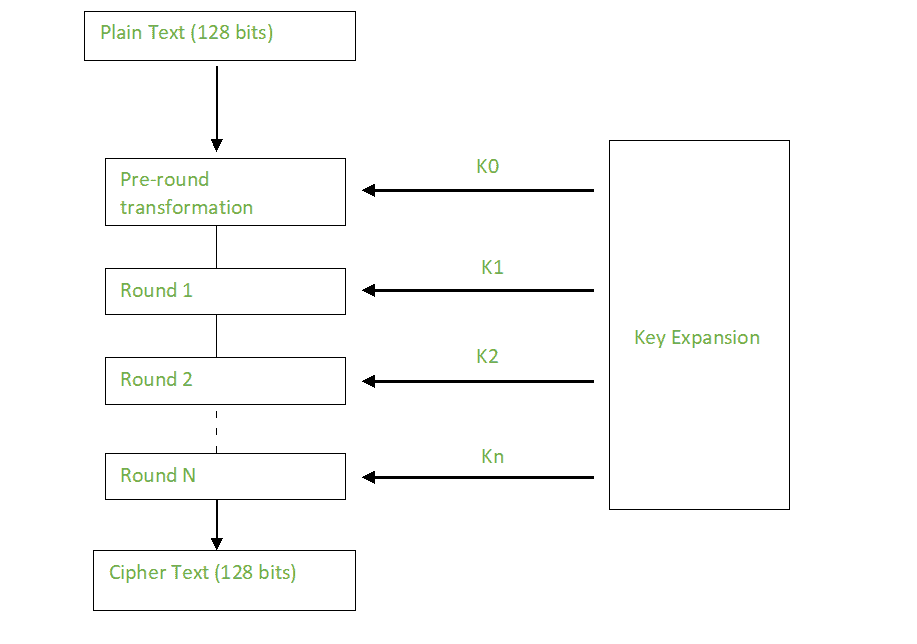
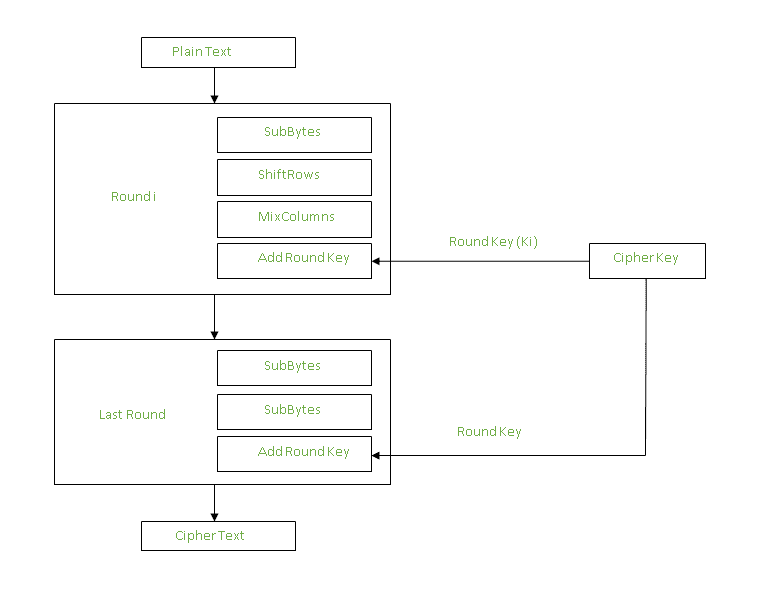

# 高级加密标准(AES)

> 原文:[https://www . geesforgeks . org/advanced-encryption-standard-AES/](https://www.geeksforgeeks.org/advanced-encryption-standard-aes/)

[高级加密标准(AES)](https://www.geeksforgeeks.org/aes-full-form/) 是美国国家标准与技术研究所(NIST)于 2001 年制定的电子数据加密规范。AES 今天被广泛使用，因为它比 DES 和三重 DES 强得多，尽管更难实现。

需要记住的要点

*   AES 是一种分组密码。
*   密钥大小可以是 128/192/256 位。
*   以 128 位为单位加密数据。

这意味着它以 128 位作为输入，输出 128 位加密密文作为输出。AES 依赖于置换-置换网络原理，这意味着它是使用一系列链接操作来执行的，这些操作涉及输入数据的替换和洗牌。

**密码的工作方式:**
AES 对数据字节而不是位进行运算。由于块大小为 128 位，密码一次处理 128 位(或 16 字节)的输入数据。

轮数取决于钥匙长度，如下所示:

*   128 位密钥–10 轮
*   192 位密钥–12 轮
*   256 位密钥–14 轮

**创建倒圆角关键点:**
使用关键点调度算法从关键点计算所有倒圆角关键点。因此，初始密钥用于创建许多不同的轮密钥，这些密钥将用于相应的一轮加密。



**加密:**
AES 将每个数据块视为一个 16 字节(4 字节×4 字节= 128)的网格，以列为主排列。

```
[ b0 | b4 | b8 | b12 |
| b1 | b5 | b9 | b13 |
| b2 | b6 | b10| b14 |
| b3 | b7 | b11| b15 ]
```

每一轮包括 4 个步骤:

*   子字节
*   师父！师父
*   混合列
*   添加倒圆角键

最后一轮没有混合列轮。

子字节进行替换，移位行和混合列在算法中进行置换。

**子字节:**
这一步实现替换。

在这个步骤中，每个字节被另一个字节替代。(它是使用一个查找表来执行的，也称为 S 盒。这种替换的方式是一个字节永远不会被它自己替换，也不会被另一个字节替换，后者是当前字节的补充。这一步的结果是一个 16 字节(4 x 4)的矩阵，就像以前一样。

接下来的两个步骤实现排列。

**ShiftRows :**
这一步听起来就是这样。每行被移位特定的次数。

*   第一行不移位
*   第二行向左移动一次。
*   第三行向左移动两次。
*   第四行向左移动三次。

(执行左循环移位。)

```
[ b0  | b1  | b2  | b3  ]         [ b0  | b1  | b2  | b3  ]
| b4  | b5  | b6  | b7  |    ->   | b5  | b6  | b7  | b4  |
| b8  | b9  | b10 | b11 |         | b10 | b11 | b8  | b9  |
[ b12 | b13 | b14 | b15 ]         [ b15 | b12 | b13 | b14 ]
```

**MixColumns :**
这一步基本上是矩阵乘法。每一列都乘以一个特定的矩阵，因此列中每个字节的位置也随之改变。

**上一轮跳过这一步。**

```
[ c0 ]         [ 2  3  1  1 ]  [ b0 ]
| c1 |  =      | 1  2  3  1 |     | b1 |
| c2 |      | 1  1  2  3 |     | b2 |
[ c3 ]      [ 3  1  1  2 ]     [ b3 ]
```

**添加轮键:**
现在上一阶段的结果输出与相应的轮键进行异或运算。这里，16 个字节不被认为是一个网格，而只是 128 位数据。



在所有这些回合之后，128 位加密数据作为输出返回。重复这个过程，直到所有要加密的数据都经历这个过程。

**解密:**
回合中的阶段可以很容易地撤销，因为这些阶段有一个相反的，当执行时会恢复变化。根据钥匙的大小，每 128 个街区要经过 10、12 或 14 轮。

解密中每一轮的阶段如下:

*   添加圆角键
*   反向混合列
*   师父！师父
*   反向子字节

解密过程与加密过程相反，因此我将解释有明显不同的步骤。

**逆混合列:**
这一步类似于加密中的混合列步骤，但不同之处在于用于执行操作的矩阵。

```
[ b0 ]         [ 14  11  13  9  ]  [ c0 ]
| b1 |  =      | 9   14  11  13 |     | c1 |
| b2 |      | 13  9   14  11 |     | c2 |
[ b3 ]         [ 11  13  9   14 ]     [ c3 ]
```

**反向子字节:**
反向 S 盒用作查找表，使用它在解密期间替换字节。

**总结:**
AES 指令集现已集成到 CPU 中(提供数 GB/s 的吞吐量)，以提高使用 AES 进行加密和解密的应用程序的速度和安全性。尽管自推出以来已经有 20 年了，但我们未能打破 AES 算法，因为即使采用当前的技术，它也是不可行的。到目前为止，唯一的漏洞仍然存在于算法的实现中。