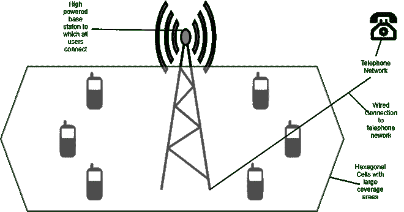

# 高级手机系统

> 原文:[https://www.geeksforgeeks.org/advanced-mobile-phone-system/](https://www.geeksforgeeks.org/advanced-mobile-phone-system/)

所有的变化 **AMPS(高级移动电话系统)**由贝尔实验室发明，1982 年首次在美国安装。在所有的移动电话系统中，一个地理区域被划分为多个单元，这就是为什么这些设备有时被称为手机。

在安培的细胞，他们通常是 10 至 20 公里，在数字系统的细胞更小。每个小区使用一些邻居没有使用的频率。赋予蜂窝系统比以前的系统更大容量的关键思想是使用相对较小的小区，并在附近的小区中重用传输频率。因此，蜂窝设计将系统容量提高了至少一个数量级，比蜂窝变小的幅度更大。更小的电池意味着需要更少的电力，这导致更小更便宜的发射器和手机。

**放大器的工作:**

*   在用户数量已经增长到系统过载的区域，可以降低功率，过载的小区可以降低功率，过载的小区分裂成小的微小区，以允许更多的频率重用。每个小区的中心是基站，小区内的所有电话都向基站发送信号。
*   基站由计算机和连接到天线的发射机/接收机组成。在小型系统中，所有的基站都连接到一个叫做 MSC(移动交换中心)或 MTSO(移动电话交换局)的设备。
*   如同在电话系统中一样，移动交换中心对于终端局是必不可少的，并且实际上连接到至少一个电话系统终端局。
*   在任何时刻，移动电话在逻辑上都处于一个指定的小区中，并且处于该小区基站的控制之下。然后电话会被告知新的老板，如果有电话正在进行，电话会被要求切换到新的频道。
*   这个被称为切换的过程需要大约 300 毫秒。信道分配由系统的神经中枢 MSC 完成。基站它真的只是哑无线电中继。

**特征:**

*   这是一个模拟系统，基于联邦通信委员会对蜂窝服务的初始电磁频谱分配。
*   它使用频分多址进行多个同时对话。
*   当对话数量很大时，需要很高的带宽。
*   第一次使用六边形细胞。
*   AMPS 中的电池跨度为 10 公里至 20 公里。
*   因为它是模拟技术，所以会受到噪音和窃听的困扰。