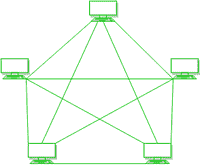

# 网状拓扑的优缺点

> 原文:[https://www . geeksforgeeks . org/网状拓扑的优缺点/](https://www.geeksforgeeks.org/advantage-and-disadvantage-of-mesh-topology/)

**先决条件–**[网络拓扑类型](https://www.geeksforgeeks.org/types-of-network-topology/)

**网状拓扑:**

在网状网络中，所有的计算机在网络中相互连接。每台计算机不仅发送自己的信号，还中继来自其他计算机的数据。这些节点完全通过专用链路相互连接，在此期间，信息从一个节点传播到另一个节点，如果有 N 个节点，则网格中有 N(N-1)/2 个链路。每个节点都有一个到对面节点的点对点连接。网格内的连接通常是有线或无线的。

网状拓扑有两种类型–

1.  **全连接网状拓扑**
2.  **部分连接的网状拓扑**

**1。全网状拓扑:**

网络中的所有节点相互连接如果网络中有 n 个节点，则每个节点将有 n-1 个连接。全网状网提供了大量的冗余，但是因为实现起来过于昂贵，所以它通常被保留给网络主干网。

**2。部分网状拓扑:**

与全网格相比，部分网格更实用。在部分连接的网格中，网络中的所有节点不必相互连接。外围网络使用部分网状网络进行连接，并与全网状主干网协同工作。

**网状拓扑的优势:**

*   单个设备故障不会破坏网络。
*   没有流量问题，因为每台计算机都有专用的点对点链接。
*   故障识别很简单。
*   这种拓扑提供了多条到达目的地的路径和大量冗余。
*   它提供了高度的隐私性和安全性。
*   数据传输更加一致，因为故障不会中断其流程。
*   添加新设备不会中断数据传输。
*   这种拓扑具有强大的功能，可以应对任何情况。
*   网格没有中央集权。

**网状拓扑的缺点:**

*   与相反的网络拓扑结构(即星形、总线、点对点拓扑结构)相比，它的成本更高。
*   在网格中安装极其困难。
*   功率要求更高，因为所有节点需要始终保持活动状态并分担负载。
*   复杂的过程。
*   实现网格的成本高于其他选择。
*   冗余连接的风险很高。
*   每个节点都需要考虑进一步的效用成本。
*   维护需求对于网格来说是一个挑战。