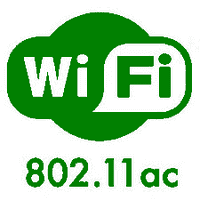

# 802.11 AC 的优缺点

> 原文:[https://www . geesforgeks . org/802-11ac 的优缺点/](https://www.geeksforgeeks.org/advantages-and-disadvantages-of-802-11ac/)

**802.11ac :**
该标准是 WLAN 规范的安排之一，其先进性是在 IEEE 802.11n 之后。创建这一 802.11ac 创新是为了给远程小工具提供以 Gbps 为单位的信息速率，本质上是为了 WLAN 应用。在过去的版本中，802.11 规范的安排是针对单个客户活动的。在 802.11ac 中，多用户多输入多输出凸显了多客户端的思想。波束形成已被添加，以覆盖更多的现场和明确的领域与参与支柱的想法。

**多客户端 802.11ac MIMO(多用户 MIMO) :**
以下是 802.11ac 创新亮点。

```
Frequency Bands     - 5 GHz
Channel Bandwidths  - 20 MHz, 40 MHz, 80+80 MHz, 160 MHz 
FFT sizes           - 64, 128, 256, 512 
Subcarrier dividing - 312.5 KHz
OFDM image length   - 3.2µs + 0.8/0.4 µs CP 
Modulation plot 
(most noteworthy)   - 256 QAM 
Data rates          - 433 Mbits/sec(with 80 MHz and 1 Spatial Streams(SS)), 
                      6.933 Gbits/sec (with 160MHz, 8 SS) 

```



**802.11 AC 的优势:**
802.11 AC 的优势或兴趣点如下。

*   它提供的千兆位速度是 802.11n 的数倍。
*   它为整个家庭提供了更少的死角。
*   它利用更广泛的信道传输能力(80 兆赫和 160 兆赫)。
*   它利用了高达 256-QAM 的复杂调整计划。这传达了 33%的信息增长率。
*   它利用不同的空间流来传递熟练程度的 N-重叠增量。
*   这使得向单流客户的并发下行链路传输成为可能。这有助于组织极限的进展。

**802.11 AC 的缺点:**
802.11 AC 的缺点或不利之处如下。

*   2.4 GHz 频段不支持。
*   它用一点点的长度来支持图像术语。
*   更高的调整计划，例如，1024QAM 没有得到支持。
*   上行链路接入是基于争议的。当小工具数量较多时，这会导致崩溃、回退和可行吞吐量下降。
*   上行链路中不支持多输入多输出。在 802.11ac 波-2 中，多用户多输入多输出在具有 4 个并发流的下行链路中得到明显利用。