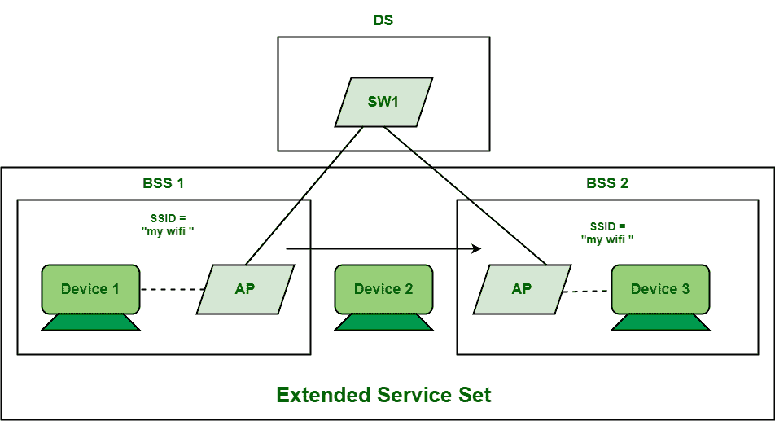

# ESS 的优缺点

> 原文:[https://www . geesforgeks . org/ess 的优缺点/](https://www.geeksforgeeks.org/advantages-and-disadvantages-of-ess/)

[ESS(扩展服务集)](https://www.geeksforgeeks.org/difference-between-dss-and-ess/)顾名思义，是一个服务集，通常包含两个或多个 [BSS(基本服务集)](https://www.geeksforgeeks.org/difference-between-bss-and-ess/)相互连接。这些基站共享相同的网络名称，即 [SSID](https://www.geeksforgeeks.org/service-set-identifier-ssid-in-computer-network/) 。SSID 代表系统服务标识符。它是给与基站相关联的每个接入点的唯一的媒体访问控制地址。基站通常提供短程无线通信，而 ess 提供远程无线通信。

要创建远程无线通信，需要一个以上的接入点，然后将所有接入点连接到有线网络。ESS 中的所有接入点都通过一个公共的配电系统相互连接。在 DS 的帮助下，多个接入点可以连接到同一个局域网。所有接入点一起工作，创建一个远程无线网络，通常覆盖整个建筑，大面积。虽然系统中存在多个接入点，并且每个接入点都有一个唯一的基站标识符，但是区域中的所有用户或客户端只能看到一个公共网络名称，即基站标识符。因此，这个网络被称为扩展系统服务。

**ESS 的优势:**

*   ESS 覆盖的整个区域被称为 ESA(扩展服务区)。同一 ESA 中的所有客户端或用户都可以相互通信，即使他们位于不同的 BSA(基本服务区)中。
*   ESS 支持移动性，即客户端可以从一个地方移动到另一个地方，而不会断开与网络的连接。由于有多个接入点，每当客户端移动时，它都会自动从一个接入点跳到另一个接入点并建立连接。这也称为漫游。
*   DS 是一个系统，是 ESS 最好和最重要的部分之一。它通常连接多个接入点以形成 ESS，因此允许用户自由移动。
*   它还隐藏了 ESS 中所有站点的移动性，使其不受 ESS 之外的任何事物和其他站点的影响。
*   ESS 在整个无线网络中提供更好的强度和增强的信号。
*   BSS 可以覆盖小区域或业务，但不能覆盖大区域。因此，ESS 多用于大型组织、企业、办公室等。因为它提供了大面积的网络覆盖。
*   在 ESS 中，客户端使用 ESS 网络没有这种限制。更多的用户可以连接到该网络，而不会出现任何网络问题和连接问题。

**ESS 的缺点:**

*   ESS 支持移动性，但在不同供应商的不同接入点之间漫游可能会产生问题。
*   漫游时，不指定切换。越区切换简单地说就是将客户端信号从一个接入点或基站传送到另一个接入点或基站。
*   由于它占地面积大，ESS 的安全性不高。