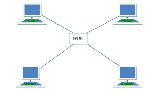

# 轮毂的优缺点

> 原文:[https://www . geesforgeks . org/hub 的优缺点/](https://www.geeksforgeeks.org/advantages-and-disadvantages-of-hub/)

集线器是连接多个主机设备到一个网络的[网络设备](https://www.geeksforgeeks.org/network-devices-hub-repeater-bridge-switch- router-gateways/)的中心点。它作为一个多端口中继器，允许数据在它们之间传输。为此，它使用光纤电缆或双绞线电缆。

它是一种网络设备，允许使用双绞线或光纤电缆连接多个[以太网](https://www.geeksforgeeks.org/ethernet-frame-format/)设备(即主机)。它在[物理层运行，即现场视察堆栈](https://www.geeksforgeeks.org/layers-of-osi-model/)的第 1 层。一般来说，集线器工作在(物理层)有点像交换机，它也将计算机连接在一起。

它充当多端口中继器，将数据广播到设备连接的所有或任何端口。以下是网络集线器设备的功能–

*   在[半双工模式](https://www.geeksforgeeks.org/transmission-modes-computer-networks/)下运行。
*   有 4 到 24 个端口可供选择。
*   主机有责任进行冲突检测。
*   有三种类型的。主动枢纽、被动枢纽和智能枢纽。

**枢纽优势:**

*   **连接性–**
    集线器的主要功能是允许客户端连接到网络，以便共享和对话。为此，集线器使用网络协议分析器。

*   **性能–**
    Hub 被认为对网络的性能影响非常小。这通常是因为它使用很少影响网络的广播模式运行。

*   **成本–**
    与交换机相比，集线器确实便宜。基本上得益于它的简单性。因此，他们会帮助你节省很多钱。而且由于它们的产品，它们在市场上随处可见。

*   **设备支持–**
    集线器可以通过一个中央集线器同时连接不同类型的媒体。尽管媒体希望以不同的速度运行，但他们不会支持它们。

*   **区域覆盖–**
    网络的区域覆盖被限制在一定距离内。集线器扩展了网络的空间，这样通信就容易形成。

**轮毂的缺点:**

*   **冲突域–**
    冲突域的功能和数据包的再次传输并不影响实际上它增加了更多的域间碰撞的机会。

*   **全双工模式–**
    集线器无法在全双工模式下通信，只能在半双工模式下运行。从本质上讲，半双工模式意味着数据通常在给定时间只传输一次。因此，集线器必须不断切换其模式。

*   **规范–**
    集线器不能支持像令牌环网一样大的网络。这通常是因为集线器必须在网络中的所有设备之间共享数据。

*   **网络流量–**
    由于附件是在数据包中收到的，因此无法减少流量。因此，集线器产生高水平的网络流量。

*   **带宽浪费–**
    集线器无法为每台设备提供专用带宽，只能共享。当发送大量信息时，所有的带宽都将被两台计算机占用，从而使其他计算机的网络速度变慢。