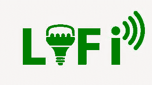

# Li-Fi 的优缺点

> 原文:[https://www . geesforgeks . org/Li-fi 的优缺点/](https://www.geeksforgeeks.org/advantages-and-disadvantages-of-li-fi/)

**[光保真](https://www.geeksforgeeks.org/li-fi/)** 或 **Li-Fi** 是一种远程通信创新，利用红外光、明显的光范围或明亮的辐射来发送信息。这一创新的现有操作思路和测试用途基本上包括使用发光二极管或发光二极管灯。无论如何，考虑到这一创新的潜在焦点，倡导者将其作为一种选择，与现有的无线网络和无线局域网的进步形成对比。

**LI-FI 的优势:**

1.  **比 Wi-Fi 更快的数据传输–**
    Li-Fi 创新的一个基本销售目的是，它比 Wi-Fi 具有更快的信息传输速率。引人注目的光范围具有比整个无线电频率和微波范围大几倍的传输能力。牛津大学的分析师断言，他们有效地尝试了一个双向速度为每秒 224 千兆位的 Li-Fi 应用程序。请注意，大多数无线网络以每秒 20 兆比特左右的速度发送信息，移动速度受距离和障碍物的影响。这一点回旋余地是维权者押注 Li-Fi 作为解决这些问题的答案的动机，这些问题包括 Wi-Fi 的传输容量障碍，以及客户创造和吞噬的信息的发展尺度。

*   **部署简单且成本低廉–**
    回想一下，目前 Li-Fi 创新的运营思路和试利用都集中在 LED 灯的利用上。这意味着 Li-Fi 组织可以有效地与现有的发光二极管照明框架相结合。基本上，任何有光源的地方，都可以上网。另外值得一提的是，发光二极管灯交付合理，市场成本适中。调查人员预测，Li-Fi 组织将比 Wi-Fi 便宜数倍。同样，它们比辐射灯和荧光灯更节能。尽管 Li-Fi 增强的 LED 灯应该保持继续发送信息，但它往往会降低到低于人类的感知能力，节省能源成本，同时发出足够的光来充当组织开关。*   **光的局限性带来的安全性–**
    Li-Fi 的另一个显著优势或首选位置是它比 Wi-Fi 更安全。依赖于无线电频率和微波的远程通信创新对窥探、信号捕获或未经批准的干扰、野兽力量攻击和自发的组织关联更无能为力。记得光波不能通过分隔物和入口通道进入。此外，它们的覆盖范围更有限。等效适用于红外光和强辐射。Li-Fi 项目传输的标志及其传达的信息仅限于封闭区域，例如房间或大厅。组织的准入受到限制。这意味着 Li-Fi 创新比 Wi-Fi 提供了额外的安全层。*   **免受电磁干扰–**
    此外，Li-Fi 还有一点不受电磁阻抗影响的余地，电磁阻抗会影响基于无线电的远程通信的发展。这项创新同样有助于电磁敏感领域，例如飞机旅馆、诊所和原子力工厂等，因为它不会造成电磁障碍。请注意，临床上使用的一些临床仪器，就像飞机上的雷达和通信框架很容易被无线电干扰。*   **Sweeping Future Applications –**
    The advancement of additional availability is another bit of leeway of Li-Fi innovation. The way that it offers quicker information move rates implies that it can propel the mainstream sending of the Internet of Things or IoT which require huge information and compelling and effective network. A portion of the particular predictable utilizations of Li-Fi incorporate home and building mechanization. Specialists have likewise conceptualized traffic applications, for example, utilization of road and traffic signals to give data about current street circumstances, and headlights and backdrop illuminations of vehicles to impart and mechanize security measures.

    **LI-FI 的缺点:**

    1.  **有限的范围和连接性–**
        明显的光线障碍使 Li-Fi 比 Wi-Fi 具有安全优势。尽管如此，这些限制同样会带来负担。例如，实际的边界、分隔物和入口限制了 Li-Fi 增强的 LED 灯的操作范围。回想一下，Li-Fi 项目传递的信息与附近分散的信息绑定在一起，因为光线无法渗透到模糊的物品中，并且影响范围更有限。例如，在房屋或建筑物的基础上，应在房间、走廊和不同的区域故意放置增强的发光二极管灯，以扩展 Li-Fi 网络的范围。单独的 Wi-Fi 交换机比 Li-Fi 交换机覆盖范围更广，覆盖范围更广。Li-Fi 的这些障碍同样使其不太适合在开放的 Wi-Fi 网络中使用。
    2.  **兼容技术的不可及性–**
        Li-Fi 要比 Wi-Fi 更合理，还需要很长时间。当前的小工具，例如个人电脑、手机和平板电脑，实际上使用设备来组织无线网络。这些小工具无法立即与 Li-Fi 网络配合使用，因为它们没有必要的设备细节。Li-Fi 并不能迅速逆转。另外值得一提的是，在专业组织的互联网速度提高之前，这种创新的更快的信息移动速度并不重要。在那些因网速比合作伙伴慢而臭名昭著的地区或国家，传递一个 Li-Fi 组织将是愚蠢的。因此，需要不同业务和领域的协调来推进这一创新的大规模选择。
    3.  **光干涉与光污染–**
        Li-Fi 不同的负担是对光的无力感阻碍和光污染的推进。请注意，尽管这项创新不受电磁阻抗的影响，但不同的光源泉可能会干扰信号。日光会干扰由 Li-Fi 供电的发光二极管灯产生的光信号。相关的接收者可能很难处理这些信号。网络干扰是可以想象的。此外，基于增强的发光二极管灯应该保持点亮，它们可以进一步防止光污染，特别是当设置在更高的亮度时，以弥补其他光源可能出现的阻抗。
    4.  **可能的成本影响–**
        发送 Li-Fi 是假设合理的，因为与制造 LED 灯相关的费用很少。无论如何，建立成本可能比无线网络发送成本更高，因为创新通常是新的，兴趣保持较低，集中的专家还不多。一个单独的家需要几个 Li-Fi 交换机来增加组织的程度和互联网可用性的可访问性，这同样意味着额外的购买和建立成本。请注意，一个单独的无线网络开关对于正常测量的房屋来说就足够了。