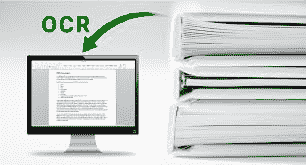

# 光学字符阅读器(OCR)的优缺点

> 原文:[https://www . geesforgeks . org/optical-character-reader-ocr 的优缺点/](https://www.geeksforgeeks.org/advantages-and-disadvantages-of-optical-character-reader-ocr/)

**光学字符阅读器(OCR)** 有助于通过字符的形状来区分字符的存在。光学字符识别被用作数据输入设备，从打印机、打字机等产生的预打印文档中读取数字和字母数字字符。

准确扫描字符的准确度取决于书写的清晰程度。扫描仪经过改进，可以读取不同样式和大小的文本，也可以读取整洁的笔迹。用光学字符识别扫描的文本有最高的准确性，但也需要检查，因为一些字母经常被误读。在分拣办公室，光学字符识别被用来自动识别信件上的邮政编码。

在光学字符识别中，扫描仪配有字符识别软件，可将字符的位图图像转换为等效的 ASCII 码。整个过程的第一步是创建文档图像的位图，然后在软件的帮助下，光学字符识别将网格点阵列翻译成计算机可以理解的 ASCII 文本，并将其处理为字母、数字和特殊字符。

光学字符识别软件处理每个字符的位图，并将其与一组字符进行比较，机器已被编程为确认将位图转换为文本，无论哪种字符模式匹配或接近匹配，都将被视为字符读取。如果扫描的字符与任何已存储的字符模式不匹配，将被拒绝。

**光学字符阅读器(OCR)的优势:**
以下是 OCR 的优势或优势:

*   光学字符识别的信息可以以高精度读取。平板扫描仪非常精确，可以产生相当高质量的图像。
*   光学字符识别信息的处理速度很快。大量文本通常输入速度很快。
*   纸质表格经常变成电子表格，可以直接存储或通过邮件发送。
*   手动输入大量文本数据比付钱给某人更便宜。此外，在电子表格中转换花费的时间更少。
*   最新的软件可以重新创建表格，也作为原始布局。
*   与手动将信息输入系统相比，这个过程要快得多
*   高级版本甚至可以重新创建表、列，甚至生成站点。

**光学字符阅读器(OCR)的缺点:**
以下是 OCR 的缺点或不足:

*   光学字符识别文本仅适用于打印文本，不适用于手写文本。手写必须通过电脑学习。
*   光学字符识别系统很贵。
*   产生的图像需要大量的空间。
*   在此过程中，图像质量可能会下降。
*   最终图像的质量取决于第一张图像的质量。
*   所有的文件都必须仔细检查，然后手动更正。
*   不是 100%准确，方法过程中很可能会出现一些错误。
*   不值得做少量的文本。