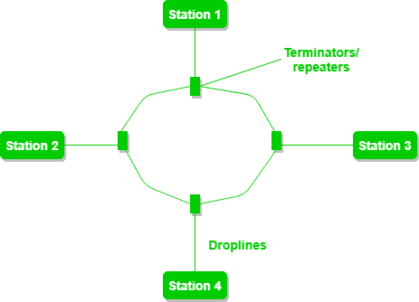

# 环形拓扑的优缺点

> 原文:[https://www . geesforgeks . org/环拓扑的优缺点/](https://www.geeksforgeeks.org/advantages-and-disadvantages-of-ring-topology/)

[环形拓扑](https://www.geeksforgeeks.org/types-of-network-topology/)可能是一种网络配置，其中设备连接创建了一条环形数据路径。在这种情况下，每个设备都与其两个相邻的设备相连，就像一个圆上的点，形成一个环形结构。许多中继器用于具有大量节点的环形拓扑，以发送数据并防止数据丢失。中继器用于该网络。环形拓扑中的设备统称为环形网络。

在这种情况下，数据包从一个设备传输到另一个设备，直到到达所需的目的地。在这种情况下，数据以单向形式传输意味着只能在一个方向上传输，但它也可以通过在每个网络节点之间有两个连接来实现双向传输，这称为双环拓扑。

它用于局域网和广域网，取决于计算机中的网卡。

**环形拓扑的优势:**

*   在这种情况下，数据朝一个方向流动，从而减少了分组冲突的机会。
*   在这种拓扑中，可以在不影响网络性能的情况下添加额外的工作站。
*   平等获得资源。
*   不需要服务器来控制拓扑中节点之间的连接。
*   安装和扩展都很便宜。
*   最小碰撞。
*   在这种拓扑中，传输数据的速度非常快。
*   由于令牌传递的存在，在大流量下，环形拓扑的性能变得比总线拓扑更好。
*   易于管理。
*   环形网络组织极其有序，每个设备都可以访问令牌，因此有机会进行传输。

**环形拓扑的缺点:**

*   由于单向环，数据包(令牌)必须通过所有节点。
*   如果一个工作站关闭，它会影响整个网络，或者如果一个节点关闭，整个网络都会关闭。
*   与总线拓扑相比，它的性能较慢
*   它很贵。
*   在网络中添加和删除任何节点都很困难，可能会导致网络活动出现问题。
*   戒指疑难解答。
*   为了让所有的计算机相互通信，所有的计算机都必须打开。
*   完全依赖一根电缆。
*   它们是不可扩展的。