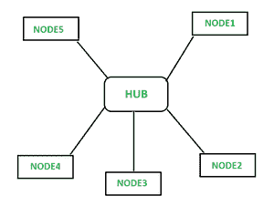

# 星型拓扑的优缺点

> 原文:[https://www . geesforgeks . org/星型拓扑的优缺点/](https://www.geeksforgeeks.org/advantages-and-disadvantages-of-star-topology/)

**星型拓扑**

星形可以是局域网的一种拓扑，在这种拓扑中，所有节点都单独连接到一个中央连接点，类似于集线器或交换机。一根星形电缆比一条总线占用更多的电缆，但好处是如果一根电缆出现故障，只有一个节点会被关闭。网络中的每个设备都连接到一个称为集线器的中央设备。如果一台设备想向另一台设备发送数据，首先要向集线器发送信息，然后集线器将数据传输到指定的设备。

**星型拓扑的优势**

*   它非常可靠——如果一根电缆或设备出现故障，那么所有其他电缆或设备仍将工作
*   它的性能很高，因为不会发生数据冲突
*   成本较低，因为每个设备只需要一个输入/输出端口，并且希望通过一条链路与集线器连接。
*   更容易放进去
*   本质上健壮
*   易于故障检测，因为链接通常很容易识别。
*   连接或移除设备时不会中断网络。
*   每个设备只需要一个端口，即连接到集线器。
*   如果 N 个设备以星形相互连接，那么连接它们所需的电缆数量是 N。因此，很容易排列。

**星型拓扑的缺点**

*   需要比线性总线更多的电缆。
*   如果连接的网络设备(网络交换机)出现故障，连接的节点将被禁用，无法参与网络通信。
*   由于连接设备(网络交换机)的价值，比线性总线拓扑更昂贵
*   如果集线器出故障，所有设备都会出故障，没有集线器，所有设备都无法工作。
*   Hub 需要更多的资源和定期维护，因为它是 star 的中心系统。
*   需要额外的硬件(集线器或交换机)，这增加了成本
*   性能取决于一个集中器，即集线器。