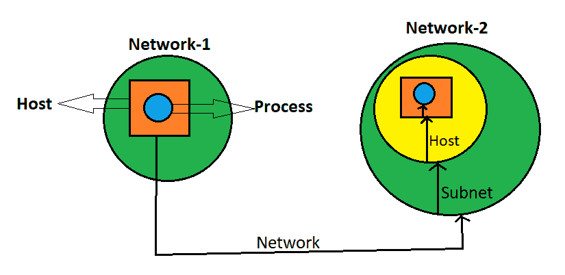
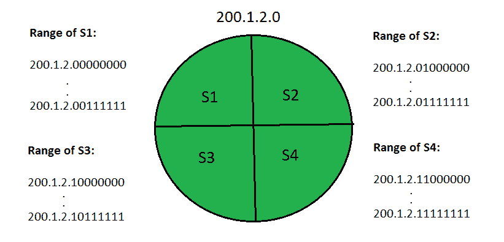
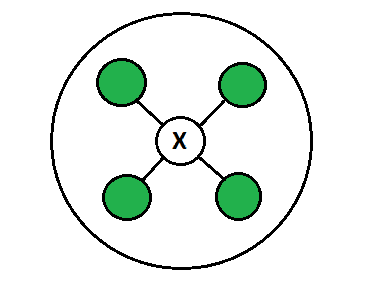

# 子网划分的优缺点

> 原文:[https://www . geeksforgeeks . org/子网划分的优缺点/](https://www.geeksforgeeks.org/advantages-and-disadvantages-of-subnetting/)

[子网划分](https://www.geeksforgeeks.org/ip-addressing-classless-addressing/):将一个网络划分为多个小网络称为子网划分。
子网划分在许多方面都很有用，例如:

1.  它从一个网络向另一个网络提供安全性。在一个组织中，开发人员部门的代码不得被其他部门访问。
2.  特定子网可能比其他子网需要更高的网络优先级。例如，销售部门需要主持网络广播或视频会议。

*   In the case of Small networks, maintenance is easy.

    **除了这些优点，子网划分也有一些缺点:**

    1.  在单个网络的情况下，只需要三个步骤就可以到达一个进程，即源主机到目标网络、目标网络到目标主机，然后目标主机到进程。

    但是在子网划分的情况下，网络间通信需要四个步骤。即源主机到目标网络，目标网络到适当的子网，然后子网到主机，最后主机到进程。

    因此，它增加了时间复杂性。就子网而言，通信或数据传输需要更多时间。

    

    *   In the case of Single Network only two IP addresses are wasted to represent Network Id and Broadcast address but in case of Subnetting two IP addresses are wasted for each Subnet.
    **Example:** If a Network has four Subnets, it means 8 IP addresses are going to waste.

    

    ```
    Network Id for S1: 200.1.2.0
    Broadcast address of S1: 200.1.2.63

    Network Id for S2: 200.1.2.64
    Broadcast address of S2: 200.1.2.127

    Network Id for S3: 200.1.2.128
    Broadcast address of S3: 200.1.2.191

    Network Id for S4: 200.1.2.192
    Direct Broadcast address of S4: 200.1.2.255
    ```

    因此，我们可以说网络规模也将减少。我们不能完全使用我们的网络。

    *   Cost of the overall Network also increases. Subnetting requires internal routers, Switches, Hubs, Bridges etc. which are very costly.

    

    *   子网划分和网络管理需要有经验的网络管理员。这也增加了总成本。