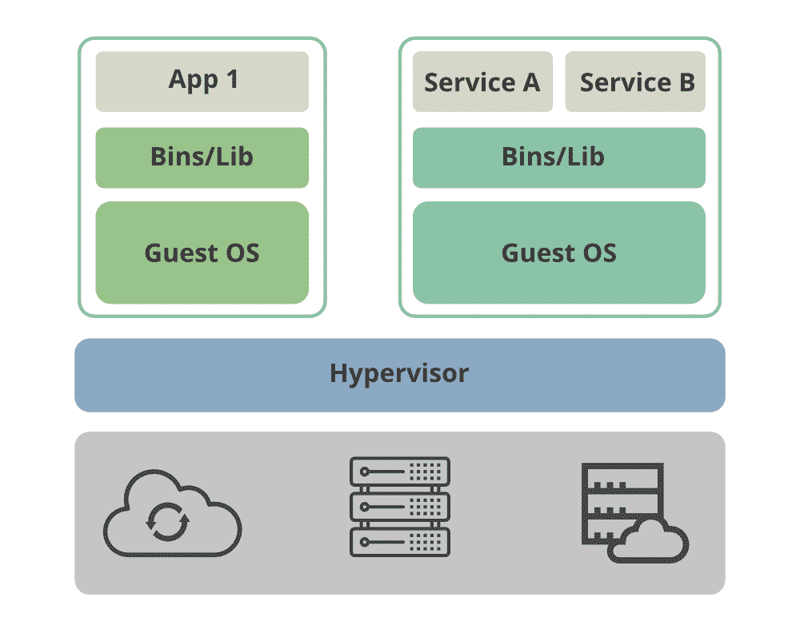

# 虚拟机相对于便携式容器的优势

> 原文:[https://www . geeksforgeeks . org/虚拟机相对于便携式容器的优势/](https://www.geeksforgeeks.org/advantages-of-virtual-machines-over-portable-containers/)

虽然现代容器似乎是提供计算环境的首选解决方案，因为它们具有轻量级的特性，但在本文中，我们将研究虚拟机相对于新时代便携式容器的优势。

### **1。安全:**

虚拟机比容器更安全，因为应用程序(多个)在虚拟机(即来宾操作系统)内部运行，并且通过虚拟机管理程序与硬件进行通信。就容器而言，它们拥有运行应用程序所需的一切。但是，当它们必须与其他容器或运行这些容器的主机操作系统通信时，就会带来安全风险。自从虚拟化首次出现以来，与容器相比，虚拟机在安全性和数据加密方面做了大量工作。与虚拟机的任何妥协都不会影响或让攻击者到达另一个虚拟机，因为安全方面由虚拟机管理程序控制，而在容器中则不是这样，因为它们没有强安全边界。

管理程序

### **2。运行旧应用程序:**

当我们必须运行旧应用程序或运行在旧版本操作系统之上的应用程序时，虚拟机是首选。由于我们可能没有资源使应用程序现代化以在容器内运行，我们将不得不求助于虚拟机。在这种情况下，我们可以将旧操作系统作为虚拟机运行，并在其上运行应用程序。

### **3。操作系统资源密集型应用程序:**

当我们需要托管或运行资源密集型且需要操作系统功能和资源的应用程序时，可以使用虚拟机。此外，在我们需要运行各种操作系统的环境中，虚拟机是首选。在容器的情况下，它们使用主机的内核，不能像虚拟机一样隔离，因为它们运行自己的内核。

### **4。主机操作系统和兼容内核的使用(可移植性):**

我们可以在主机/服务器上运行运行不同客户操作系统(有自己的内核)的多个虚拟机。而对于容器，由于它们使用来自主机操作系统的内核，因此它们受限于操作系统，因此被设计为在特定主机操作系统上运行的容器将不能迁移运行不同内核的另一个服务器，并且在迁移容器时会有兼容性问题。

### **5。图形用户界面(视频输出):**

与虚拟机相比，容器在视频输出/支持方面是无效的，因为它们主要用于控制台应用程序。通过在主机上使用虚拟显示，在虚拟机上运行具有图形界面或需要丰富图形用户界面的工具或软件更容易。当我们需要运行基于图形用户界面的应用程序时，虚拟机是首选解决方案。

### **6。持久存储:**

虚拟机具有虚拟磁盘，用于持久存储应用程序数据。然而，在容器中却不是这样，容器使用我们称之为临时存储的东西(容器默认是无状态的)。随着对有状态应用程序需求的增长，容器面临着添加存储解决方案的挑战。说到持久存储，虚拟机的得分优于容器，因为我们需要在容器中实施复杂的存储解决方案。

下图区分了虚拟机和容器:

虚拟机 Vs 容器