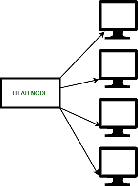
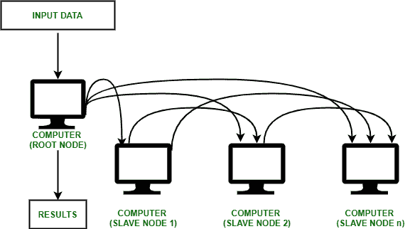
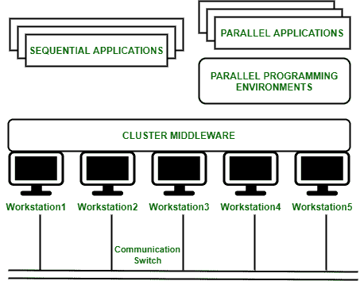
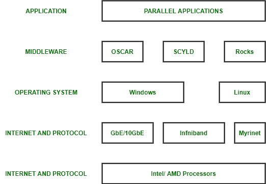

# 集群计算概述

> 原文:[https://www . geeksforgeeks . org/a-集群计算概述/](https://www.geeksforgeeks.org/an-overview-of-cluster-computing/)

**简介:**
[集群计算](https://www.geeksforgeeks.org/difference-between-cloud-computing-and-cluster-computing/)是紧密或松散连接的计算机的集合，它们协同工作，从而作为一个单一的实体。相连的计算机一起执行操作，从而产生了单一系统的概念。集群通常通过快速[局域网](https://www.geeksforgeeks.org/lan-full-form/)连接

**集群计算**

**集群计算为什么重要？**

1.  集群计算为大型服务器或大型计算机解决方案提供了相对便宜、非常规的解决方案。
2.  它以更快的方式解决了对内容重要性和流程服务的需求。
3.  许多组织和信息技术公司正在实施集群计算，以经济的价格增强其可扩展性、可用性、处理速度和资源管理。
4.  它确保计算能力始终可用。
5.  它为独立于某些硬件供应商及其产品决策的并行高性能系统的实现和应用提供了单一的通用策略。

**简单的集群计算布局**

**集群计算的类型:**

**1。高性能(HP)集群:**
HP 集群使用计算机集群和超级计算机来解决高级计算问题。他们习惯于执行需要节点在执行工作时进行通信的功能。它们旨在利用几个节点的并行处理能力。

**2。负载平衡集群:**

传入的资源请求分布在运行相似程序或具有相似内容的几个节点中。这可以防止任何单个节点接收过多的任务。这种类型的分发通常用于网络托管环境。

**3。高可用性集群:**

高可用性集群旨在维护冗余节点，以便在出现任何故障时充当备份系统。提供一致的计算服务，如商业活动、复杂的数据库、客户服务，如电子网站和网络文件分发。它们旨在为客户提供不间断的数据可用性。

**集群分类:**

**1。开放集群:**

每个节点都需要入侵防御系统，这些系统只能通过互联网或网络访问。这种类型的集群会引起更大的安全问题。

**2。关闭集群:**

这些节点隐藏在网关节点的后面，它们提供了增强的保护。它们需要更少的 IP 地址，非常适合计算任务。

**集群计算架构:**

*   它由一系列相互连接的独立计算机和作为一个独立系统共同运行的计算机系统组成。
*   它是一组工作站或计算机，作为单一的集成计算资源，通过高速互连连接在一起。
*   节点–具有内存、输入输出功能和操作系统的单个或多处理器网络。
*   两个或多个节点连接在一条线上，或者每个节点可以通过局域网连接单独连接。

**集群计算架构**

**集群计算机的组件:**

1.  集群节点
2.  集群操作系统
3.  交换机或节点互连
4.  网络交换硬件

**集群组件**

**集群计算优势:**

**1。高性能:**

这些系统提供了比大型计算机网络更好、更强的性能。

**2。易于管理:**

集群计算易于管理和实施。

**3。可扩展:**

资源可以相应地添加到集群中。

**4。可扩展性:**

通过向网络中添加额外的计算机，可以轻松扩展计算机集群。集群计算能够将几个额外的资源或网络结合到现有的计算机系统中。

**5。可用性:**

当一个节点出现故障时，其他节点将处于活动状态，并将充当故障节点的代理。这确保了增强的可用性。

**6。灵活性:**

它可以升级到更高的规格，也可以添加额外的节点。

**集群计算的缺点:**

**1。成本高:**

由于它的高硬件和设计，它的性价比并不高。

**2。故障查找问题:**

很难发现哪个部件有故障。

**3。需要更多空间:**

随着需要更多服务器来管理和监控，基础架构可能会增加。

**集群计算的应用:**

*   可以解决各种复杂的计算问题。
*   它可以应用于空气动力学、天体物理学和数据挖掘。
*   天气预报。
*   图像渲染。
*   各种电子商务应用。
*   地震模拟。
*   油藏模拟。