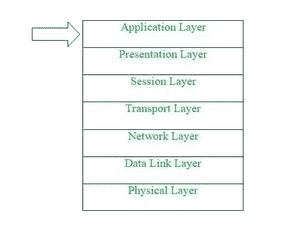
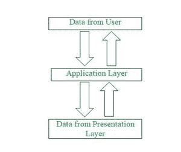

# OSI 模型中的应用层

> 原文:[https://www . geesforgeks . org/应用层 in-osi-model/](https://www.geeksforgeeks.org/application-layer-in-osi-model/)

**先决条件:** [现场视察模型](https://www.geeksforgeeks.org/layers-of-osi-model/)

**简介:**
应用层是开放系统互连(OSI)模型中最顶层。这一层提供了几种处理数据(信息)的方法，实际上使任何类型的用户都能轻松访问网络。这个层也向它的底层发出请求，底层是表示层，用于从它那里接收各种类型的信息。应用层接口直接与应用程序交互，并提供通用的网络应用服务。这一层基本上是开放系统的最高层次，直接为应用进程提供服务。

**应用层的功能:**
如上所述，应用层是 OSI 模型中的最顶层，执行任何种类的应用或通信过程中所需的几种功能。
以下是由现场视察模型应用层执行的功能列表–

*   应用层提供了一个工具，用户可以通过它转发几封电子邮件，它还提供了一个存储工具。
*   该层允许用户访问、检索和管理远程计算机中的文件。
*   它允许用户作为远程主机登录。
*   该层提供对各种服务的全局信息的访问。
*   该层提供的服务包括:电子邮件、传输文件、向用户分发结果、目录服务、网络资源等。
*   它提供的协议允许软件发送和接收信息，并向用户呈现有意义的数据。
*   它处理网络透明度、资源分配等问题。
*   该层充当用户和应用程序进程访问网络服务的窗口。
*   应用层基本上不是一个功能，而是执行应用层的功能。
*   应用层实际上是一个抽象层，它指定通信网络中主机使用的共享协议和接口方法。
*   应用层帮助我们识别通信伙伴，并同步通信。
*   这一层允许用户与其他软件应用程序交互。
*   在这一层中，数据是可视化的形式，这使得用户真正理解数据，而不是以二进制格式(0 或 1)记住或可视化数据。
*   该应用层基本上与操作系统(OS)交互，因此进一步以适当的方式保存数据。
*   该层还接收并保存来自其前一层的数据，前一层是表示层(其本身包含所传输信息的语法和语义)。
*   应用层使用的协议取决于用户希望发送或接收什么信息。
*   该应用层通常执行主机初始化，然后远程登录主机。

**应用层在 OSI 模型中的工作:**
在 OSI 模型中，这个应用层的范围比较窄。
OSI 模型中的应用层通常只像接口一样，负责与基于主机和面向用户的应用程序进行通信。这与 TCP/IP 协议形成对比，在 TCP/IP 协议中，应用层下面的层，即会话层和表示层，被组合在一起，形成一个简单的单层，负责执行各种功能，包括控制计算机之间的对话，建立以及维护和结束特定的会话，提供数据压缩和数据加密等。

首先，客户端向服务器发送一个命令，当服务器收到该命令时，它将端口号分配给客户端。此后，客户机向服务器发送一个启动连接请求，当服务器接收到请求时，它通过客户机已经成功地与服务器建立连接向客户机发出确认(ACK)，因此，现在客户机可以访问服务器，通过服务器它可以要求服务器发送任何类型的文件或其他文档，或者它可以在服务器本身上传一些文件或文档。

**应用层协议提供的功能:**
为了保证通信的顺畅，应用层协议在源主机和目的主机上实现相同。
以下是应用层协议提供的一些功能-

*   应用层协议为参与通信的双方定义了过程。
*   这些协议定义了从任何一方(源主机或目标主机)发送或接收的消息类型。
*   这些协议还定义了被转发或检索的消息的基本语法。
*   这些协议定义了发送消息的方式和预期的响应。
*   这些协议还定义了与下一级的交互。

[**应用层协议**](https://www.geeksforgeeks.org/protocols-application-layer/) **:**
应用层提供多种协议，允许任何软件轻松发送和接收信息，并向其用户呈现有意义的数据。
下面是应用层提供的一些协议-

1.  [**TELNET**](https://www.geeksforgeeks.org/introduction-to-telnet/)**–**
    TELNET 代表电信网络。该协议用于管理互联网上的文件。它允许远程登录客户端访问远程登录服务器的资源。Telnet 使用端口号 23。
2.  [**DNS**](https://www.geeksforgeeks.org/domain-name-system-dns-in-application-layer/)**–**
    DNS 代表域名系统。DNS 服务将域名(由用户选择)转换为相应的 IP 地址。例如-如果你选择域名为 www.abcd.com，那么域名系统必须将其翻译为 192.36.20.8(随机的 IP 地址写只是为了理解的目的)。DNS 协议使用端口号 53。
3.  [**DHCP**](https://www.geeksforgeeks.org/dynamic-host-configuration-protocol-dhcp/)**–**
    DHCP 代表动态主机配置协议。它向主机提供 IP 地址。每当主机试图向 DHCP 服务器注册一个 IP 地址时，DHCP 服务器都会向相应的主机提供大量信息。DHCP 使用端口号 67 和 68。
4.  ****–**
    FTP 代表文件传输协议。该协议有助于将不同的文件从一个设备传输到另一个设备。FTP 通过可靠、高效的数据传输，促进通过远程计算机设备共享文件。FTP 使用端口号 20 进行数据访问，使用端口号 21 进行数据控制。**
5.  **[**SMTP**](https://www.geeksforgeeks.org/simple-mail-transfer-protocol-smtp/)**–**
    SMTP 代表简单邮件传输协议。它用于将电子邮件从一个用户传输到另一个用户。最终用户使用 SMTP 轻松发送电子邮件。SMTP 使用端口号 25 和 587。**
6.  **[**HTTP**](https://www.geeksforgeeks.org/http-full-form/)**–**
    HTTP 代表超文本传输协议。它是万维网的基础。HTTP 在客户端服务器模型上工作。该协议用于传输像 HTML 这样的超媒体文档。这个协议是专门为网络浏览器和网络服务器之间的通信而设计的，但是这个协议也可以用于其他几个目的。HTTP 是一种无状态协议(网络协议，其中客户端向服务器发送请求，服务器根据给定的状态返回响应)，这意味着服务器不负责维护先前客户端的请求。HTTP 使用端口号 80。**
7.  **[**【NFS】**](https://www.geeksforgeeks.org/network-file-system-nfs/)**–**
    NFS 代表网络文件系统。该协议允许远程主机通过网络装载文件，并与这些文件系统交互，就像它们在本地装载一样。NFS 使用端口号 2049。**
8.  **[**SNMP**](https://www.geeksforgeeks.org/simple-network-management-protocol-snmp/)**–**
    SNMP 代表简单网络管理协议。该协议通过以固定或随机的时间间隔轮询从网络到管理站的设备来收集数据，要求它们公开某些信息。SNMP 使用端口号 161 (TCP)和 162 (UDP)。**