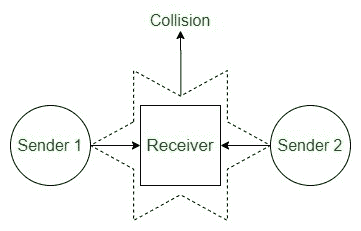

# 自组网的应用及其存在的问题

> 原文:[https://www . geeksforgeeks . org/网络及其问题应用/](https://www.geeksforgeeks.org/applications-of-ad-hoc-network-and-its-problems/)

随着大量小型设备的出现以及远程通信的发展，自组织网络正随着大量深远的应用而发挥作用。无论何时，在任何通信框架受限或没有通信框架的地方，都可以使用自组织网络。第一个框架使用起来很奢侈或令人恼火。ad hoc 网络架构可以利用连续的业务应用，扩大企业组织的效率和效益。

**特设网络可以通过它们的应用来排列为:**

*   移动自组织网络(MANET)是一种通过远程连接进行通信的无基础设施的自组织手机系统。
*   车辆自组织网络(VANET)利用车辆作为网络中的节点来构成移动网络。
*   无线传感器网络(WSN)由控制生态活动的独立传感器组成。

**自组织网络的用途:**

*   **军事–**
    一个特别的网络将允许军队维持所有士兵、车辆和总部之间的网络。
*   **个人区域网(PAN)–**
    这是一个短程的本地网络，其中每个节点通常与给定的范围相关。
*   **危机状态–**
    因为创建相当容易，所以可以在危机时刻用来发送紧急信号。
*   **医疗应用–**
    可用于监测患者。
*   **环境应用–**
    可用于查看天气情况、森林火灾、海啸等。

**问题:**
Ad Hoc 网络面临几个问题

*   有限的无线范围
*   数据包丢失
*   因为电池有限而节能。
*   低质量的通信。
*   如果两台设备试图与同一个接收器通信，隐藏节点问题会产生冲突。
    
*   暴露节点问题。