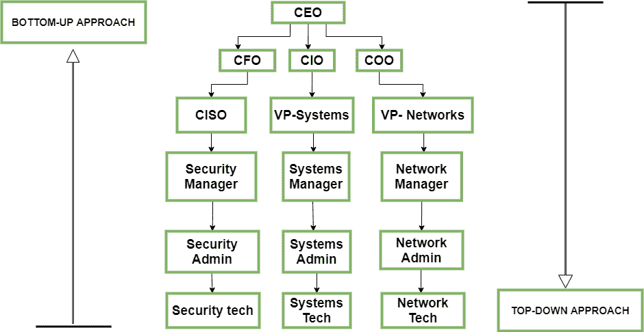

# 信息安全实施方法

> 原文:[https://www . geeksforgeeks . org/信息安全方法-实施/](https://www.geeksforgeeks.org/approaches-to-information-security-implementation/)

为了从潜在的违规和网络攻击中确定数据的安全性，[安全模型](https://www.geeksforgeeks.org/what-is-information-security/)的实施有一个重要阶段要执行。为了确保安全模型的完整性，可以使用两种方法进行设计:

**1。自下而上的方法:**
该公司的安全模型由系统管理员或从事网络安全工作的人员或网络工程师应用。这种方法背后的主要思想是让在信息系统领域工作的个人利用他们在网络安全方面的知识和经验来保证设计一个高度安全的信息安全模型。

*   **关键优势–**
    个人在本领域的技术专长确保每个系统漏洞都得到解决，并且安全模型能够应对任何可能的潜在威胁。
*   **劣势–**
    由于高层管理者与相关指令缺乏合作，往往不适合组织的要求和战略。

**2。自上而下的方法:**
这种方法是由组织的高管初始化和启动的。

*   他们制定政策并概述应遵循的程序。
*   确定项目的优先级和预期结果
*   确定每项所需行动的责任

它更有可能成功。该战略通常通过投入资源、一致的准备和执行机制以及影响企业文化的机会，提供来自最高管理层的有力支持。

安全管理问题已由组织以各种方式处理。传统上，公司采用自下而上的方法，由运营员工启动流程，然后根据建议的政策将结果传播给高层管理人员。由于管理层没有关于威胁、影响、资源理念、可能的回报和安全方法的信息，这种方法偶尔会造成突然而猛烈的崩溃。

相反，自上而下的方法是对整个问题非常成功的逆向观点。管理层了解事情的严重性，并启动该流程，随后系统地从网络工程师和操作人员那里收集信息。