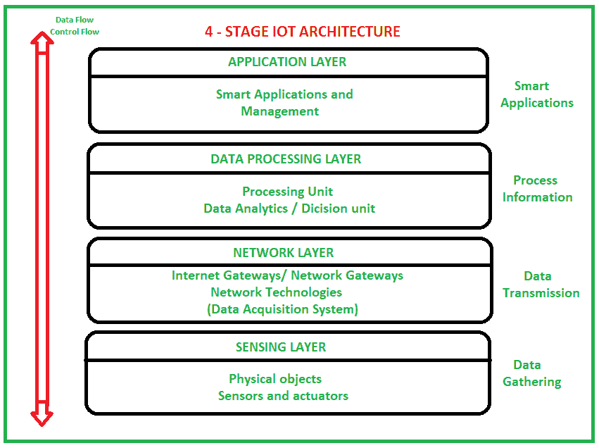

# 物联网(IoT)架构

> 原文:[https://www . geeksforgeeks . org/物联网架构-iot/](https://www.geeksforgeeks.org/architecture-of-internet-of-things-iot/)

[物联网(IoT)](https://www.geeksforgeeks.org/introduction-to-internet-of-things-iot-set-1/) 技术的应用非常广泛，物联网的使用增长如此之快。根据物联网的不同应用领域，它的工作原理与设计/开发的一致。但是它没有一个标准定义的工作体系结构，而这个体系结构是被普遍严格遵循的。物联网的架构取决于它在不同领域的功能和实现。尽管如此，构建物联网仍有一个基本的流程。

所以。在本文中，我们将讨论物联网的基本基础架构，即 4 阶段物联网架构。

因此，从上面的图像可以清楚地看出，存在 4 层，可分为以下几层:传感层、网络层、数据处理层和应用层。
这些解释如下。

1.  **传感层–**
    传感器、致动器、设备均位于该传感层。这些传感器或执行器接受数据(物理/环境参数)，处理数据并通过网络发送数据。
2.  **网络层–**
    互联网/网络网关、数据采集系统(DAS)均位于该层。DAS 执行数据聚合和转换功能(收集数据和聚合数据，然后将传感器的模拟数据转换为数字数据等)。高级网关主要打开传感器网络和互联网之间的连接，也执行许多基本的网关功能，如恶意软件保护，过滤，有时还根据输入的数据和数据管理服务进行决策等。
3.  **数据处理层–**
    这是物联网生态系统的处理单元。在这里，在将数据发送到数据中心之前，对数据进行分析和预处理，在数据中心，软件应用程序(通常称为业务应用程序)访问数据，在业务应用程序中，对数据进行监控和管理，并准备进一步的操作。因此，边缘信息技术或边缘分析应运而生。
4.  **应用层–**
    这是物联网架构 4 个阶段的最后一层。数据中心或云是数据的管理阶段，其中数据由最终用户应用程序管理和使用，如农业、医疗保健、航空航天、农业、国防等。