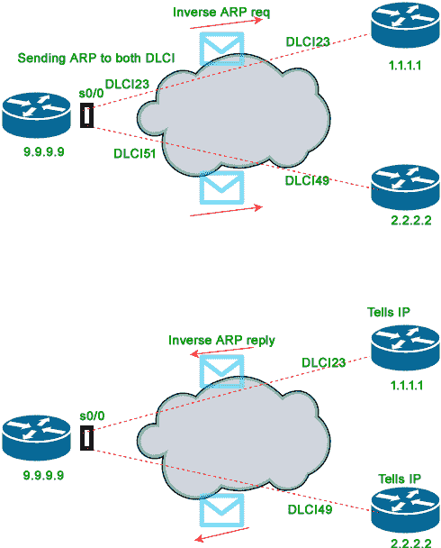
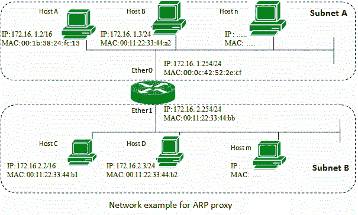
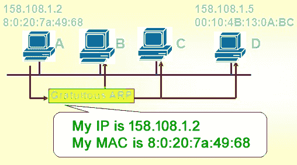
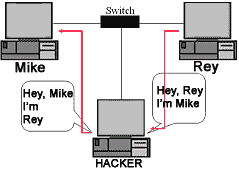

# ARP、反向 ARP(RARP)、反向 ARP (InARP)、代理 ARP 和无偿 ARP

> 原文:[https://www . geesforgeks . org/ARP-reverse-ARP rarp-reverse-ARP-inarp-proxy-ARP-无偿-arp/](https://www.geeksforgeeks.org/arp-reverse-arprarp-inverse-arp-inarp-proxy-arp-and-gratuitous-arp/)

**先决条件** [IP 寻址](https://www.geeksforgeeks.org/ip-addressing-classless-addressing/)[MAC 地址介绍](https://www.geeksforgeeks.org/computer-network-introduction-mac-addresses/)[地址解析协议(ARP)基础知识](https://www.geeksforgeeks.org/computer-network-arp-works/)

在本文中，我们将讨论整个 ARP 家族，即 ARP，RARP，InARP，代理 ARP 和免费 ARP。让我们试着一个一个理解。

### 1.地址解析协议–

地址解析协议是一种通信协议，用于发现与给定网络地址相关联的物理地址。通常，ARP 是网络层到数据链路层的映射过程，用于发现给定互联网协议地址的媒体访问控制地址。
为了将数据发送到目的地，有 IP 地址是必要的，但还不够；我们还需要目的机器的物理地址。ARP 用于获取目的机器的物理地址(MAC 地址)。

在发送 IP 数据包之前，必须知道目的地的媒体访问控制地址。如果不是，那么发送者广播 ARP 发现分组，请求预期目的地的媒体访问控制地址。由于 ARP-discovery 是广播的，网络中的每台主机都会收到此消息，但除了 IP 相关的目标接收主机之外，所有人都会丢弃数据包。现在，这个接收者将发送一个单播数据包及其媒体访问控制地址(ARP-reply)给 ARP-discovery 数据包的发送者。原始发送方收到 ARP 回复后，会更新 ARP 缓存，并开始向目的地发送单播消息。

**示例–**[GATE CS 2005，问题 24(基于 ARP)。](https://www.geeksforgeeks.org/gate-gate-cs-2005-question-24/)

### 2.反向地址解析协议–

反向 ARP 是局域网中客户端机器使用的一种网络协议，用于从网关路由器的 ARP 表中请求其互联网协议地址(IPv4)。网络管理员在网关路由器中创建一个表，用于将媒体访问控制地址映射到相应的 IP 地址。
当一台新机器被设置或者任何没有内存存储 IP 地址的机器需要一个 IP 地址供自己使用。因此，机器发送一个 RARP 广播数据包，该数据包在发送方和接收方硬件地址字段中都包含自己的 MAC 地址。

局域网内配置的一个特殊主机，称为 RARP 服务器，负责回复这类广播数据包。现在，RARP 服务器尝试找出 IP 到 MAC 地址映射表中的条目。如果表中有任何条目匹配，RARP 服务器会将响应数据包连同 IP 地址一起发送给请求设备。

*   以太网、以太网二、令牌环和光纤分布式数据接口等局域网技术支持地址解析协议。
*   RARP 没有在今天的网络中使用。因为我们有很多功能强大的协议，比如 BOOTP(引导协议)和 DHCP(动态主机配置协议)。

### 3.反向地址解析协议(InARP)–

反向 ARP 不是使用第三层地址(IP 地址)来查找 MAC 地址，而是使用 MAC 地址来查找 IP 地址。顾名思义，InARP 只是 ARP 的反义词。反向 ARP 已被 BOOTP 和后来的 DHCP 取代，但反向 ARP 仅用于设备配置。在自动柜员机(异步传输模式)网络中，默认情况下启用反向 ARP。InARP 用于从第 2 层地址(帧中继中的 DLCI)中找到第 3 层地址。配置帧中继时，反向 ARP 会将本地 DLCIs 动态映射到远程 IP 地址。使用反向 ARP 时，我们知道远程路由器的 DLCI，但不知道它的 IP 地址。InARP 发送请求以获取该 IP 地址，并将其映射到第 2 层帧中继 DLCI。

### 4.代理 ARP–

实施代理 ARP 是为了使被同一 IP 网络或子网中的路由器连接的分成网段的设备能够将 IP 地址解析为 MAC 地址。当设备不在同一个数据链路层网络中，但在同一个 IP 网络中时，它们会尝试像在本地网络中一样相互传输数据。但是，分隔设备的路由器不会发送广播消息，因为路由器不会传递硬件层广播。因此，地址无法解析。默认情况下，代理 ARP 是启用的，因此位于本地网络之间的“代理路由器”会使用其 MAC 地址进行响应，就好像它是广播所针对的路由器一样。当发送设备接收到代理路由器的媒体访问控制地址时，它将数据报发送到代理路由器，代理路由器再将数据报发送到指定的设备。

### 5.免费 ARP–

免费地址解析协议用于高级网络场景。它是计算机在启动时执行的操作。当计算机第一次启动(网络接口卡通电)时，它会自动向整个网络广播其媒体访问控制地址。在每台交换机都知道计算机的免费 ARP 媒体访问控制地址后，如果需要，允许 DHCP 服务器知道将 IP 地址发送到哪里。
无偿 ARP 可以指无偿 ARP 请求和无偿 ARP 回复，但并非所有情况都需要。无端 ARP 请求是一个数据包，其中源 IP 和目的 IP 都设置为发出数据包的机器的 IP，目的 MAC 是广播地址 ff:ff:ff:ff:ff:ff；不会出现回复数据包。
免费的 ARP 是没有被 ARP 请求提示的 ARP 回复。免费地址解析协议有助于检测 IP 冲突。免费 ARP 也用于更新 ARP 映射表和交换机端口 MAC 地址表。

### 什么是 ARP 中毒(ARP 欺骗)–

ARP 欺骗是一种网络攻击，攻击者通过局域网(比如默认网关)发送伪造的 ARP 请求，从而将攻击者的 MAC 地址连接到受害网络上的合法服务器。现在，攻击者将开始接收针对该 IP 地址的数据。在 ARP 中毒(或 ARP 欺骗)的帮助下，攻击者能够拦截数据帧，修改流量，甚至停止传输中的数据。

ARP 中毒可以作为其他主要攻击的开端，如中间人、拒绝服务或会话劫持攻击。稍后我们将深入讨论 ARP 欺骗。

**参考资料–**
[地址解析协议–思科](https://www.cisco.com/c/en/us/td/docs/ios-xml/ios/ipaddr_arp/configuration/15-mt/arp-15-mt-book/arp-config-arp.html)
[tools.ietf.org/html/rfc826](https://tools.ietf.org/html/rfc826)
tools.ietf.org/html/rfc903
T15】ARP–维基百科
T18】

本文由 **Abhishek Agrawal** 供稿。如果你喜欢极客博客并想投稿，你也可以用 contribute.geeksforgeeks.org 写一篇文章或者把你的文章邮寄到 contribute@geeksforgeeks.org。看到你的文章出现在极客博客主页上，帮助其他极客。

如果你发现任何不正确的地方，或者你想分享更多关于上面讨论的话题的信息，请写评论。