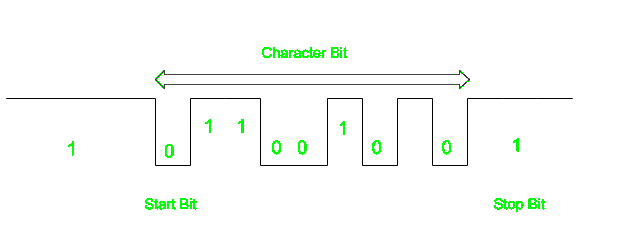

# 异步串行数据传输

> 原文:[https://www . geesforgeks . org/异步-串行-数据传输/](https://www.geeksforgeeks.org/asynchronous-serial-data-transfer/)

在大多数计算机中，使用异步数据传输模式，其中两个组件具有不同时钟。数据传输可以串行和并行两种方式在数据之间进行。在并行的情况下，多条线路用于发送一个位，而在串行传输中，每个位一次发送一个。为了告诉其他设备何时字符/数据将被赋予开始和结束位的概念，使用了。当线路至少一次返回到 1 状态时，开始位由 0 表示，停止位被检测到，这里 1 状态意味着没有数据传输正在发生。

当一个字符没有被发送时，行保持在状态 1。发送 0 时会检测到字符的开头。字符位总是在 0 位之后。发送最后一位后，线路状态变为 1。

下图显示了这个概念:

这里，当必须发送一个字符时，行的早期状态是 1，发送一个 0，并传输字符位。

**串行和并行传输的区别–**

| 连续的 | 平行的 |
| --- | --- |
| 需要单行发送数据 | 需要多行 |
| 误差小，模型简单 | 容易出错且工作复杂 |
| 经济的 | 昂贵的 |
| 较慢的数据传输 | 更快的数据传输 |
| 用于长途 | 用于短距离 |
| 示例:计算机到计算机 | 示例:计算机到打印机 |