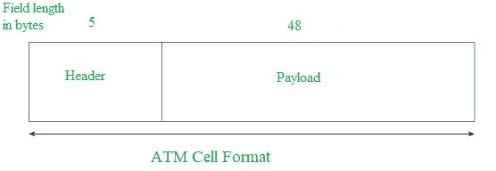
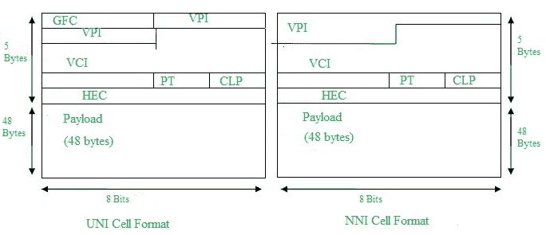
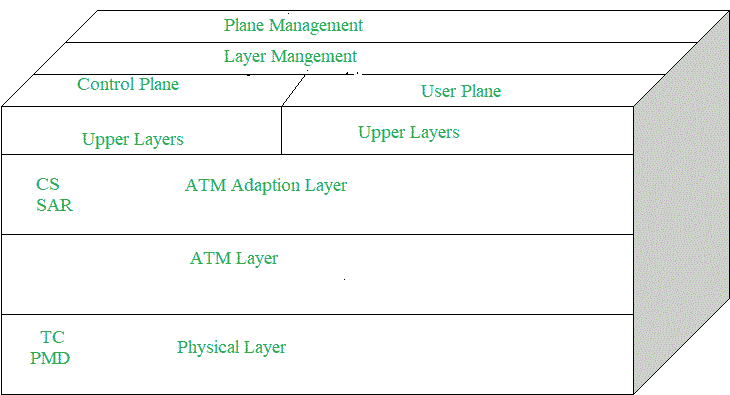

# 计算机网络中的异步传输模式

> 原文:[https://www . geesforgeks . org/异步-传输模式-计算机网络中的 ATM/](https://www.geeksforgeeks.org/asynchronous-transfer-mode-atm-in-computer-network/)

**为什么是 ATM 网络？**

1.  由电话和数据网络的服务和性能要求的集成驱动:“宽带综合服务愿景”(B-ISON)。

2.  电话网络支持单一的服务质量，而且启动成本很高。

3.  互联网不支持服务质量，但灵活且便宜。

4.  自动柜员机网络旨在以合理的成本支持一系列服务质量，旨在包含电话网络和互联网。

**异步传输模式(ATM):**
它是国际电信联盟-电信标准部(ITU-T)的一个有效的呼叫中继，它传输包括多种服务类型的所有信息，如数据、视频或语音，这些信息以称为信元的固定大小的小数据包的形式传送。信元异步传输，网络面向连接。

自动柜员机是 20 世纪 70 年代和 80 年代宽带综合业务数字网发展中的一项技术，可以认为是分组交换的发展。*每个信元长 53 字节*–5 字节报头和 48 字节有效载荷。拨打自动柜员机电话需要首先发送消息来建立连接。

随后，所有单元都沿着相同的路径到达目的地。它可以处理固定速率流量和可变速率流量。因此它可以以**端到端**的服务质量承载多种类型的流量。自动柜员机独立于传输介质，它们可以通过电线或光纤自行发送，也可以封装在其他运营商系统的有效负载中。自动柜员机网络使用带有虚电路的“分组”或“信元”交换。它的设计有助于实现高性能多媒体网络。

**自动柜员机信元格式–**
由于信息是以固定大小的单元形式在自动柜员机上传输的，称为**信元**。众所周知，每个信元有 53 字节长，包括一个 5 字节的报头和 48 字节的有效载荷。

异步传输模式可以有以下两种格式类型:

1.  **UNI 报头:**这在 ATM 的专用网络中用于 ATM 端点和 ATM 交换机之间的通信。它包括通用流量控制(GFC)字段。

2.  **NNI 报头:**用于自动柜员机交换机之间的通信，它不包括通用流量控制(GFC)，而是包括占用前 12 位的虚拟路径标识符(VPI)。

**自动柜员机的工作方式:**
自动柜员机标准使用两种类型的连接。即虚拟路径连接，其由捆绑在一起的虚拟信道连接组成，虚拟信道连接是承载从用户到用户的单个信元流的基本单元。虚拟路径可以在自动柜员机网络中端到端创建，因为它不会将信元路由到特定的虚拟电路。如果发生重大故障，属于特定虚拟路径的所有信元都以相同的方式通过自动柜员机网络路由，从而有助于更快的恢复。

连接到用户的交换机使用虚拟专用网络和虚拟专用网络来交换信元，信元是虚拟路径和虚拟连接交换机，它们之间可以有不同的虚拟信道连接，目的是在交换机之间创建一个*虚拟中继线*，可以作为一个单一实体来处理。它的基本操作很简单，通过在本地转换表中查找连接值来确定连接的输出端口和该链路上连接的新 VPI/VCI 值。

**自动柜员机对数据网络(互联网)–**

*   ATM is a “virtual circuit” based: the path is reserved before transmission. While Internet Protocol (IP) is connectionless and end-to-end resource reservations are not possible. RSVP is a new signaling protocol on the internet. 
*   ATM Cells: Fixed or small size and Tradeoff is between voice or data. While IP packets are of variable size. 
*   寻址:自动柜员机使用 20 字节的全球 NSAP 地址进行信令，并在信元中使用 32 位本地分配的标签。而 IP 在所有数据包中使用 32 位全局地址。

**自动柜员机层:**

1.  **ATM Adaption Layer (AAL) –** 
    It is meant for isolating higher-layer protocols from details of ATM processes and prepares for conversion of user data into cells and segments it into 48-byte cell payloads. AAL protocol excepts transmission from upper-layer services and helps them in mapping applications, e.g., voice, data to ATM cells. 
2.  **物理层–**
    管理介质相关传输，分为物理介质相关子层和传输汇聚子层两部分。主要功能如下:
    *   它将细胞转化为比特流。
    *   它控制物理介质中比特的传输和接收。
    *   它可以跟踪自动柜员机信元边界。
    *   寻找将单元格打包到适当类型的框架中。
3.  **ATM 层–**
    它处理传输、交换、拥塞控制、信元报头处理、顺序传送等。并且负责在称为信元多路复用的物理链路上同时共享虚电路，并且利用信元报头中的 VPI 和 VCI 信息使信元通过称为信元中继的 ATM 网络。

**自动柜员机应用:**

1.  **ATM 广域网–**
    它可以作为广域网远距离发送信元，路由器作为 ATM 网络和其他网络之间的端点，它有两个协议栈。

2.  **多媒体虚拟专用网络和托管服务–**
    它有助于管理自动柜员机、局域网、语音和视频服务，并能够提供全服务虚拟专用网络，包括对多媒体的集成访问。

3.  **帧中继主干网–**
    帧中继服务被用作一系列数据服务的网络基础设施，并支持帧中继自动柜员机服务到互联网服务。

4.  **住宅宽带网络–**
    ATM 是通过选择为住宅宽带服务的建立提供网络基础设施，以寻求高度可扩展的解决方案。

5.  **电话和专线网络的运营商基础设施–**
    通过构建承载电话和专线流量的自动柜员机基础设施，更有效地利用 SONET/SDH 光纤基础设施。