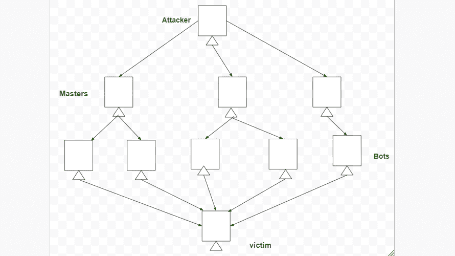

# 针对 3G 移动网络的攻击

> 原文:[https://www . geeksforgeeks . org/攻击-针对-3g-移动-网络/](https://www.geeksforgeeks.org/attacks-against-3g-mobile-networks/)

针对移动网络可以发起多种攻击，它们有两种类型，即

1.  移动网络之外:公共网络、专用网络、其他网络，
2.  移动网络内部:连接到 3G 网络的智能手机、笔记本电脑和个人电脑。

**针对 3G 移动网络的攻击有:**

**1。恶意软件、病毒和蠕虫–**
由于许多用户仍在从 2G、2.5G 和 3G 转向 3G，因此越来越需要提高对使用手机时存在的风险的认识。以下是针对手机的恶意软件的几个例子:

*   **骷髅头木马*****–***
    它被设计用来感染运行塞班移动操作系统的 Series 60 手机。
*   **Cabir 蠕虫–**
    它是手机中最初已知的蠕虫；它攻击移动设备，然后扫描剩余的设备，寻找它的副本，启动移动设备，检测使用蓝牙。
*   **蚊子木马–**
    蚊子木马是针对 60 系列手机的 Mosquitos 手机游戏的一个被破坏的变种。
*   ***Brador 木马–***
    通过在 Windows 的启动文件中制作 svchost.exe 文件感染 Windows Mobile 操作系统，让你可以完全访问手机。包括电子邮件附件在内的标准蠕虫传播媒介与此可执行文件兼容。
*   **Lasco Worm–**
    最初发布于 2005 年，旨在攻击基于 Symbian 的 PDAs 和手机。Lasco 是基于 Cabir 的代码构建的，并使用蓝牙技术进行复制。

**2。DDoS(分布式拒绝服务):**
这次攻击的总体目的是确保目标用户无法访问系统。分布式拒绝服务(DDoS)攻击是目前有线互联网服务提供商面临的主要网络安全风险之一。It 攻击是 DoS 攻击的一种。分布式拒绝服务攻击需要部署一个机器人，这是一个相关小工具的集合，用来利用虚假流量淹没目标系统。

**3。超额计费攻击:**
攻击者劫持用户的 IP 地址，然后使用它开始非免费传输或仅仅是出于自己的原因。在任何情况下，交易都是向真实用户收费的。每当合法用户的 IP 地址被恢复到 IP 池中时，黑客就可以拦截它并获得所有权。之后，黑客利用用户的蜂窝/移动网络服务。

**4。欺骗的策略开发过程(PDP) :**
当 GTP 有缺陷时，这个会攻击。当黑客在窃取信息、恶意安装或规避安全措施的情况下，伪装成合法的系统或客户端时，就会发生欺骗。

**5。信令级攻击:**
IMS 网络中的 VoIP 服务是通过会话发起协议(SIP)使用信令来提供的。基于 SIP 的网络电话系统有许多安全缺陷。