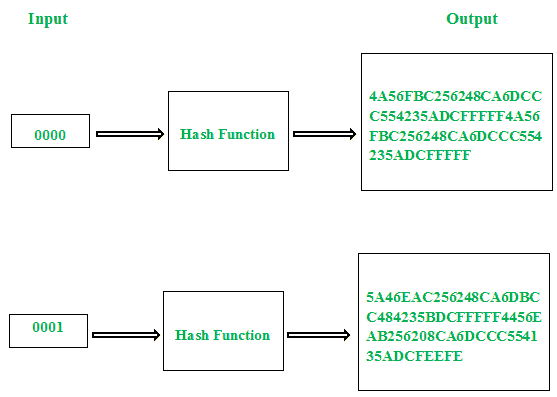

# 密码学中的雪崩效应

> 原文:[https://www . geesforgeks . org/密码学中的雪崩效应/](https://www.geeksforgeeks.org/avalanche-effect-in-cryptography/)

在[密码学](https://www.geeksforgeeks.org/cryptography-and-its-types/)中，雪崩效应是与用于加密的数学函数的特定行为相关联的术语。雪崩效应被认为是任何加密算法的理想特性之一。密钥或纯文本的微小变化都会导致密文的显著变化。这种特性被称为**雪崩效应**。

简单地说，它量化了明文或密钥中的微小变化对密文的影响。



<center>**Figure –** Avalanche Effect</center>

尽管雪崩效应的概念是由“香农混淆性质”确定的，但这个术语是由霍斯特·费斯特尔首先提到的。为了实现强密码或密码散列函数，这应该被认为是主要设计目标之一。

在使用哈希值的算法的情况下，即使输入字符串中的一个小变化也会彻底改变哈希值。换句话说，翻转输入字符串中的单个位应该至少翻转哈希值中的一半位。

一个好的加密算法应该总是满足以下关系:

```
Avalanche effect > 50% 
```

这种效果确保攻击者无法通过统计分析轻松预测纯文本。不满足这一特性的加密算法可以支持简单的统计分析。也就是说，如果输入的一个位的改变只导致所需输出的一个位的改变，那么就很容易破解加密文本。

**示例:**

[例-1](https://www.geeksforgeeks.org/isro-isro-cs-2020-question-29/) :密码学中的雪崩效应是指
**(A)** 关键字变化最小时密文变化较大
**(B)** 纯文本变化时密文变化较大
**(C)** 关键字变化对密文长度影响较大
**(D)** 以上都不是

**回答:(A)**

[示例-2](https://www.geeksforgeeks.org/isro-isro-cs-2018-question-36/) :密码学中的雪崩效应
**(A)** 是密码算法的可取属性
**(B)** 是密码算法的不可取属性
**(C)** 对加密算法没有影响
**(D)** 以上都没有

**回答:(A)**