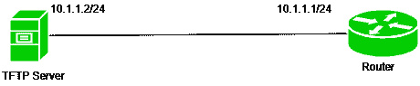
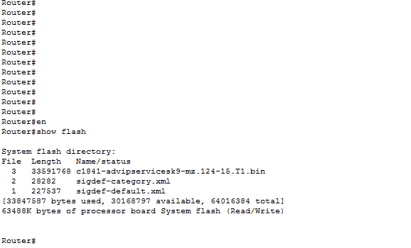
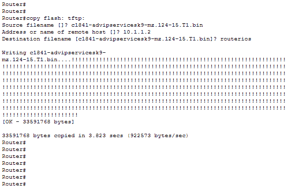
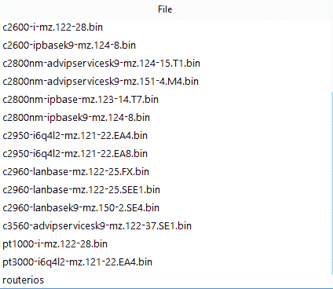
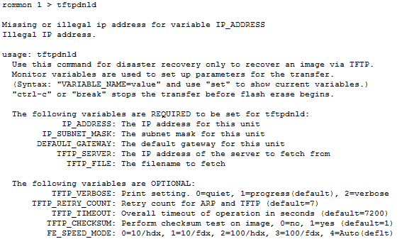
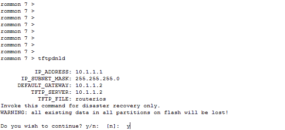

# 备份思科 IOS 路由器映像

> 原文:[https://www . geesforgeks . org/backing-backing-Cisco-IOs-router-image/](https://www.geeksforgeeks.org/backing-up-cisco-ios-router-image/)

作为网络管理员，您应该随时准备一份备份以应对更糟糕的情况。可能出现的常见更糟情况之一是设备的 IOS 映像被删除。如果没有 IOS 映像的备份，这种情况会变得更糟。

因此，要忽略这些情况，备份应该是必须的，这里我们将在 TFTP 服务器上进行思科 IOS 映像备份。

**普通文件传输协议(TFTP)–**
TFTP 是一种简单的文件传输协议，用于从远程主机放入或取出文件。它使用 UDP 端口号 69。
但 TFTP 用于不需要认证和控制的地方。此外，它需要更少的开销。而另一方面，它的交互性不如 FTP。因此，根据需要，使用 FTP 或 TFTP。

**配置–**



这是一个简单的拓扑，其中有一台路由器(我们将对其进行 IOS 备份)和一台 TFTP 服务器。路由器的 IP 地址为 10.1.1.1/24，TFTP 服务器的 IP 地址为 10.1.1.2/24。

**注意–**
在进行 IOS 备份之前，请确保 Tftp 服务器和路由器能够相互 ping 通。



如图所示，我们在 flash()中看到一个 IOS 镜像文件。bin 文件)通过命令:

```
router#show flash
```

现在，我们将通过命令
将该文件复制到我们的 Tftp 服务器上

```
router#copy flash: tftp:
Source filename[]? c1841-advipservicesk9-mz.124-15.T1.bin
Address or name of remote host []? 10.1.1.2
Destination filename [c1841-advipservicesk9-mz.124-15.T1.bin]? routerios 
```



现在，正如我们在上面的图片中看到的，它要求源文件名、远程主机地址和目标文件名。

*   **源文件名–**是 IOS 镜像文件的名称。这里，它被命名为 c 1841-advipservicesk 9-mz . 124-15。T1.bin(闪烁显示)。

*   **远程主机的地址或名称–**是 TFTP 服务器的 IP 地址。在我们的场景中，它是 10.1.1.2。

*   **目标文件名–**这是将放入 TFTP 服务器的目标文件的名称。在这里，我们将其命名为 routerios。



如上图所示，文件已经复制到 TFTP 服务器。
现在，我们将从路由器中删除 IOS 映像:

```
router(config)#delete flash:
```

**注意–**
现在，由于文件被删除，路由器仍在运行，因为 IOS 已经加载到内存中。因此，当我们重新加载路由器时，它将进入 ROMMON 模式。

因此，现在要从 TFTP 服务器复制 IOS 文件，我们将使用命令:

```
rommon 1>tftpdnld
```



现在，只要我们输入这个命令，我们就会看到接下来要输入的参数。

```
ROMMON 2>IP_ADDRESS=10.1.1.1
ROMMON 3>IP_SUBNET_MASK=255.255.255.0
ROMMON 4>DEFAULT_GATEWAY=10.1.1.2
ROMMON 5>TFTP_SERVER=10.1.1.2
ROMMON 6>TFTP_FILE=routerios
```

*   **IP _ ADDRESS–**这是我们要给路由器接口 fa0/0 的 IP 地址，但是请记住，这个 IP 地址应该属于同一个子网。这里，我们在路由器的接口上提供了 10.1.1.1。

*   **IP _ SUBNET _ MASK–**这是我们要给路由器接口 IP 地址的子网掩码，在我们的场景中是 255.255.255.0。

*   **DEFAULT _ GATEWAY–**这里，我们必须给出该路由器接口 IP 地址的默认网关。
    在这里，请注意我们的 TFTP 服务器直接连接到路由器的接口，因此，我们可以给出 TFTP 服务器的 IP 地址，该地址被指定为 10.1.1.2，但是如果在 TFTP 服务器和路由器之间有任何路由器，那么我们必须给出路由器的默认网关 IP 地址。

*   **TFTP _ 服务器–**该命令需要 TFTP 服务器的 IP 地址，在我们的场景中是 10.1.1.2。

*   **TFTP _ FILE–**这是我们保存在 TFTP 服务器上的文件的名称。在我们的场景中，我们给了 routerios.bin.
    这个名字

输入这些命令后，我们将再次输入命令 tftpdnld。



之后，如果我们输入了正确的参数，它将要求我们继续说是(如图所示)，否则输入否并再次指定正确的参数。

```
ROMMON 7>reset
```

之后，只需输入命令 reset 来重新加载路由器。