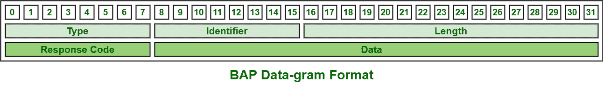

# 带宽分配协议(BAP)

> 原文:[https://www . geesforgeks . org/带宽-分配-协议-bap/](https://www.geeksforgeeks.org/bandwidth-allocation-protocol-bap/)

**带宽分配协议(BAP)** 一般管理多链路束中的链路总数。它对于通常包含基于带宽利用率的载波收费的不同操作特别有价值。它基本上是一个[点对点协议(PPP)](https://www.geeksforgeeks.org/point-to-point-protocol-ppp-phase-diagram/) ，需要动态添加或删除多点捆绑或连接的附加连接或链接。它定义和解释数据报只是为了协调在多链路包中添加或删除额外的链路。它还有助于指定哪个对等体通常负责在多链路连接期间管理和控制带宽的决策。

它还定义了数据包、参数和协商过程，只是为了允许两个端点优雅地协商添加和删除链接。最重要的是需要通过[综合业务数字网络(ISDN)](https://www.geeksforgeeks.org/integrated-services-digital-network-isdn/) 连接，因为这些拨号服务可能会立即增加或减少线路。需要动态 BAP 来促进多链路连接的链路动态分配。动态 BAP 由以下给出的各种协议组成:

```
1. Bandwidth Allocation Protocol (BAP)
2. Bandwidth Allocation Control Protocol (BACP)
3. Link Control Protocol (LCP) 
```

**BAP 功能:**

1.  它动态控制如何分配带宽。
2.  它还提供了一种高效且有效的机制，用于简单地管理和控制成本，同时动态地提供最佳带宽。
3.  需要修改数据链路协议之间的连接或链路，并承担指定的决策责任，因为它基本上与带宽管理相关。
4.  它允许管理员配置 PPP 服务器，以便简单地指定和识别哪些特定的多链路线路可以添加或删除。
5.  它还为 PPP 和多链路添加了功能，以监控和管理所有连接要求并进行相应调整。

**BAP 表头格式:**
BAP 表头一般由 5 个字段组成，如下所示:



1.  **Type field –**
    This field is of 8 bits. It generally specifies the type of BAP message or datagram packet being sent or transmitted. Types of messages or datagrams are given below in the table :

    <center>

    | 类型 | 描述 |
    | --- | --- |
    | 01 | 呼叫请求 |
    | 02 | 呼叫响应 |
    | 03 | 回拨-请求 |
    | 04 | 回调-响应 |
    | 05 | 链接-删除-查询-请求 |
    | 06 | 链接-删除-查询-响应 |
    | 07 | 呼叫状态指示 |
    | 08 | 呼叫-状态-响应 |

    </center>

2.  **标识符字段–**
    该字段为 8 位。
3.  **长度字段–**
    该字段为 16 位。它通常有助于表示数据包或消息的总长度。
4.  **数据字段–**
    该字段长度不同。
5.  **Response code field –**
    This field is of 8 bits. It is also binary coded. It contains the following values :

    <center>

    | 密码 | 描述 |
    | --- | --- |
    | 00000000 | 请求-Ack |
    | 00000001 | 请求-Nak |
    | 00000010 | Request-Rej(请求-Rej) |
    | 00000011 | 请求-全裸 |

    </center>