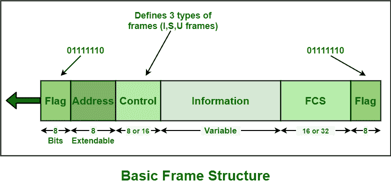
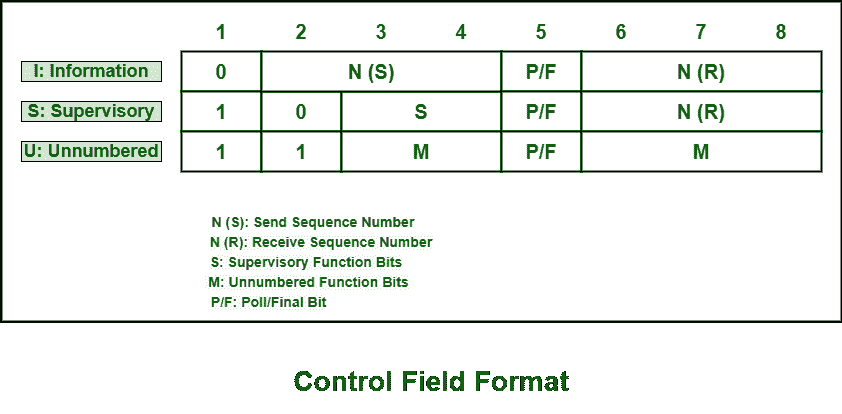

# HDLC 基本框架结构

> 原文:[https://www . geesforgeks . org/basic-frame-structure-of-HDLC/](https://www.geeksforgeeks.org/basic-frame-structure-of-hdlc/)

**高级数据链路控制(HDLC)** 通常使用术语“帧”来指示和表示经常从一个站传输或转移到另一个站的数据实体或数据单元协议。链路上的每一帧都应以标志序列字段开始和结束。HDLC 的每一帧主要包括六个场。它以标志字段、地址字段、控制字段、信息字段、帧校验序列(FCS)字段和结束标志字段开始。在多帧传输中，一帧的结束标志字段可以用作下一帧的开始标志字段。

HDLC 协议的基本帧结构如下所示:

**不同场地大小:**

| 字段名 | 大小(位) |
| 标志字段 | 8 位 |
| 地址字段 | 8 位 |
| 控制字段 | 8 或 16 位 |
| 信息字段 | 变量(不用于某些类型的 HDLC 帧) |
| 帧校验序列字段 | 16 或 32 位 |
| 关闭标志字段 | 8 位 |

**让我们详细了解这些字段:**

1.  **Flag Field –**
    The flag field is generally responsible for initiation and termination of error checking. In HDLC protocol, there is no start and stop bits. So, the flag field is basically using delimiter 0x7e to simply indicate beginning and end of frame.

    它是一个 8 位序列，位模式为 01111110，基本上有助于识别帧的开始和结束。该位模式也用作接收机的同步模式。该位模式也不允许出现在完整帧内的任何其他位置。

2.  **Address Field –**
    The address field generally includes HDLC address of secondary station. It helps to identify secondary station will sent or receive data frame. This field also generally consists of 8 bits therefore it is capable of addressing 256 addresses. This field can be of 1 byte or several bytes long, it depends upon requirements of network. Each byte can identify up to 128 stations.

    该地址可能包括特定地址、组地址或广播地址。主地址可以是通信源，也可以是目的地，这样就不需要包含主地址。

3.  **Control Field –**
    HDLC generally uses this field to determine how to control process of communication. The control field is different for different types of frames in HDLC protocol. The types of frames can be Information frame (I-frame), Supervisory frame (S-frame), and Unnumbered frame (U-frame).

    

    这个字段是一个 1-2 字节的帧段，通常需要用于流量和错误控制。该字段基本上由 8 位组成，但可以扩展到 16 位。在这个领域，比特的解释通常取决于帧的类型。

4.  **Information Field –
    This field usually contains data or information of users sender is transmitting to receiver in an I-frame and network layer or management information in U-frame. It also consists of user’s data and is fully transparent. The length of this field might vary from one network to another network.
    Information field is not always present in an HDLC frame.**
5.  ****Frame Check Sequence (FCS) –**

    FCS 通常用于识别错误，即 HDLC 错误检测。在 FCS 中，错误检测基本上使用 CRC16 (16 位循环冗余校验)或 CRC32 (32 位循环冗余校验)码。循环冗余校验计算在接收器中再次完成。如果结果与原始帧中的值稍有不同，则假定存在错误。

    该字段可以包含 2 字节或 4 字节。该字段总共为 16 位，用于地址字段、控制字段和信息字段中的错误检测。FCS 基本上是由数据帧的发送方和接收方计算的。FCS 用于确认和确保数据帧未被用于将帧从发送方传输到接收方的介质损坏。**