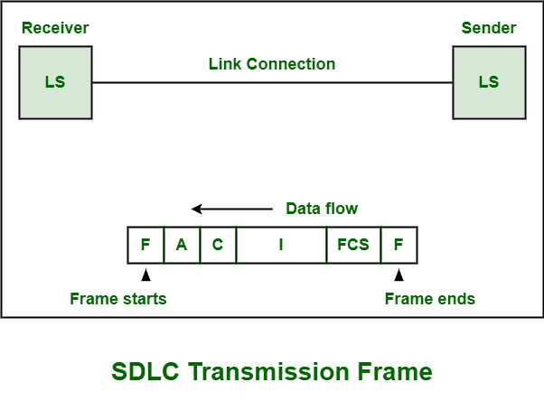
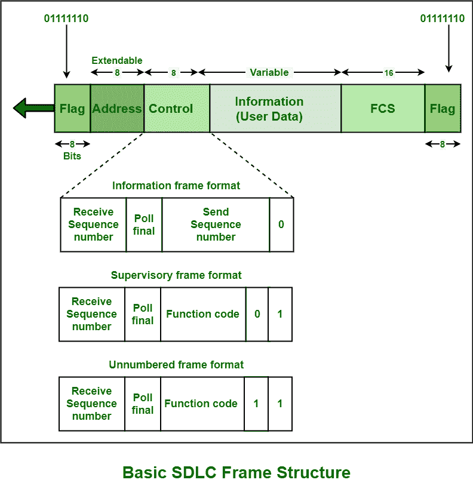

# SDLC 基本框架结构

> 原文:[https://www . geesforgeks . org/basic-frame-structure-of-SDLC/](https://www.geeksforgeeks.org/basic-frame-structure-of-sdlc/)

[同步数据链路控制(SDLC)](https://www.geeksforgeeks.org/sdlc-types-and-topologies/) 通常是与系统网络架构(SNA)环境一起使用的链路层协议。SNA 是 IBM 的专有网络架构，于 1974 年开发。SDLC 还支持多种类型和不同类型的数据链路。

示例包括点对点链路、多点链路、交换网络、分组网络等。它还采用主站-次站的数据通信模式。在 SDLC [数据链路](https://www.geeksforgeeks.org/framing-in-data-link-layer/)上，所有的数据和控制传输都简单地以基本上称为传输帧的特定格式组织和管理。传输帧也称为 SDLC 帧或只是一个帧。

传输帧简单地在发送或发送站和接收站之间携带或传输用户的控制信息和数据。它允许并准许接收站:

*   确定帧的开始和结束。
*   以识别帧是为该特定站制作还是打算为该特定站制作。
*   识别需要对接收到的信息或数据执行的操作。
*   检测和识别接收帧传输过程中出现的错误。
*   向发射站确认收到帧。

**帧格式:**
每个 SDLC 的传输帧都有特定的帧格式。每个帧由以下字段组成:

1.  **标志字段–**
    标志(F)是表示帧开始的开始帧。此字段用于通过定期检查启动和终止错误的发生。
2.  **地址字段–**
    地址(A)字段紧跟在起始标志之后。它用于识别和确定发送帧的辅助站。这样做是因为帧包含关于组地址、特定地址的信息或数据。广播地址等。
3.  **控制字段–**
    控制(C)字段紧跟在地址字段之后。它用于指定特定框架的功能。
    该字段可采用以下三种格式:
    *   **(一)。未编号(U)格式:**
        需要执行各种功能，如建立断开链接、报告一些程序错误、传输或传输数据，尤其是在不需要检查帧序列中数据的位置或地址时。
    *   **(二)。监督(S)格式:**
        需要执行各种功能，例如确认接收到的帧、传达就绪或繁忙状态、报告帧编号错误等。该格式不包含任何信息字段。
    *   **(三)。信息(一)格式:**
        需要执行各种功能，如传输数据或信息，控制需要发送帧的顺序和帧数。
4.  **信息字段–**
    信息(一)字段紧跟在控制字段之后。该字段为可选字段，主要包含信息数据。需要在数据链路上传输的数据就在这个字段中。
5.  **FCS 字段–**
    帧校验序列(FCS)字段紧跟在信息字段之后。该字段特别允许并授权接收站简单地确保和检查帧的传输精度。此字段只是检查接收到的帧是否有任何类型的错误，这些错误可能是由链路连接引起的。
6.  **结束标志字段–**
    该字段指示帧的结束。